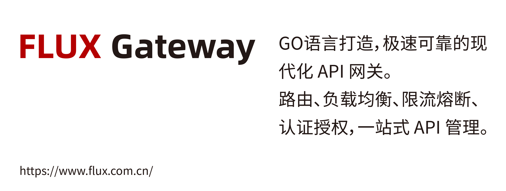
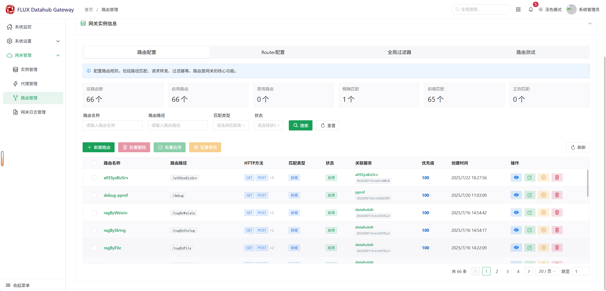
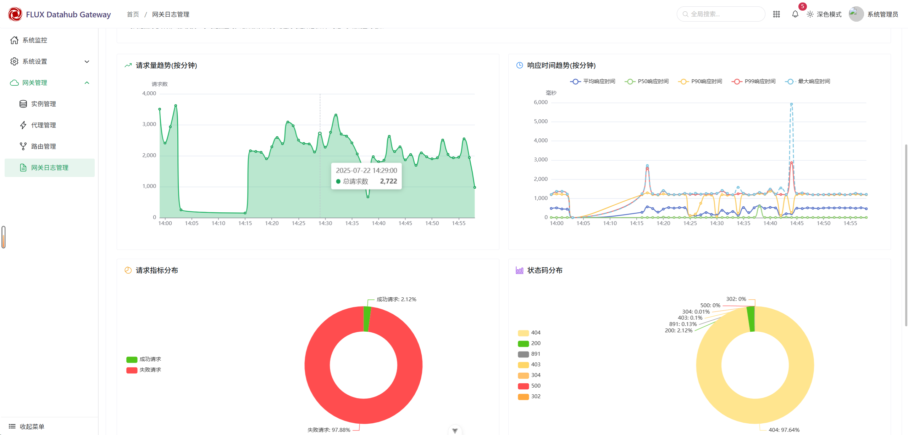
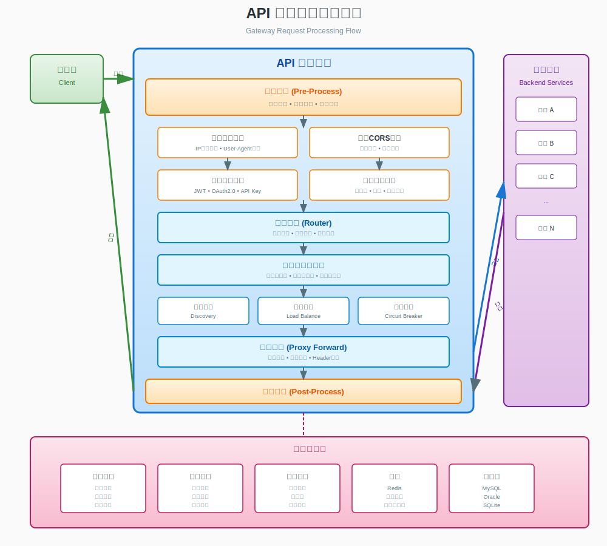

<p align="center">
  <a href="https://www.flux.com.cn/" target="_blank">
    
  </a>
</p>


<p align="center">
  
  
  
  
  
</p>

<p align="center">
  <strong>现代化高性能云原生 API 网关</strong>
</p>

<p align="center">
  FLUX Gateway 是一款基于 Go 语言开发的现代化 API 网关，依托 Go 语言的高性能与简洁特性，集成了路由分发、负载均衡、流量限流、服务熔断及认证授权等核心能力。提供全链路 API 管理可视化功能，助力用户高效管控接口生命周期，为分布式系统构建稳定、安全、可观测的 API 接入层。
</p>

<p align="center">
  <a href="README_EN.md">English</a> | <strong>简体中文</strong>
</p>

<p align="center">
  <a href="https://matrix.to/#/#fluxsce/gateway:gitter.im">
    
  </a>
</p>

---

## 🚩 主要特性

- 🚀 高性能路由与负载均衡
- 🔒 多种认证与安全防护[](url)
- 📊 实时监控与可观测性
- 🧩 插件化扩展
- ☁️ 云原生友好

---

## 🖼️ Demo 截图

<p align="center">
  
  
</p>

---

## 🚀 快速开始

### 环境准备

#### Windows 用户特别说明

由于项目依赖CGO，Windows用户需要先安装C编译器：

1. **下载并安装TDM-GCC编译器**
   - 访问 [TDM-GCC下载页面](https://jmeubank.github.io/tdm-gcc/download/)
   - 推荐下载：`tdm64-gcc-10.3.0-2.exe` (64+32位MinGW-w64版本)
   - 安装完成后**重新打开命令行窗口**

2. **配置Go代理（国内用户推荐）**
   ```bash
   go env -w GOPROXY=https://goproxy.cn
   ```

#### 启动步骤

```bash
# 克隆项目
git clone https://github.com/fluxsce/gateway.git
cd gateway

# 安装依赖
go mod download

# 启动网关
go run cmd/app/main.go
```

**访问控制台**
- 浏览器访问：http://localhost:12003/gatewayweb
- 默认用户名：`admin`
- 默认密码：`123456`

---

## 🏗️ 架构概览

<p align="left">
  
  
</p>

## 📚 文档导航

| 章节 | 文档 | 描述 |
|---------|----------|-------------|
| 📖 | **[完整文档](docs/zh-CN/README.md)** | 查看所有中文文档 |
| 01 | [项目介绍](docs/zh-CN/01-项目介绍.md) | 了解核心能力、系统架构和使用场景 |
| 02 | [开发指南](docs/zh-CN/02-快速开始.md) | 开发环境搭建、项目结构和快速上手 |
| 03 | [安装部署](docs/zh-CN/03-安装部署.md) | 详细的安装和部署步骤 |
| 04 | [容器化部署](docs/zh-CN/04-容器化部署.md) | Docker 和 Kubernetes 容器化部署 |
| 05 | [数据库规范](docs/zh-CN/05-数据库规范.md) | 数据库设计规范和最佳实践 |
| 06 | [调试指南](docs/zh-CN/06-调试指南.md) | 调试技巧、性能分析和问题排查 |
| 07 | [错误处理](docs/zh-CN/07-错误处理.md) | 错误处理机制和最佳实践 |
| 🛡️ | [安全指南](SECURITY.md) | 安全最佳实践与漏洞报告 |

## 📜 行为准则

请在参与贡献前，务必阅读并遵守我们的[社区行为准则](CODE_OF_CONDUCT.md)。

## 🤝 参与贡献

我们欢迎所有形式的贡献！详细的贡献指南请查看 [CONTRIBUTING.md](CONTRIBUTING.md)。

## ❓ 常见问题

- [FAQ / 常见问题解答](docs/faq.md)
  
## 📜 开源协议

本项目使用 [Apache License 2.0](LICENSE) 开源协议。

## ⭐ Star 历史

<p align="center">
  <a href="https://star-history.com/#fluxsce/gateway">
    
  </a>
</p>

---

## 🙏 致谢与贡献者

感谢 [所有贡献者](https://github.com/fluxsce/gateway/graphs/contributors) 的付出与支持！
## 📞 联系方式

- 📧 **邮箱**: [fluxopensource@flux.com.cn](mailto:fluxopensource@flux.com.cn)
- 💬 **GitHub Issues**: [提交问题](https://github.com/fluxsce/gateway/issues)
- 💬 **GitHub Discussion**: [提交讨论](https://github.com/orgs/fluxsce/discussions)
- 📱 **微信群**: 扫描下方二维码加入交流群

<table align="left" style="border: none; border-collapse: collapse;"> <tr> <td style="text-align: center; padding: 200px; border: none;">  </td> <td style="text-align: center; padding: 200px; border: none;">  </td> </tr> </table>
<br></br>
<br></br>
<br></br>
<br></br>
<br></br>
<br></br>
<br></br>
<br></br>
<br></br>
<p align="center">
  <sub>Built with ❤️ by the Gateway team</sub>
</p>
