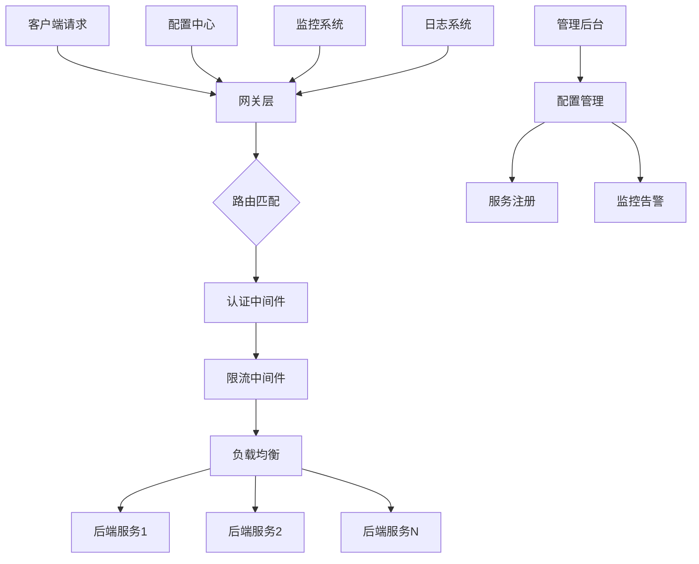

# GoHub - 企业级微服务治理平台

GoHub 是一个基于 Go 语言开发的企业级微服务治理平台，集成了高性能网关引擎、统一管理后台、用户权限系统、配置管理中心等多个核心组件。

## 📁 项目目录结构

```
gohub/
├── api/                          # API相关文件
│   ├── proto/                    # Protocol Buffers定义
│   └── swagger/                  # Swagger API文档
├── bin/                          # 编译后的可执行文件
│   ├── gateway                   # 网关服务程序
│   └── test                      # 测试程序
├── cmd/                          # 应用程序入口
│   ├── app/                      # 主应用程序
│   ├── cache/                    # 缓存服务
│   ├── gateway/                  # 网关服务
│   └── web/                      # Web管理界面
├── configs/                      # 配置文件
│   ├── database.yaml             # 数据库配置
│   ├── gateway.yaml              # 网关配置
│   ├── logger.yaml               # 日志配置
│   └── web.yaml                  # Web服务配置
├── internal/                     # 内部包（不对外暴露）
│   ├── auth/                     # 认证相关
│   ├── cache/                    # 缓存实现
│   ├── common/                   # 通用组件
│   ├── discovery/                # 服务发现
│   ├── gateway/                  # 网关核心实现
│   │   ├── bootstrap/            # 网关启动器
│   │   ├── config/               # 网关配置
│   │   ├── core/                 # 核心引擎
│   │   ├── handler/              # 处理器集合
│   │   └── loader/               # 配置加载器
│   ├── metrics/                  # 监控指标
│   ├── model/                    # 数据模型
│   ├── service/                  # 业务服务
│   └── storage/                  # 存储层
├── pkg/                          # 公共包（可对外暴露）
│   ├── cache/                    # 缓存工具包
│   ├── config/                   # 配置工具包
│   ├── database/                 # 数据库工具包
│   ├── logger/                   # 日志工具包
│   └── utils/                    # 通用工具
├── test/                         # 测试文件
│   ├── cache/                    # 缓存测试
│   ├── database/                 # 数据库测试
│   ├── e2e/                      # 端到端测试
│   ├── gateway/                  # 网关测试
│   └── integration/              # 集成测试
├── web/                          # Web管理平台
│   ├── globalmodels/             # 全局数据模型
│   ├── middleware/               # Web中间件
│   ├── routes/                   # 全局路由配置
│   ├── utils/                    # Web工具包
│   └── views/                    # 业务模块视图
│       ├── hub0001/              # 认证授权模块
│       │   ├── controllers/      # 控制器层
│       │   ├── dao/              # 数据访问层
│       │   ├── models/           # 数据模型
│       │   └── routes/           # 路由配置
│       ├── hub0002/              # 用户管理模块
│       ├── hub0020/              # 网关实例管理模块
│       └── hubcommon002/         # 通用配置管理模块
│           ├── controllers/      # 配置管理控制器
│           ├── dao/              # 配置数据访问层
│           ├── models/           # 配置数据模型
│           └── routes/           # 配置管理路由
├── go.mod                        # Go模块定义
├── go.sum                        # Go模块校验和
├── Makefile                      # 构建脚本
└── README.md                     # 项目说明文档
```

## 📖 API接口文档

### 认证授权模块 (`hub0001`)
```bash
POST /gohub/hub0001/login              # 用户登录
POST /gohub/hub0001/logout             # 用户登出
POST /gohub/hub0001/refresh-token      # 刷新访问令牌
GET  /gohub/hub0001/captcha            # 获取图形验证码
POST /gohub/hub0001/verify-captcha     # 验证图形验证码
```

### 用户管理模块 (`hub0002`)
```bash
POST /gohub/hub0002/user/add           # 创建新用户
POST /gohub/hub0002/user/get           # 获取用户详情
POST /gohub/hub0002/user/update        # 更新用户信息
POST /gohub/hub0002/user/delete        # 删除用户
POST /gohub/hub0002/user/query         # 查询用户列表
```

### 网关实例管理模块 (`hub0020`)
```bash
POST /gohub/hub0020/instance/add       # 创建网关实例
POST /gohub/hub0020/instance/get       # 获取实例详情
POST /gohub/hub0020/instance/update    # 更新实例配置
POST /gohub/hub0020/instance/delete    # 删除实例
POST /gohub/hub0020/instance/query     # 查询实例列表
POST /gohub/hub0020/instance/start     # 启动实例
POST /gohub/hub0020/instance/stop      # 停止实例
```

### 通用配置管理模块 (`hubcommon002`)

#### 安全配置管理
```bash
POST /gohub/hubcommon002/querySecurityConfigs              # 查询安全配置列表
POST /gohub/hubcommon002/getSecurityConfig                 # 获取安全配置详情
POST /gohub/hubcommon002/addSecurityConfig                 # 添加安全配置
POST /gohub/hubcommon002/editSecurityConfig                # 编辑安全配置
POST /gohub/hubcommon002/deleteSecurityConfig              # 删除安全配置

# IP访问控制
POST /gohub/hubcommon002/ip-access/add                     # 添加IP访问配置
POST /gohub/hubcommon002/ip-access/get                     # 获取IP访问配置
POST /gohub/hubcommon002/ip-access/update                  # 更新IP访问配置
POST /gohub/hubcommon002/ip-access/delete                  # 删除IP访问配置
POST /gohub/hubcommon002/ip-access/query                   # 查询IP访问配置

# User-Agent访问控制
POST /gohub/hubcommon002/useragent-access/add              # 添加UA访问配置
POST /gohub/hubcommon002/useragent-access/get              # 获取UA访问配置
POST /gohub/hubcommon002/useragent-access/update           # 更新UA访问配置
POST /gohub/hubcommon002/useragent-access/delete           # 删除UA访问配置
POST /gohub/hubcommon002/useragent-access/query            # 查询UA访问配置

# API访问控制
POST /gohub/hubcommon002/api-access/add                    # 添加API访问配置
POST /gohub/hubcommon002/api-access/get                    # 获取API访问配置
POST /gohub/hubcommon002/api-access/update                 # 更新API访问配置
POST /gohub/hubcommon002/api-access/delete                 # 删除API访问配置
POST /gohub/hubcommon002/api-access/query                  # 查询API访问配置

# 域名访问控制
POST /gohub/hubcommon002/domain-access/add                 # 添加域名访问配置
POST /gohub/hubcommon002/domain-access/get                 # 获取域名访问配置
POST /gohub/hubcommon002/domain-access/update              # 更新域名访问配置
POST /gohub/hubcommon002/domain-access/delete              # 删除域名访问配置
POST /gohub/hubcommon002/domain-access/query               # 查询域名访问配置
```

#### CORS跨域配置
```bash
POST /gohub/hubcommon002/cors/add                          # 添加CORS配置
POST /gohub/hubcommon002/cors/get                          # 获取CORS配置
POST /gohub/hubcommon002/cors/update                       # 更新CORS配置
POST /gohub/hubcommon002/cors/delete                       # 删除CORS配置
POST /gohub/hubcommon002/cors/query                        # 查询CORS配置列表
```

#### 认证配置
```bash
POST /gohub/hubcommon002/auth/add                          # 添加认证配置
POST /gohub/hubcommon002/auth/get                          # 获取认证配置
POST /gohub/hubcommon002/auth/update                       # 更新认证配置
POST /gohub/hubcommon002/auth/delete                       # 删除认证配置
POST /gohub/hubcommon002/auth/query                        # 查询认证配置列表
```

#### 限流配置
```bash
POST /gohub/hubcommon002/rate-limit/add                    # 添加限流配置
POST /gohub/hubcommon002/rate-limit/get                    # 获取限流配置
POST /gohub/hubcommon002/rate-limit/update                 # 更新限流配置
POST /gohub/hubcommon002/rate-limit/delete                 # 删除限流配置
POST /gohub/hubcommon002/rate-limit/query                  # 查询限流配置列表
```

### API规范说明

#### 统一响应格式
```json
{
  "code": "SD00002",                    // 响应码：成功SD开头，错误ED开头
  "message": "操作成功",                 // 响应消息
  "data": {...},                       // 响应数据
  "timestamp": "2024-01-01T12:00:00Z", // 时间戳
  "traceId": "trace-123456"            // 链路追踪ID
}
```

#### 多种查询方式
配置获取接口(`get`)支持三种查询方式：
- **按配置ID查询**：`{"configId": "CONFIG123"}`
- **按网关实例查询**：`{"gatewayInstanceId": "INSTANCE123"}`  
- **按路由配置查询**：`{"routeConfigId": "ROUTE123"}`

#### 分页查询规范
```json
{
  "page": 1,           // 页码，从1开始
  "pageSize": 10,      // 每页数量，默认10
  "total": 100,        // 总记录数
  "configs": [...]     // 数据列表
}
```

#### 错误码规范
- **SD00002**：查询成功
- **SD00003**：操作成功  
- **ED00006**：参数错误
- **ED00007**：验证失败
- **ED00008**：数据不存在
- **ED00009**：操作失败

## 🛠️ 环境要求

- **Go**: 1.19+
- **MySQL**: 8.0+
- **Redis**: 6.0+ (可选)

### 安装步骤

1. **克隆项目**
```bash
git clone <repository-url>
cd gohub
```

2. **安装依赖**
```bash
go mod download
```

3. **配置数据库**
```bash
# 创建数据库
mysql -u root -p < docs/database/mysql/init.sql

# 导入表结构
mysql -u root -p gohub < docs/database/mysql/HUB_GATEWAY_*.sql
```

4. **修改配置文件**
```bash
# 修改数据库连接信息
vim configs/database.yaml
vim configs/gateway.yaml
vim configs/web.yaml
```

5. **编译运行**
```bash
# 编译所有组件
make build

# 运行网关服务
./bin/gateway

# 运行Web管理界面
./bin/web
```

## 📝 开发规范

### 添加新的业务模块

1. **创建模块目录结构**
```bash
mkdir -p web/views/hubXXXX/{controllers,dao,models,routes}
```

2. **实现模块组件**
- **数据模型** (`models/`): 定义数据结构和表映射
- **数据访问层** (`dao/`): 实现CRUD操作
- **控制器** (`controllers/`): 实现RESTful API
- **路由配置** (`routes/`): 注册API路由

3. **注册模块**
```go
// 在 web/moduleimports/imports.go 中导入
import _ "gohub/web/views/hubXXXX/routes"
```

### 添加新的配置管理模块

1. **在通用配置模块中添加新配置类型**
```bash
# 创建配置文件
touch web/views/hubcommon002/models/new_config.go
touch web/views/hubcommon002/dao/new_config_dao.go
touch web/views/hubcommon002/controllers/new_config_controller.go
```

2. **遵循统一API规范**
```go
POST /gohub/hubcommon002/{config-type}/add     # 添加配置
POST /gohub/hubcommon002/{config-type}/get     # 获取配置
POST /gohub/hubcommon002/{config-type}/update  # 更新配置
POST /gohub/hubcommon002/{config-type}/delete  # 删除配置
POST /gohub/hubcommon002/{config-type}/query   # 查询配置列表
```

### 数据库表设计规范

#### 表命名规范
- 所有表名以 `HUB_` 开头
- 使用大写字母和下划线分隔
- 表名应具有描述性

#### 必需字段
所有配置表都应包含以下系统字段:
```sql
tenantId VARCHAR(32) NOT NULL COMMENT '租户ID',
addTime DATETIME NOT NULL DEFAULT CURRENT_TIMESTAMP COMMENT '创建时间',
addWho VARCHAR(32) NOT NULL COMMENT '创建人ID',
editTime DATETIME NOT NULL DEFAULT CURRENT_TIMESTAMP ON UPDATE CURRENT_TIMESTAMP COMMENT '最后修改时间',
editWho VARCHAR(32) NOT NULL COMMENT '最后修改人ID',
oprSeqFlag VARCHAR(32) NOT NULL COMMENT '操作序列标识',
currentVersion INT NOT NULL DEFAULT 1 COMMENT '当前版本号',
activeFlag VARCHAR(1) NOT NULL DEFAULT 'Y' COMMENT '活动状态标记(N非活动,Y活动)',
noteText VARCHAR(500) DEFAULT NULL COMMENT '备注信息'
```

## 🧪 测试说明

### 单元测试
```bash
# 运行单元测试
make test

# 运行特定模块测试
go test ./web/views/hubcommon002/...

# 生成测试覆盖率报告
make test-coverage
```

### 集成测试
```bash
# 运行集成测试
make test-integration

# 运行端到端测试
make test-e2e
```

### 测试文件组织
```bash
# 控制器测试
test/web/views/hubXXXX/controllers/example_controller_test.go

# DAO测试  
test/web/views/hubXXXX/dao/example_dao_test.go

# 网关处理器测试
test/gateway/handler/newhandler/newhandler_test.go
```

## 🚀 快速体验

### Docker 部署

```bash
# 使用 Docker 快速启动
docker run -d --name gohub-gateway \
  -p 8080:8080 \
  -p 8090:8090 \
  -v $(pwd)/configs:/app/configs \
  gohub/gateway:latest

# 使用 Docker Compose
curl -O https://raw.githubusercontent.com/your-org/gohub/main/docker-compose.yml
docker-compose up -d
```

### Kubernetes 部署

```bash
# 使用 Helm 安装
helm repo add gohub https://charts.gohub.io
helm install gohub-gateway gohub/gohub-gateway

# 或使用 kubectl
kubectl apply -f https://raw.githubusercontent.com/your-org/gohub/main/deployments/kubernetes/
```

## 📊 项目状态


## 🏗️ 架构设计



## 🌟 核心特性

### 🔥 高性能网关
- **零配置启动**：开箱即用，5分钟完成部署
- **毫秒级响应**：基于 Go 协程的高并发处理
- **智能负载均衡**：支持轮询、权重、一致性哈希等策略
- **熔断降级**：自动故障检测和服务降级

### 🛡️ 企业级安全
- **多重认证**：JWT、OAuth2、API Key 等认证方式
- **精细权限控制**：基于角色和资源的访问控制
- **安全防护**：防SQL注入、XSS攻击、CSRF攻击
- **审计日志**：完整的操作审计和安全日志

### 📊 可观测性
- **实时监控**：性能指标、错误率、响应时间监控
- **分布式追踪**：完整的请求链路追踪
- **智能告警**：基于阈值和趋势的告警策略
- **可视化面板**：直观的监控仪表板

### 🔧 运维友好
- **配置热更新**：无需重启的配置动态更新
- **优雅重启**：零停机的服务重启和升级
- **健康检查**：多维度的服务健康检查
- **故障诊断**：内置的故障诊断和排查工具

## 🎯 使用场景

### 微服务网关
- API 统一入口和路由管理
- 服务发现和负载均衡
- 协议转换和数据聚合
- 版本管理和灰度发布

### API 管理平台
- API 生命周期管理
- 开发者门户和文档
- API 监控和分析
- 商业化和计费

### 企业服务总线
- 内部服务互联
- 数据格式标准化
- 业务流程编排
- 遗留系统集成

## 🤝 开源社区

### 💻 如何贡献

我们欢迎所有形式的贡献！请查看 [贡献指南](CONTRIBUTING.md) 了解如何参与：

- 🐛 [报告 Bug](https://github.com/your-org/gohub/issues/new?template=bug_report.md)
- 💡 [提出功能建议](https://github.com/your-org/gohub/issues/new?template=feature_request.md)
- ❓ [寻求帮助](https://github.com/your-org/gohub/issues/new?template=question.md)
- 📝 [改进文档](https://github.com/your-org/gohub/tree/main/docs)
- 🔧 [提交代码](https://github.com/your-org/gohub/pulls)

### 🌟 贡献者

感谢所有为 GoHub 做出贡献的开发者：

<a href="https://github.com/your-org/gohub/graphs/contributors">
  
</a>

### 🏆 特别鸣谢

- 感谢所有提交 Issue 和 PR 的贡献者
- 感谢在社区中积极帮助他人的维护者
- 感谢提供宝贵建议和反馈的用户

## 📞 联系我们

### 社区交流

- 💬 **GitHub Discussions**: [参与讨论](https://github.com/your-org/gohub/discussions)
- 🐛 **问题反馈**: [提交 Issue](https://github.com/your-org/gohub/issues)
- 📧 **邮件联系**: [project@example.com](mailto:project@example.com)

### 商业支持

- 🏢 **企业服务**: [联系商务合作](mailto:business@example.com)
- 🎓 **技术培训**: [培训咨询](mailto:training@example.com)
- 🔧 **定制开发**: [定制服务](mailto:custom@example.com)

### 社交媒体

- 🐦 **Twitter**: [@gohub_gateway](https://twitter.com/gohub_gateway)
- 📝 **博客**: [官方博客](https://blog.example.com)
- 📺 **YouTube**: [技术视频](https://youtube.com/c/gohub)

## 📄 许可证

GoHub 使用 [Apache License 2.0](LICENSE) 开源协议。

```
Copyright 2024 GoHub Contributors

Licensed under the Apache License, Version 2.0 (the "License");
you may not use this file except in compliance with the License.
You may obtain a copy of the License at

    http://www.apache.org/licenses/LICENSE-2.0

Unless required by applicable law or agreed to in writing, software
distributed under the License is distributed on an "AS IS" BASIS,
WITHOUT WARRANTIES OR CONDITIONS OF ANY KIND, either express or implied.
See the License for the specific language governing permissions and
limitations under the License.
```

## ⭐ Star History

[](https://star-history.com/#your-org/gohub&Date)

## 🔗 相关项目

- [GoHub Web UI](https://github.com/your-org/gohub-ui) - Web 管理界面
- [GoHub CLI](https://github.com/your-org/gohub-cli) - 命令行工具
- [GoHub Plugins](https://github.com/your-org/gohub-plugins) - 官方插件集合
- [GoHub Examples](https://github.com/your-org/gohub-examples) - 使用示例和最佳实践

---

<div align="center">

**[官网](https://gohub.example.com) • [文档](https://docs.gohub.example.com) • [API参考](https://api.gohub.example.com) • [博客](https://blog.gohub.example.com)**

Made with ❤️ by the GoHub community

如果 GoHub 对您有帮助，请给我们一个 ⭐️ 星标支持！

</div>
