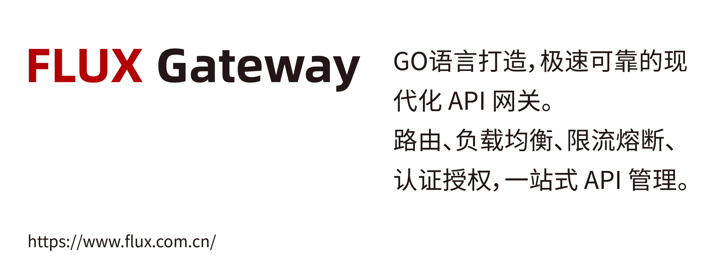

<p align="center">
  <a href="https://www.flux.com.cn/" target="_blank">
    
  </a>
</p>

<p align="center">
  
  
  
</p>

<p align="center">
  <strong>现代化高性能云原生 API 网关</strong>
</p>

<p align="center">
  FLUX Gateway 是一款基于 Go 语言开发的现代化 API 网关，依托 Go 语言的高性能与简洁特性，集成了路由分发、负载均衡、流量限流、服务熔断及认证授权等核心能力。提供全链路 API 管理可视化功能，助力用户高效管控接口生命周期，为分布式系统构建稳定、安全、可观测的 API 接入层。默认 SQLite 即可启动，生产环境可切换 MySQL / Oracle / ClickHouse。
</p>

<p align="center">
  <a href="README_EN.md">English</a> | <strong>简体中文</strong>
  &nbsp;·&nbsp;
  <a href="https://matrix.to/#/#fluxsce/gateway:gitter.im">Chat</a>
</p>

---

**目录：** [架构](#架构概览) · [功能](#功能) · [界面](#界面) · [快速开始](#快速开始) · [升级](#版本升级) · [文档](#文档) · [贡献](#参与贡献) · [联系](#联系)

---

## 架构概览

<p align="center">
  
</p>

<p align="center"><sub>图 1　请求处理链路：接入、安全、路由、负载、熔断、转发</sub></p>

<p align="center">
  
</p>

<p align="center"><sub>图 2　模块模型：网关、控制台、隧道与存储</sub></p>

分层架构与隧道原理见 [项目介绍 · 系统架构](docs/zh-CN/01-项目介绍.md)。

---

## 功能

<table width="100%">
  <colgroup>
    <col width="28%">
    <col width="72%">
  </colgroup>
  <thead>
    <tr>
      <th align="left">能力</th>
      <th align="left">说明</th>
    </tr>
  </thead>
  <tbody>
    <tr>
      <td>流量治理</td>
      <td>路由分发、多种负载均衡、限流、熔断</td>
    </tr>
    <tr>
      <td>安全</td>
      <td>JWT / OAuth2 / API Key，IP、域名与 User-Agent 访问控制</td>
    </tr>
    <tr>
      <td>可观测</td>
      <td>管理控制台、访问日志、运行指标</td>
    </tr>
    <tr>
      <td>扩展与交付</td>
      <td>插件；静态资源托管；二进制、Docker、Kubernetes</td>
    </tr>
  </tbody>
</table>

完整能力说明见 [项目介绍](docs/zh-CN/01-项目介绍.md)。

---

## 界面

<p align="center">
  
</p>

<p align="center"><sub>图 3　路由配置</sub></p>

<p align="center">
  
</p>

<p align="center"><sub>图 4　网关日志</sub></p>

---

## 快速开始

示例版本 **3.2.5**，安装包与镜像以 [GitHub Releases](https://github.com/fluxsce/gateway/releases) 最新版为准。

<table width="100%">
  <colgroup>
    <col width="28%">
    <col width="72%">
  </colgroup>
  <thead>
    <tr>
      <th align="left">项</th>
      <th align="left">值</th>
    </tr>
  </thead>
  <tbody>
    <tr>
      <td>控制台</td>
      <td><a href="http://localhost:12003/gatewayweb">http://localhost:12003/gatewayweb</a></td>
    </tr>
    <tr>
      <td>默认账号</td>
      <td><code>admin</code> / <code>123456</code>（登录后立即修改）</td>
    </tr>
    <tr>
      <td>网关端口</td>
      <td><code>8080</code></td>
    </tr>
    <tr>
      <td>健康检查</td>
      <td><a href="http://localhost:12003/health">http://localhost:12003/health</a></td>
    </tr>
  </tbody>
</table>

### Docker

镜像内含配置、数据库脚本和前端资源，默认 SQLite。

```bash
docker pull ghcr.io/fluxsce/gateway:3.2.5

docker run -d --name gateway \
  -p 8080:8080 \
  -p 12003:12003 \
  ghcr.io/fluxsce/gateway:3.2.5
```

国内镜像：

```bash
docker pull crpi-25xt72cd1prwdj5s.cn-hangzhou.personal.cr.aliyuncs.com/datahub-images/gateway:3.2.5
```

个人版 ACR 通常需先 `docker login`。MySQL + Redis 编排见 [容器化部署](docs/zh-CN/04-容器化部署.md)。

### 安装包

从 [Releases](https://github.com/fluxsce/gateway/releases) 下载对应平台包。归档根目录为 `gateway/`。

<table width="100%">
  <colgroup>
    <col width="46%">
    <col width="22%">
    <col width="32%">
  </colgroup>
  <thead>
    <tr>
      <th align="left">文件</th>
      <th align="left">平台</th>
      <th align="left">数据库</th>
    </tr>
  </thead>
  <tbody>
    <tr>
      <td><code>gateway-linux-amd64-3.2.5.tar.gz</code></td>
      <td>Linux amd64</td>
      <td>MySQL / SQLite / ClickHouse</td>
    </tr>
    <tr>
      <td><code>gateway-linux-arm64-3.2.5.tar.gz</code></td>
      <td>Linux arm64</td>
      <td>同上</td>
    </tr>
    <tr>
      <td><code>gateway-windows-amd64-3.2.5.zip</code></td>
      <td>Windows amd64</td>
      <td>同上</td>
    </tr>
    <tr>
      <td><code>gateway-linux-amd64-oracle-3.2.5.tar.gz</code></td>
      <td>Linux amd64</td>
      <td>上表 + Oracle</td>
    </tr>
    <tr>
      <td><code>gateway-windows-amd64-oracle-3.2.5.zip</code></td>
      <td>Windows amd64</td>
      <td>上表 + Oracle</td>
    </tr>
  </tbody>
</table>

```bash
tar -xzf gateway-linux-amd64-3.2.5.tar.gz
cd gateway
./gateway --config ./configs
```

Windows：`gateway.exe --config .\configs`。默认 SQLite，库文件 `scripts/data/gateway.db`，启动时执行 `scripts/db` 下的初始化脚本。

系统服务与生产配置见 [安装部署](docs/zh-CN/03-安装部署.md)。

### 源码

需要 **Go 1.24+**。SQLite 使用 `go-sqlite3`，必须开启 CGO（Windows 先安装 [TDM-GCC](https://jmeubank.github.io/tdm-gcc/download/) 并重开终端）。

```bash
git clone https://github.com/fluxsce/gateway.git
cd gateway
go env -w GOPROXY=https://goproxy.cn,direct   # 国内建议
go mod download
go run cmd/app/main.go --config ./configs
```

控制台静态资源来自 `web/frontend/dist`（不随仓库提交）：

```bash
cd web/frontend
pnpm install
pnpm run dev:vite
```

开发服务器将 API 代理到 `http://127.0.0.1:12003`。亦可 `pnpm run build` 后由网关托管 `dist`。完整步骤见 [开发指南](docs/zh-CN/02-快速开始.md)。

---

## 版本升级

以 `/opt/gateway` 为例。先备份 `database.yaml`，解压覆盖后再拷回。

```bash
sudo systemctl stop gateway
sudo cp /opt/gateway/configs/database.yaml /tmp/database.yaml.bak
sudo tar -xzf gateway-linux-amd64-*.tar.gz -C /opt
sudo cp /tmp/database.yaml.bak /opt/gateway/configs/database.yaml
sudo systemctl start gateway
```

Windows 与 Docker 见 [安装部署](docs/zh-CN/03-安装部署.md)、[容器化部署](docs/zh-CN/04-容器化部署.md)。

---

## 文档

按任务打开对应文档。完整目录：[中文](docs/zh-CN/README.md) · [English](docs/en/README.md)

### 使用

<table width="100%">
  <colgroup>
    <col width="40%">
    <col width="60%">
  </colgroup>
  <thead>
    <tr>
      <th align="left">任务</th>
      <th align="left">文档</th>
    </tr>
  </thead>
  <tbody>
    <tr>
      <td>能力、架构与适用场景</td>
      <td><a href="docs/zh-CN/01-项目介绍.md">项目介绍</a></td>
    </tr>
    <tr>
      <td>用网关发布本地静态站点</td>
      <td><a href="docs/zh-CN/08-静态资源托管.md">静态资源托管</a></td>
    </tr>
    <tr>
      <td>启动、端口、账号与常见错误</td>
      <td><a href="docs/faq.md">FAQ</a></td>
    </tr>
  </tbody>
</table>

### 部署

<table width="100%">
  <colgroup>
    <col width="40%">
    <col width="60%">
  </colgroup>
  <thead>
    <tr>
      <th align="left">任务</th>
      <th align="left">文档</th>
    </tr>
  </thead>
  <tbody>
    <tr>
      <td>安装包、系统服务、升级</td>
      <td><a href="docs/zh-CN/03-安装部署.md">安装部署</a></td>
    </tr>
    <tr>
      <td>Docker / Kubernetes</td>
      <td><a href="docs/zh-CN/04-容器化部署.md">容器化部署</a></td>
    </tr>
    <tr>
      <td>发版产物与镜像 tag</td>
      <td><a href=".github/CI.md">发版流水线</a></td>
    </tr>
  </tbody>
</table>

### 开发

<table width="100%">
  <colgroup>
    <col width="40%">
    <col width="60%">
  </colgroup>
  <thead>
    <tr>
      <th align="left">任务</th>
      <th align="left">文档</th>
    </tr>
  </thead>
  <tbody>
    <tr>
      <td>源码编译与本地联调</td>
      <td><a href="docs/zh-CN/02-快速开始.md">开发指南</a></td>
    </tr>
    <tr>
      <td>表结构与命名</td>
      <td><a href="docs/zh-CN/05-数据库规范.md">数据库规范</a></td>
    </tr>
    <tr>
      <td>排查与性能</td>
      <td><a href="docs/zh-CN/06-调试指南.md">调试指南</a></td>
    </tr>
    <tr>
      <td>错误处理约定</td>
      <td><a href="docs/zh-CN/07-错误处理.md">错误处理</a></td>
    </tr>
    <tr>
      <td>安全与漏洞报告</td>
      <td><a href="SECURITY.md">SECURITY.md</a></td>
    </tr>
  </tbody>
</table>

---

## 参与贡献

请阅读 [社区行为准则](CODE_OF_CONDUCT.md) 与 [贡献指南](CONTRIBUTING.md)。中文摘要：[CONTRIBUTING_CN.md](CONTRIBUTING_CN.md)。

## 开源协议

[Apache License 2.0](LICENSE)

## Star 历史

<p align="center">
  <a href="https://star-history.com/#fluxsce/gateway">
    
  </a>
</p>

---

## 联系

感谢 [所有贡献者](https://github.com/fluxsce/gateway/graphs/contributors)。

- 邮箱：[fluxopensource@flux.com.cn](mailto:fluxopensource@flux.com.cn)
- Issues：[提交问题](https://github.com/fluxsce/gateway/issues)
- Discussions：[讨论区](https://github.com/orgs/fluxsce/discussions)
- 微信群：扫描下方二维码加入交流群

<table width="100%">
  <tr>
    <td align="center" valign="top" width="50%">
      
      <br>企业微信
    </td>
    <td align="center" valign="top" width="50%">
      
      <br>微信
    </td>
  </tr>
</table>

<p align="center">
  <sub>Built by the Gateway team</sub>
</p>
