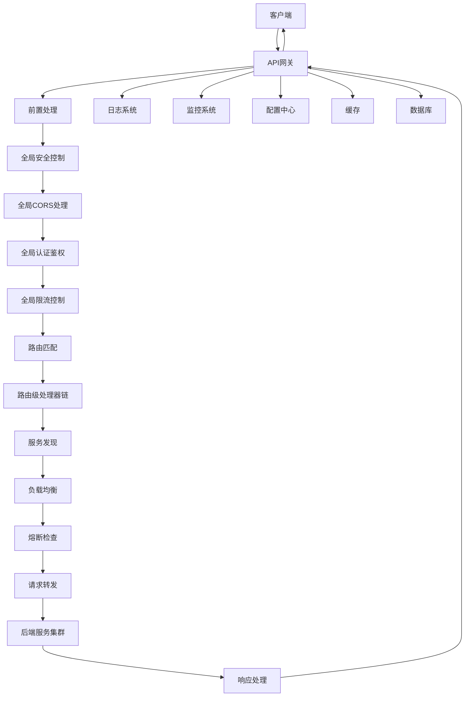

<p align="center">
  <a href="https://www.flux.com.cn/" target="_blank">
    
  </a>
</p>


<p align="center">
  
  
  
  
  
</p>

<p align="center">
  <strong>现代化高性能云原生 API 网关</strong>
</p>

<p align="center">
  FLUX Gateway 是一款基于 Go 语言开发的现代化 API 网关，依托 Go 语言的高性能与简洁特性，集成了路由分发、负载均衡、流量限流、服务熔断及认证授权等核心能力。提供全链路 API 管理可视化功能，助力用户高效管控接口生命周期，为分布式系统构建稳定、安全、可观测的 API 接入层。
</p>

<p align="center">
  <a href="#en">English</a> | <strong>简体中文</strong>
</p>

---

## 🚩 主要特性

- 🚀 高性能路由与负载均衡
- 🔒 多种认证与安全防护[](url)
- 📊 实时监控与可观测性
- 🧩 插件化扩展
- ☁️ 云原生友好

---

## 🖼️ Demo 截图

<p align="center">
  
  
</p>

---

## 🚀 快速开始

```bash
# 克隆项目
git clone https://github.com/your-org/gateway.git
cd gateway

# 安装依赖
go mod download

# 启动网关
go run cmd/app/main.go
```

详细使用说明请参考[快速开始指南](docs/quickstart.md)。

## 🏗️ 架构概览



## 📚 文档导航

| 文档类型 | 描述 | 链接 |
|---------|------|------|
| 🚀 **快速开始** | 5分钟上手指南 | [快速开始](docs/guide/quickstart.md) |
| 🛠️ **安装指南** | 详细的安装和部署说明 | [安装指南](docs/guide/installation.md) |
| 📝 **部署指南** | 详细的部署和运维说明 | [部署指南](docs/guide/deployment.md) |
| ⚙️ **配置手册** | 完整的配置参数说明 | [配置手册](docs/guide/configuration.md) |
| 📖 **用户手册** | 功能使用和最佳实践 | [用户手册](docs/guide/user-guide.md) |
| 🔧 **开发指南** | 开发、构建和测试 | [开发指南](docs/guide/development.md) |
| 🏗️ **架构设计** | 系统架构和设计理念 | [架构设计](docs/guide/architecture.md) |
| 💾 **数据库规范** | 数据库设计规范 | [数据库规范](docs/database/naming-convention.md) |
| 🐞 **调试指南** | 调试技巧和错误处理 | [调试指南](docs/debugging/debugging-guide.md) |
| 🔍 **错误处理** | 错误处理最佳实践 | [错误处理](docs/debugging/error-handling.md) |
| 🛡️ **安全指南** | 安全最佳实践与漏洞报告 | [安全指南](SECURITY.md) |

## 📜 行为准则

请在参与贡献前，务必阅读并遵守我们的[社区行为准则](CODE_OF_CONDUCT.md)。

## 🤝 参与贡献

我们欢迎所有形式的贡献！详细的贡献指南请查看 [CONTRIBUTING.md](CONTRIBUTING.md)。

## ❓ 常见问题

- [FAQ / 常见问题解答](docs/faq.md)

## 📞 联系方式

- 📧 **邮箱**: [gateway@example.com](mailto:gateway@example.com)
- 💬 **GitHub Issues**: [提交问题](https://github.com/your-org/gateway/issues)
- 📱 **微信群**: 扫描下方二维码加入交流群
- 🐧 **QQ群**: 123456789
- 🛡️ **安全报告**: security@yourcompany.com

## 📜 开源协议

本项目使用 [Apache License 2.0](LICENSE) 开源协议。

## ⭐ Star 历史

<p align="center">
  <a href="https://star-history.com/#your-org/gateway">
    
  </a>
</p>

---

## 🙏 致谢与贡献者

感谢 [所有贡献者](https://github.com/your-org/gateway/graphs/contributors) 的付出与支持！

<p align="center">
  <sub>Built with ❤️ by the Gateway team</sub>
</p>
