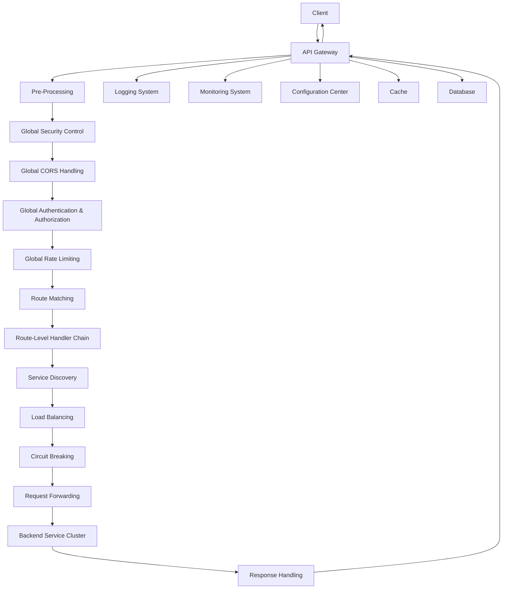

<p align="center">
  <a href="https://www.flux.com.cn/" target="_blank">
    
  </a>
</p>

<p align="center">
  
  
  
  
  
</p>

<p align="center">
  <strong>Modern High-Performance Cloud-Native API Gateway</strong>
</p>

<p align="center">
  FLUX Gateway is a modern API gateway developed in Go, integrating essential features such as routing, load balancing, rate limiting, circuit breaking, and authentication/authorization. It provides full-link API management visualization to help users efficiently manage the API lifecycle, building a stable, secure, and observable API access layer for distributed systems.
</p>

<p align="center">
  <strong>English</strong> | <a href="#zh">简体中文</a>
</p>

---

## 🚩 Key Features

- 🚀 High-performance routing and load balancing
- 🔒 Multiple authentication and security protections
- 📊 Real-time monitoring and observability
- 🧩 Plugin extensibility
- ☁️ Cloud-native friendly

---

## 🖼️ Demo Screenshots

<p align="center">
  
  
</p>

---

## 🚀 Quick Start

```bash
# Clone the repository
git clone https://github.com/your-org/gateway.git
cd gateway

# Install dependencies
go mod download

# Start the gateway
go run cmd/app/main.go
```

Refer to the [Quick Start Guide](docs/quickstart.md) for detailed instructions.

## 🏗️ Architecture Overview



## 📚 Documentation Index

| Type | Description | Link |
|------|-------------|------|
| 🚀 **Quick Start** | 5-Minute Getting Started Guide | [Quick Start](docs/guide/quickstart.md) |
| 🛠️ **Installation Guide** | Detailed installation and deployment instructions | [Installation Guide](docs/guide/installation.md) |
| 📝 **Deployment Guide** | Deployment and operations guide | [Deployment Guide](docs/guide/deployment.md) |
| ⚙️ **Configuration Manual** | Full configuration reference | [Configuration Manual](docs/guide/configuration.md) |
| 📖 **User Guide** | Feature usage and best practices | [User Guide](docs/guide/user-guide.md) |
| 🔧 **Developer Guide** | Development, build, and testing | [Developer Guide](docs/guide/development.md) |
| 🏗️ **Architecture Design** | System architecture and design concepts | [Architecture Design](docs/guide/architecture.md) |
| 💾 **Database Specification** | Database design standards | [Database Specification](docs/database/naming-convention.md) |
| 🐞 **Debugging Guide** | Debugging tips and error handling | [Debugging Guide](docs/debugging/debugging-guide.md) |
| 🔍 **Error Handling** | Error handling best practices | [Error Handling](docs/debugging/error-handling.md) |
| 🛡️ **Security Guide** | Security best practices and vulnerability reporting | [Security Guide](SECURITY.md) |

## 📜 Code of Conduct

Please read and follow our [Code of Conduct](CODE_OF_CONDUCT.md) before contributing.

## 🤝 Contributing

We welcome all contributions! For details, please refer to the [CONTRIBUTING.md](CONTRIBUTING.md).

## ❓ FAQ

- [FAQ](docs/faq.md)

## 📞 Contact

- 📧 **Email**: [gateway@example.com](mailto:gateway@example.com)
- 💬 **GitHub Issues**: [Submit Issues](https://github.com/your-org/gateway/issues)
- 📱 **WeChat Group**: Scan the QR code below to join the community
- 🐧 **QQ Group**: 123456789
- 🛡️ **Security Reports**: security@yourcompany.com

## 📜 License

This project is licensed under the [Apache License 2.0](LICENSE).

## ⭐ Star History

<p align="center">
  <a href="https://star-history.com/#your-org/gateway">
    
  </a>
</p>

---

## 🙏 Acknowledgements & Contributors

Thanks to [all contributors](https://github.com/your-org/gateway/graphs/contributors) for their efforts and support!

<p align="center">
  <sub>Built with ❤️ by the Gateway team</sub>
</p>