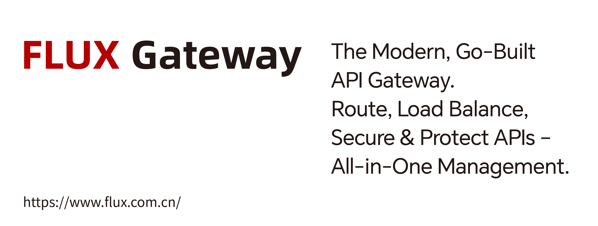
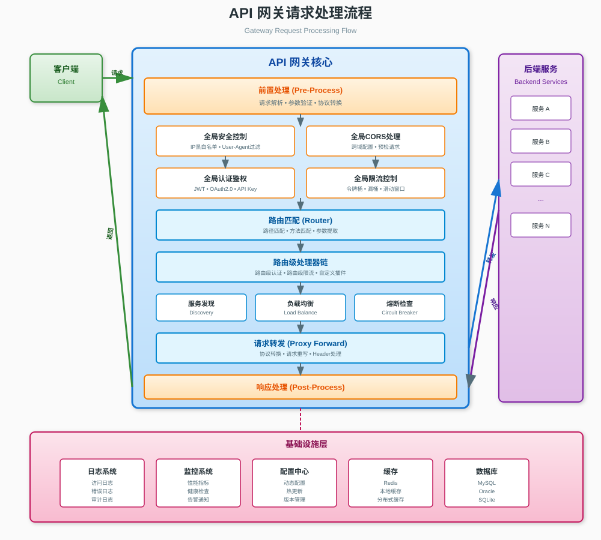
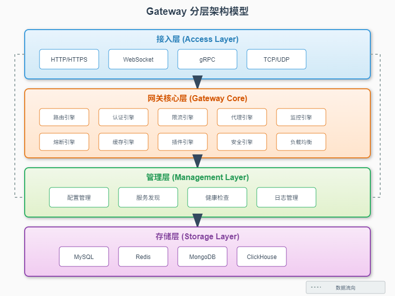
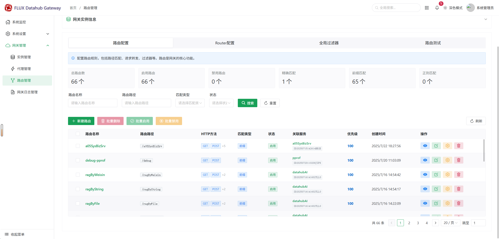
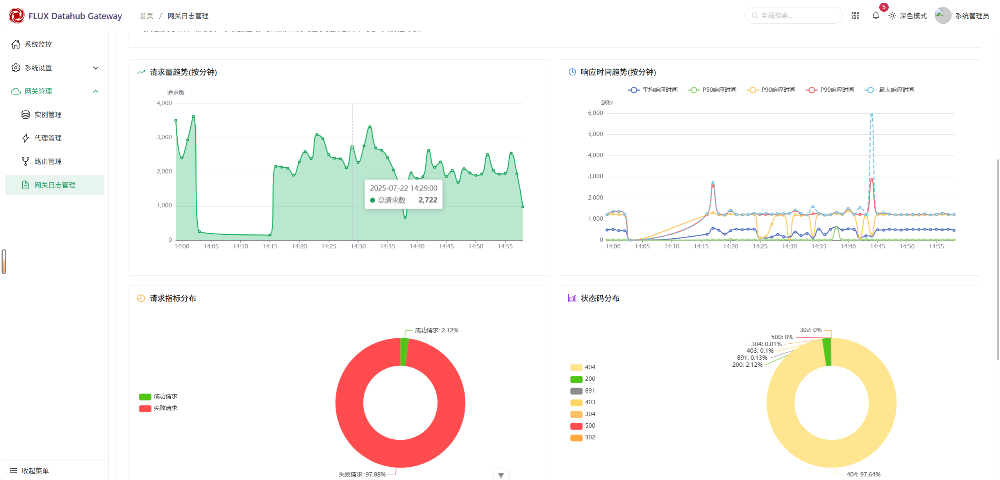

<p align="center">
  <a href="https://www.flux.com.cn/" target="_blank">
    
  </a>
</p>

<p align="center">
  
  
  
</p>

<p align="center">
  <strong>Modern High-Performance Cloud-Native API Gateway</strong>
</p>

<p align="center">
  FLUX Gateway is a modern API gateway developed in Go. Leveraging Go's high performance and simplicity, it integrates core capabilities such as routing, load balancing, rate limiting, circuit breaking, and authentication/authorization. It provides end-to-end API management visualization to help users efficiently manage the API lifecycle, building a stable, secure, and observable API access layer for distributed systems. SQLite is the default; switch to MySQL, Oracle, or ClickHouse in production.
</p>

<p align="center">
  <strong>English</strong> | <a href="README.md">简体中文</a>
  &nbsp;·&nbsp;
  <a href="https://matrix.to/#/#fluxsce/gateway:gitter.im">Chat</a>
</p>

---

**Contents:** [Architecture](#architecture-overview) · [Features](#features) · [Console](#console) · [Quick start](#quick-start) · [Upgrade](#upgrade) · [Documentation](#documentation) · [Contributing](#contributing) · [Contact](#contact)

---

## Architecture Overview

<p align="center">
  
</p>

<p align="center"><sub>Figure 1. Request path: ingress, security, routing, load balancing, circuit breaking, forward</sub></p>

<p align="center">
  
</p>

<p align="center"><sub>Figure 2. Modules: gateway, console, tunnel, and storage</sub></p>

Layered architecture and tunnel design: [Introduction · System Architecture](docs/en/01-introduction.md).

---

## Features

| Area | Description |
|------|-------------|
| Traffic | Routing, load balancing, rate limiting, circuit breaking |
| Security | JWT / OAuth2 / API Key; IP, domain, and User-Agent controls |
| Observability | Web console, access logs, runtime metrics |
| Delivery | Plugins, static hosting; binary, Docker, Kubernetes |

Full capability list: [Introduction](docs/en/01-introduction.md).

---

## Console

<p align="center">
  
</p>

<p align="center"><sub>Figure 3. Route configuration</sub></p>

<p align="center">
  
</p>

<p align="center"><sub>Figure 4. Gateway logs</sub></p>

---

## Quick start

Examples use **3.2.8**. Prefer the latest assets on [GitHub Releases](https://github.com/fluxsce/gateway/releases).

| Item | Value |
|------|-------|
| Console | http://localhost:12003/gatewayweb |
| Default login | `admin` / `123456` (change immediately) |
| Gateway port | `8080` |
| Health | http://localhost:12003/health |

### Docker

The image includes configs, DB scripts, and the frontend. Default database is SQLite.

```bash
docker pull ghcr.io/fluxsce/gateway:3.2.8

docker run -d --name gateway \
  -p 8080:8080 \
  -p 12003:12003 \
  ghcr.io/fluxsce/gateway:3.2.8
```

Mainland China (personal ACR usually requires `docker login`):

```bash
docker pull crpi-25xt72cd1prwdj5s.cn-hangzhou.personal.cr.aliyuncs.com/datahub-images/gateway:3.2.8
```

Compose (MySQL + Redis): [Containerized Deployment](docs/en/04-container-deployment.md).

### Release package

Download from [Releases](https://github.com/fluxsce/gateway/releases). Archive root is `gateway/`.

| File | Platform | Databases |
|------|----------|-----------|
| `gateway-linux-amd64-3.2.8.tar.gz` | Linux amd64 | MySQL / SQLite / ClickHouse |
| `gateway-linux-arm64-3.2.8.tar.gz` | Linux arm64 | same |
| `gateway-windows-amd64-3.2.8.zip` | Windows amd64 | same |
| `gateway-linux-amd64-oracle-3.2.8.tar.gz` | Linux amd64 | above + Oracle |
| `gateway-windows-amd64-oracle-3.2.8.zip` | Windows amd64 | above + Oracle |

```bash
tar -xzf gateway-linux-amd64-3.2.8.tar.gz
cd gateway
./gateway --config ./configs
```

Windows: `gateway.exe --config .\configs`. SQLite file: `scripts/data/gateway.db`. Startup runs scripts under `scripts/db`.

System services: [Installation](docs/en/03-installation.md).

### From source

Requires **Go 1.24+**. SQLite uses `go-sqlite3` (CGO). Windows: install [TDM-GCC](https://jmeubank.github.io/tdm-gcc/download/) and reopen the terminal.

```bash
git clone https://github.com/fluxsce/gateway.git
cd gateway
go mod download
go run cmd/app/main.go --config ./configs
```

Console assets live in `web/frontend/dist` (not committed):

```bash
cd web/frontend
pnpm install
pnpm run dev:vite
```

Vite proxies to `http://127.0.0.1:12003`. Or `pnpm run build` and let the gateway serve `dist`. Full setup: [Development Guide](docs/en/02-quick-start.md).

---

## Upgrade

Example directory: `/opt/gateway`. Back up `database.yaml`, extract, restore that file.

```bash
sudo systemctl stop gateway
sudo cp /opt/gateway/configs/database.yaml /tmp/database.yaml.bak
sudo tar -xzf gateway-linux-amd64-*.tar.gz -C /opt
sudo cp /tmp/database.yaml.bak /opt/gateway/configs/database.yaml
sudo systemctl start gateway
```

Windows and Docker: [Installation](docs/en/03-installation.md), [Containerized Deployment](docs/en/04-container-deployment.md).

---

## Documentation

Indexes: [English](docs/en/README.md) · [中文](docs/zh-CN/README.md)

| Document | Description |
|----------|-------------|
| [Introduction](docs/en/01-introduction.md) | Capabilities, architecture, use cases |
| [First route](docs/en/09-first-route.md) | Console: instance, service, route, reload |
| [Static hosting](docs/en/08-static-hosting.md) | Serve local static sites |
| [FAQ](docs/faq.md) | Ports, login, common errors |
| [Installation](docs/en/03-installation.md) | Packages, services, upgrades |
| [Containerized Deployment](docs/en/04-container-deployment.md) | Docker / Kubernetes |
| [Release pipeline](.github/CI.md) | Artifacts and image tags |
| [Development Guide](docs/en/02-quick-start.md) | Build from source |
| [Database specs](docs/en/05-database-specs.md) | Schema conventions |
| [Debugging](docs/en/06-debugging.md) | Troubleshooting |
| [Error handling](docs/en/07-error-handling.md) | Error conventions |
| [SECURITY.md](SECURITY.md) | Security and vulnerability reports |

---

## Contributing

[Code of Conduct](CODE_OF_CONDUCT.md) · [CONTRIBUTING.md](CONTRIBUTING.md)

## License

[Apache License 2.0](LICENSE)

## Star history

<p align="center">
  <a href="https://star-history.com/#fluxsce/gateway">
    
  </a>
</p>

---

## Contact

Thanks to [all contributors](https://github.com/fluxsce/gateway/graphs/contributors).

- Email: [fluxopensource@flux.com.cn](mailto:fluxopensource@flux.com.cn)
- Issues: [Open an issue](https://github.com/fluxsce/gateway/issues)
- Discussions: [Start a discussion](https://github.com/orgs/fluxsce/discussions)
- WeChat: scan the QR code below

<table width="100%">
  <tr>
    <td align="center" valign="top" width="50%">
      
      <br>WeCom
    </td>
    <td align="center" valign="top" width="50%">
      
      <br>WeChat
    </td>
  </tr>
</table>

<p align="center">
  <sub>Built by the Gateway team</sub>
</p>
