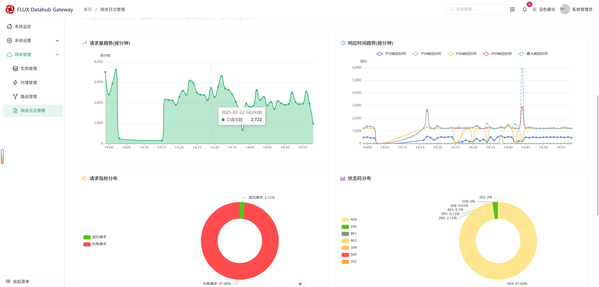

<p align="center">
  <a href="https://www.flux.com.cn/" target="_blank">
    
  </a>
</p>

<p align="center">
  
  
  
  
  
</p>

<p align="center">
  <strong>Modern High-Performance Cloud-Native API Gateway</strong>
</p>

<p align="center">
  FLUX Gateway is a modern API gateway developed in Go. Leveraging Go&#39;s high performance and simplicity, it integrates core capabilities such as routing, load balancing, rate limiting, circuit breaking, and authentication/authorization. It provides end-to-end API management visualization to help users efficiently manage the API lifecycle, building a stable, secure, and observable API access layer for distributed systems.
</p>

<p align="center">
  <strong>English</strong> | <a href="README.md">简体中文</a>
</p>

<p align="center">
  <a href="https://matrix.to/#/#fluxsce/gateway:gitter.im">
    
  </a>
</p>

---

## 🚩 Key Features

- 🚀 High-performance routing and load balancing
- 🔒 Multiple authentication and security protections
- 📊 Real-time monitoring and observability
- 🧩 Plugin-based extensibility
- ☁️ Cloud-native friendly

---

## 🖼️ Demo Screenshots

<p align="center">
  
  
</p>

---

## 🚀 Quick Start

### Environment Preparation

#### Special Note for Windows Users

This project depends on CGO. Windows users need to install a C compiler first:

1. Download and install TDM-GCC
   - Visit: https://jmeubank.github.io/tdm-gcc/download/
   - Recommended: `tdm64-gcc-10.3.0-2.exe` (64+32-bit MinGW-w64 version)
   - After installation, reopen your terminal

2. Configure Go proxy (recommended for mainland China users)
   ```bash
   go env -w GOPROXY=https://goproxy.cn
   ```

#### Startup Steps

```bash
# Clone the repository
git clone https://github.com/fluxsce/gateway.git
cd gateway

# Install dependencies
go mod download

# Start the gateway
go run cmd/app/main.go
```

**Access Console**
- Browser: http://localhost:12003/gatewayweb
- Default Username: `admin`
- Default Password: `123456`

---

## 🏗️ Architecture Overview


## 📚 Documentation Navigation

| Chapter | Document | Description |
|---------|----------|-------------|
| 📖 | **[Complete Documentation](docs/en/README.md)** | View all English documentation |
| 01 | [Project Introduction](docs/en/01-introduction.md) | Understand core capabilities, system architecture, and use cases |
| 02 | [Development Guide](docs/en/02-quick-start.md) | Development environment setup, project structure, and quick start |
| 03 | [Installation & Deployment](docs/en/03-installation.md) | Detailed installation and deployment steps |
| 04 | [Containerized Deployment](docs/en/04-container-deployment.md) | Docker and Kubernetes containerized deployment |
| 05 | [Database Specifications](docs/en/05-database-specs.md) | Database design specifications and best practices |
| 06 | [Debugging Guide](docs/en/06-debugging.md) | Debugging techniques, performance analysis, and troubleshooting |
| 07 | [Error Handling](docs/en/07-error-handling.md) | Error handling mechanisms and best practices |
| 🛡️ | [Security Guide](SECURITY.md) | Security best practices and vulnerability reporting |

## 📜 Code of Conduct

Please read and follow our [Code of Conduct](CODE_OF_CONDUCT.md) before contributing.

## 🤝 Contributing

We welcome all contributions! For details, please refer to the [CONTRIBUTING.md](CONTRIBUTING.md).

## ❓ FAQ

- [FAQ](docs/faq.md)

## 📜 License

This project is licensed under the [Apache License 2.0](LICENSE).

## ⭐ Star History

<p align="center">
  <a href="https://star-history.com/#fluxsce/gateway">
    
  </a>
</p>

---

## 🙏 Acknowledgements & Contributors

Thanks to [all contributors](https://github.com/fluxsce/gateway/graphs/contributors) for their efforts and support!
## 📞 Contact

- 📧 **Email**: [fluxopensource@flux.com.cn](mailto:fluxopensource@flux.com.cn)
- 💬 **GitHub Issues**: [Open an issue](https://github.com/fluxsce/gateway/issues)
- 💬 **GitHub Discussion**: [Start a discussion](https://github.com/orgs/fluxsce/discussions)
- 📱 **WeChat Group**: Scan the QR code below to join the community

<table align="left" style="border: none; border-collapse: collapse;"> <tr> <td style="text-align: center; padding: 200px; border: none;">  </td> <td style="text-align: center; padding: 200px; border: none;">  </td> </tr> </table>
<br></br>
<br></br>
<br></br>
<br></br>
<br></br>
<br></br>
<br></br>
<br></br>
<br></br>
<p align="center">
  <sub>Built with ❤️ by the Gateway team</sub>
</p>
