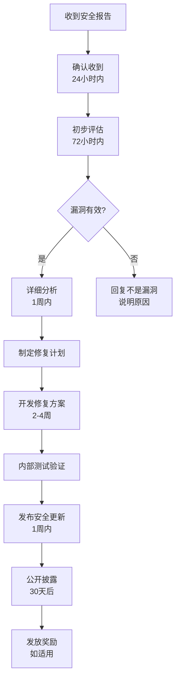

# GoHub 安全政策

## 🛡️ 支持的版本

我们积极维护并提供安全更新的 GoHub 版本：

| 版本 | 支持状态 |
| --- | --- |
| 2.x.x | ✅ 完全支持 |
| 1.x.x | ✅ 安全补丁支持 |
| 0.x.x | ❌ 不再支持 |

**说明：**
- **完全支持**：提供新功能、bug修复和安全补丁
- **安全补丁支持**：仅提供关键安全漏洞的修复
- **不再支持**：不提供任何更新，建议尽快升级

## 🚨 安全漏洞报告

### 报告渠道

如果您发现了 GoHub 的安全漏洞，**请不要公开披露**，而是通过以下私密渠道报告：

#### 主要联系方式
- **邮箱**: [security@example.com](mailto:security@example.com)
- **加密邮箱**: [使用 PGP 加密发送](mailto:security@example.com)
  - PGP 公钥: [下载链接]
  - 密钥指纹: `XXXX XXXX XXXX XXXX XXXX XXXX XXXX XXXX`

#### 备用联系方式
- **私人邮件**: [admin@example.com](mailto:admin@example.com)
- **GitHub Security Advisory**: [创建私密报告](https://github.com/your-org/gohub/security/advisories/new)

### 报告内容

请在安全报告中包含以下信息：

#### 🔍 漏洞描述
- **漏洞类型**：[例如：SQL注入、XSS、权限绕过等]
- **影响范围**：[哪些组件或功能受影响]
- **严重程度**：[您认为的严重程度等级]

#### 📋 环境信息
- **GoHub 版本**：[具体版本号]
- **操作系统**：[OS类型和版本]
- **Go 版本**：[Go版本]
- **部署环境**：[Docker、Kubernetes、裸机等]

#### 🔬 技术详情
- **漏洞位置**：[文件路径、函数名称、代码行数]
- **触发条件**：[什么情况下漏洞会被触发]
- **攻击向量**：[攻击者如何利用此漏洞]
- **影响评估**：[成功利用后的潜在影响]

#### 🧪 重现步骤
```
1. 第一步操作...
2. 第二步操作...
3. 观察到的结果...
```

#### 💡 修复建议
如果您有修复建议，请一并提供：
- 建议的修复方案
- 相关的代码补丁（如有）
- 缓解措施建议

### 奖励计划

我们感谢安全研究人员的贡献，并提供以下奖励：

| 严重程度 | 奖励金额 | 说明 |
|---------|---------|------|
| 🔴 **严重** | $500-1000 | 可远程执行代码、权限提升等 |
| 🟡 **高危** | $200-500 | 数据泄露、认证绕过等 |
| 🟠 **中危** | $100-200 | 信息泄露、拒绝服务等 |
| 🟢 **低危** | $50-100 | 配置问题、轻微信息泄露等 |

**注意事项：**
- 奖励基于漏洞的实际影响和质量确定
- 重复报告不予奖励
- 恶意测试不予奖励

## ⚡ 响应流程

### 响应时间承诺

| 阶段 | 承诺时间 | 说明 |
|-----|---------|------|
| **确认收到** | 24小时内 | 确认收到您的报告 |
| **初步评估** | 72小时内 | 评估漏洞的有效性和严重程度 |
| **详细分析** | 1周内 | 完成技术分析和影响评估 |
| **修复开发** | 2-4周 | 根据严重程度确定修复时间 |
| **发布修复** | 修复完成后1周内 | 发布安全更新 |

### 处理流程



### 沟通原则

- **保密性**：在修复发布前，我们不会公开披露漏洞详情
- **透明性**：我们会及时向报告者反馈处理进展
- **协作性**：欢迎报告者参与修复验证过程

## 🔒 安全最佳实践

### 对于用户

#### 🚀 部署安全
- **使用最新版本**：始终使用最新的稳定版本
- **及时更新**：订阅安全通知，及时应用安全补丁
- **环境隔离**：在隔离的环境中部署，限制网络访问
- **权限最小化**：使用最小必要权限运行服务

#### 🔐 配置安全
- **强密码策略**：使用强密码和密钥管理
- **HTTPS 强制**：在生产环境中强制使用 HTTPS
- **访问控制**：配置适当的访问控制和防火墙规则
- **日志监控**：启用安全日志并定期检查

#### 📊 监控安全
- **异常监控**：监控异常登录和API调用
- **资源监控**：监控系统资源使用情况
- **安全扫描**：定期进行安全扫描和漏洞评估

### 对于开发者

#### 💻 开发安全
- **安全编码**：遵循安全编码最佳实践
- **依赖管理**：定期更新依赖包，检查已知漏洞
- **代码审查**：所有代码变更都要进行安全审查
- **静态分析**：使用静态代码分析工具检查安全问题

#### 🧪 测试安全
- **安全测试**：编写安全相关的测试用例
- **渗透测试**：定期进行渗透测试
- **模糊测试**：对关键组件进行模糊测试

## 📢 安全公告

### 订阅通知

订阅安全更新通知：

- **GitHub Watch**: 关注项目并启用安全通知
- **邮件列表**: [订阅安全邮件列表](mailto:security-subscribe@example.com)
- **RSS 订阅**: [安全公告 RSS](https://example.com/security.rss)
- **官方博客**: [关注官方博客](https://blog.example.com)

### 历史公告

查看历史安全公告：
- [GitHub Security Advisories](https://github.com/your-org/gohub/security/advisories)
- [CVE 数据库记录](https://cve.mitre.org/)

## 🛠️ 安全工具

### 自动化扫描

我们使用以下工具进行自动化安全扫描：

- **Static Analysis**: CodeQL, SonarQube
- **Dependency Scan**: Dependabot, Snyk
- **Container Scan**: Trivy, Clair
- **SAST/DAST**: 定期进行静态和动态安全测试

### 第三方审计

- **年度安全审计**：由第三方安全公司进行
- **漏洞奖励计划**：持续的社区安全测试
- **合规性检查**：定期进行合规性评估

## 🤝 安全社区

### 贡献安全

欢迎社区参与安全建设：

- **安全代码审查**：参与代码审查，关注安全问题
- **安全测试**：编写和改进安全测试用例
- **文档改进**：改进安全相关文档
- **最佳实践分享**：分享安全部署和配置经验

### 安全讨论

- **GitHub Discussions**: [安全话题讨论](https://github.com/your-org/gohub/discussions)
- **社区论坛**: [加入安全讨论组]
- **技术分享**: 定期举办安全主题技术分享

## 📞 联系信息

### 安全团队

- **安全负责人**: [Name] <[email]>
- **技术负责人**: [Name] <[email]>
- **社区经理**: [Name] <[email]>

### 紧急联系

对于严重安全问题的紧急联系：
- **电话**: [电话号码] (工作时间)
- **紧急邮箱**: [emergency@example.com]
- **即时通讯**: [相关联系方式]

---

## 📋 附录

### 版本历史

| 版本 | 更新日期 | 变更内容 |
|-----|---------|---------|
| 1.0 | 2024-01-01 | 初始版本 |

### 相关资源

- [OWASP 安全指南](https://owasp.org/)
- [CVE 数据库](https://cve.mitre.org/)
- [国家信息安全漏洞库](https://www.cnnvd.org.cn/)

**感谢您帮助保护 GoHub 和用户的安全！** 🛡️ 