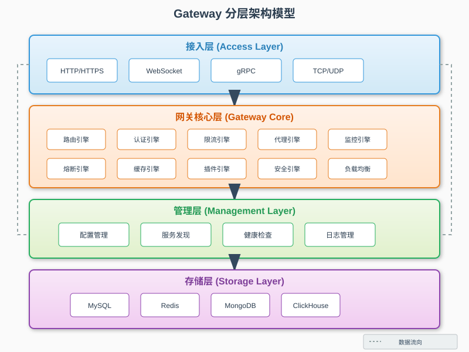
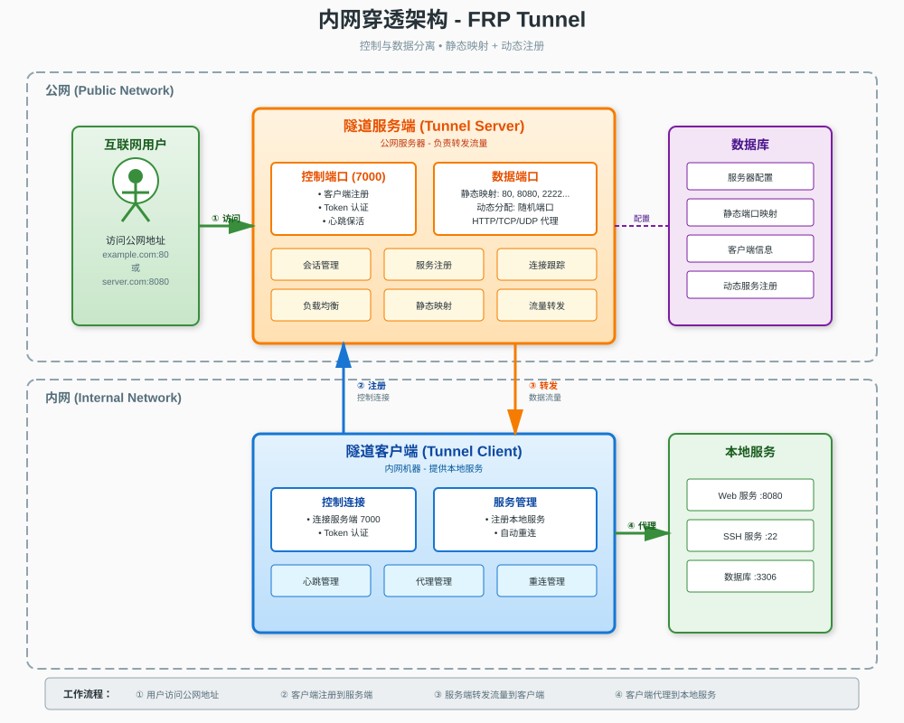

# FLUX Gateway - Project Introduction

## Overview

FLUX Gateway is a powerful enterprise-grade microservice governance platform that integrates three core capabilities: **High-Performance API Gateway**, **Network Penetration Service**, and **Service Registration Management Platform**, providing comprehensive access layer solutions for modern distributed systems.

## Core Capabilities

### API Gateway

A modern API gateway developed in Go, providing enterprise-grade traffic management and service governance capabilities.

#### Core Features

- **High-Performance Routing**
  - High concurrency based on Go goroutines
  - Millisecond-level response

- **⚖️ Intelligent Load Balancing**
  - Round Robin
  - Weighted Round Robin
  - Least Connection
  - Consistent Hash
  - IP Hash

- **🔒 Security Protection**
  - JWT Authentication
  - OAuth2.0 Authorization
  - API Key Authentication
  - IP Whitelist/Blacklist
  - User-Agent Filtering
  - Domain Access Control
  - API Access Control

- **🛡️ Traffic Control**
  - Token Bucket Rate Limiting
  - Leaky Bucket Rate Limiting
  - Fixed Window Rate Limiting
  - Sliding Window Rate Limiting
  - Distributed Rate Limiting

- **⚡ Circuit Breaking & Degradation**
  - Automatic Fault Detection
  - Service Circuit Breaking Protection
  - Degradation Strategy Configuration
  - Fast Fail Mechanism

- **🌐 CORS Support**
  - Flexible CORS Configuration
  - Multi-Domain Support
  - Preflight Request Optimization

#### Use Cases

- **Microservice Gateway**: Unified API entry and routing management
- **API Management Platform**: Complete API lifecycle management
- **Traffic Control Center**: Fine-grained traffic management and rate limiting
- **Security Gateway**: Enterprise-grade security protection and authentication

---

### Network Penetration (Tunnel)

An intranet penetration solution based on FRP (Fast Reverse Proxy) architecture, supporting secure penetration of multiple protocols.

#### Core Features

- **🔌 Multi-Protocol Support**
  - TCP Protocol Penetration
  - UDP Protocol Penetration
  - HTTP/HTTPS Protocol Penetration
  - STCP (Secure TCP)
  - SUDP (Secure UDP)
  - XTCP (Peer-to-Peer TCP)

- **🎛️ Flexible Configuration**
  - Static Port Mapping
  - Dynamic Port Allocation
  - Custom Domain Binding
  - Subdomain Support
  - Virtual Host Configuration

- **🔐 Security Mechanisms**
  - Token Authentication
  - TLS Encrypted Transmission
  - End-to-End Encryption
  - Access Control List

- **📊 Monitoring & Management**
  - Real-time Connection Monitoring
  - Traffic Statistics Analysis
  - Session Management
  - Health Checks

- **🔄 High Availability**
  - Automatic Reconnection
  - Heartbeat Keep-Alive
  - Connection Pool Management
  - Load Balancing

#### Use Cases

- **Remote Work**: Secure access to intranet development environments
- **Device Management**: Remote management of intranet devices and servers
- **Temporary Demo**: Quickly expose local services to the public network
- **WeChat Development**: Local debugging of WeChat official accounts and mini-programs
- **IoT Access**: Remote access and management of IoT devices

---

### Service Registry

Provides complete service registration, discovery, and governance capabilities, supporting multiple service registries.

#### Core Features

- **📝 Service Registration**
  - Automatic Service Registration
  - Manual Service Registration
  - Batch Service Import
  - Service Metadata Management

- **🔍 Service Discovery**
  - Real-time Service Discovery
  - Health Status Check
  - Service Version Management
  - Grayscale Release Support

- **💾 Registry Integration**
  - Consul Integration
  - Etcd Integration
  - Nacos Integration
  - Eureka Integration
  - Zookeeper Integration

- **🎯 Service Governance**
  - Service Group Management
  - Service Tag Management
  - Service Weight Configuration
  - Service Routing Strategy

- **📊 Monitoring & Alerting**
  - Service Health Monitoring
  - Instance Status Monitoring
  - Call Chain Tracing
  - Exception Alert Notification

#### Use Cases

- **Microservice Architecture**: Service registration, discovery, and governance
- **Container Orchestration**: Integration with Kubernetes, Docker Swarm
- **Multi-Cloud Deployment**: Unified management of cross-cloud services
- **Service Mesh**: Integration with Service Mesh

---

## System Architecture

Overview diagrams (request path, module model) are in the root [README_EN.md](../../README_EN.md#architecture-overview). The figures below cover layering and the tunnel.

### Overall Architecture

  

Figure 1. Layers: access, gateway core, management, storage

FLUX Gateway adopts a layered architecture design, divided into four layers from bottom to top:

- **Access Layer**: Supports multiple protocols including HTTP/HTTPS, WebSocket, gRPC, TCP/UDP
- **Gateway Core Layer**: Contains core engines such as routing, authentication, rate limiting, proxy, monitoring, circuit breaking, caching, plugins, security, and load balancing
- **Management Layer**: Provides configuration management, service discovery, health checks, log management, and other management functions
- **Storage Layer**: Supports multiple storage systems including MySQL, Redis, MongoDB, ClickHouse

### Tunnel Architecture

  

Figure 2. Tunnel: control plane and data plane

#### Working Principle

FLUX Gateway's intranet penetration is based on FRP architecture design, adopting a **control and data separation** mode:

**① Server (Public Network)**
- **Control Port (7000)**: Accepts client registration, Token authentication, heartbeat keep-alive
- **Data Ports**: 
  - Static mapping ports (e.g., 80, 8080, 2222) - Pre-configured fixed ports
  - Dynamic allocation ports - Dynamically allocated when clients register
- **Core Components**: Session management, service registration, connection tracking, load balancing, static mapping, traffic forwarding

**② Client (Intranet)**
- **Control Connection**: Connects to server port 7000 for Token authentication and service registration
- **Service Management**: Register local services, automatic reconnection, heartbeat keep-alive
- **Proxy Forwarding**: Receives traffic forwarded by the server and proxies it to local services

**③ Penetration Flow**
1. Client connects to server through control port, completes authentication and service registration
2. User accesses public network address (e.g., example.com:80)
3. Server forwards user request to corresponding client through control connection
4. Client proxies traffic to local service (e.g., localhost:8080)
5. Response data returns along the same path, completing intranet penetration

#### Supported Modes

- **Static Port Mapping**: Pre-configure fixed port mapping relationships in the database
- **Dynamic Service Registration**: Clients dynamically register services at startup, server allocates ports
- **Multi-Protocol Support**: HTTP/HTTPS, TCP, UDP, WebSocket, and other protocols

## Target Audience

### Development Teams
- Development teams with microservice architecture
- Project teams requiring API gateway
- Developers needing intranet penetration

### Operations Teams
- Operations teams requiring unified traffic management
- Operations personnel needing service governance
- SRE teams requiring monitoring and alerting

### Enterprise Users
- Small and medium-sized internet companies
- Traditional enterprises undergoing digital transformation
- Enterprises requiring hybrid cloud deployment

## Version

- **Current version**: 3.3.2
- **Go**: 1.24+
- **License**: Apache License 2.0

## Related docs

- [Development Guide](./02-quick-start.md) - Development environment setup and quick start
- [Installation & Deployment](./03-installation.md) - Detailed installation and deployment guide
- [Containerized Deployment](./04-container-deployment.md) - Docker and Kubernetes deployment

## Community

- 📧 Email: fluxopensource@flux.com.cn
- 💬 GitHub Issues: [Submit Issue](https://github.com/fluxsce/gateway/issues)

---

**[Back to Home](../../README.md) • [中文版本](../zh-CN/01-项目介绍.md)**

Made with ❤️ by FLUX Gateway Team

