# System Architecture

This document describes the overall architecture and design principles of the Gateway API Gateway, providing insights into its internal components, data flow, and design decisions.

## 🏗️ Architecture Overview

Gateway is designed as a cloud-native, high-performance API gateway built with Go. It follows modern software architecture principles including modularity, scalability, and observability.

### High-Level Architecture

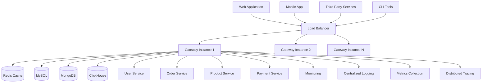

### Core Principles

1. **High Performance**: Optimized for low latency and high throughput
2. **Scalability**: Horizontal scaling with stateless design
3. **Reliability**: Circuit breakers, health checks, and failover mechanisms
4. **Security**: Multiple authentication methods and security policies
5. **Observability**: Comprehensive monitoring, logging, and tracing
6. **Extensibility**: Plugin architecture for custom functionality

## 🔧 Component Architecture

### Internal Components

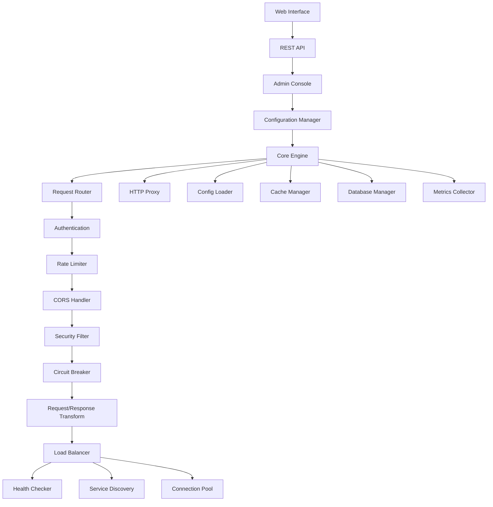

## 📊 Data Flow Architecture

### Request Processing Flow

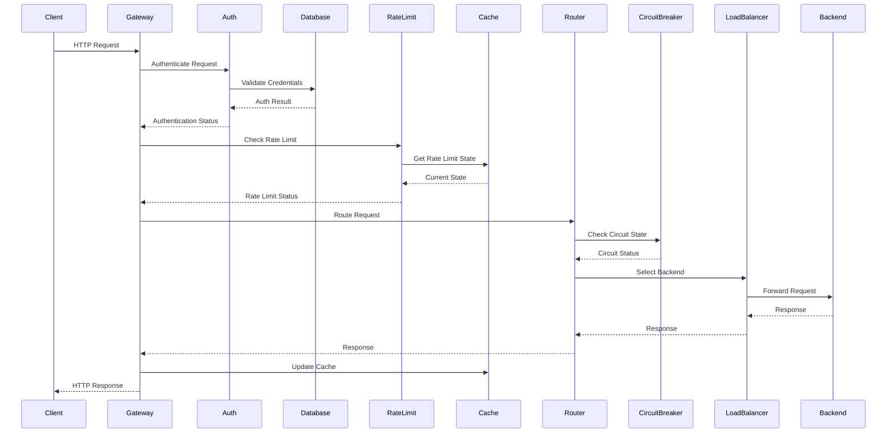

### Configuration Loading Flow

## 🏛️ Layered Architecture

### Presentation Layer
- **Web Interface**: React-based management console
- **REST API**: Management and configuration API
- **CLI Interface**: Command-line tools
- **Metrics Endpoints**: Prometheus metrics and health checks

### Application Layer
- **Request Router**: Path-based and rule-based routing
- **Middleware Pipeline**: Authentication, rate limiting, CORS, etc.
- **Proxy Engine**: HTTP request forwarding and response handling
- **Configuration Manager**: Dynamic configuration loading and validation

### Service Layer
- **Authentication Service**: JWT, OAuth2, API key authentication
- **Rate Limiting Service**: Token bucket and sliding window algorithms
- **Circuit Breaker Service**: Failure detection and recovery
- **Load Balancing Service**: Multiple algorithms for traffic distribution
- **Health Check Service**: Backend service monitoring
- **Cache Service**: Response and session caching

### Data Access Layer
- **Database Abstraction**: Multi-database support (MySQL, MongoDB, etc.)
- **Cache Abstraction**: Redis and in-memory caching
- **Configuration Storage**: File-based and database configuration
- **Metrics Storage**: Time-series data for monitoring

### Infrastructure Layer
- **Logging**: Structured logging with multiple outputs
- **Monitoring**: Metrics collection and alerting
- **Tracing**: Distributed request tracing
- **Security**: TLS/SSL, encryption, and security policies

## 🔄 Processing Pipeline

### Request Processing Pipeline

```mermaid
graph LR
    A[Request Received] --> B[Parse Request]
    B --> C[Create Context]
    C --> D[Apply Pre-Filters]
    
    D --> E[Extract Credentials]
    E --> F[Validate Authentication]
    F --> G[Load User Context]
    
    G --> H[Check Permissions]
    H --> I[Apply Security Policies]
    I --> J[Rate Limit Check]
    
    J --> K[Match Route]
    K --> L[Apply Route Filters]
    L --> M[Transform Request]
    
    M --> N[Select Backend]
    N --> O[Circuit Breaker Check]
    O --> P[Forward Request]
    
    P --> Q[Receive Response]
    Q --> R[Transform Response]
    R --> S[Apply Response Filters]
    S --> T[Send to Client]
```

### Middleware Chain Processing

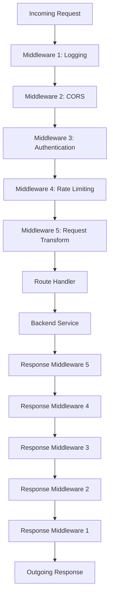

## 💾 Data Architecture

### Configuration Management

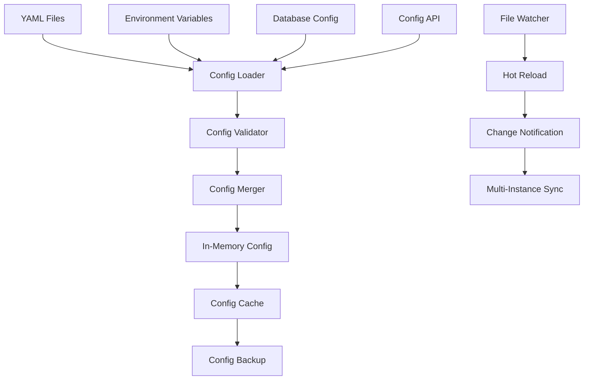

### Caching Architecture

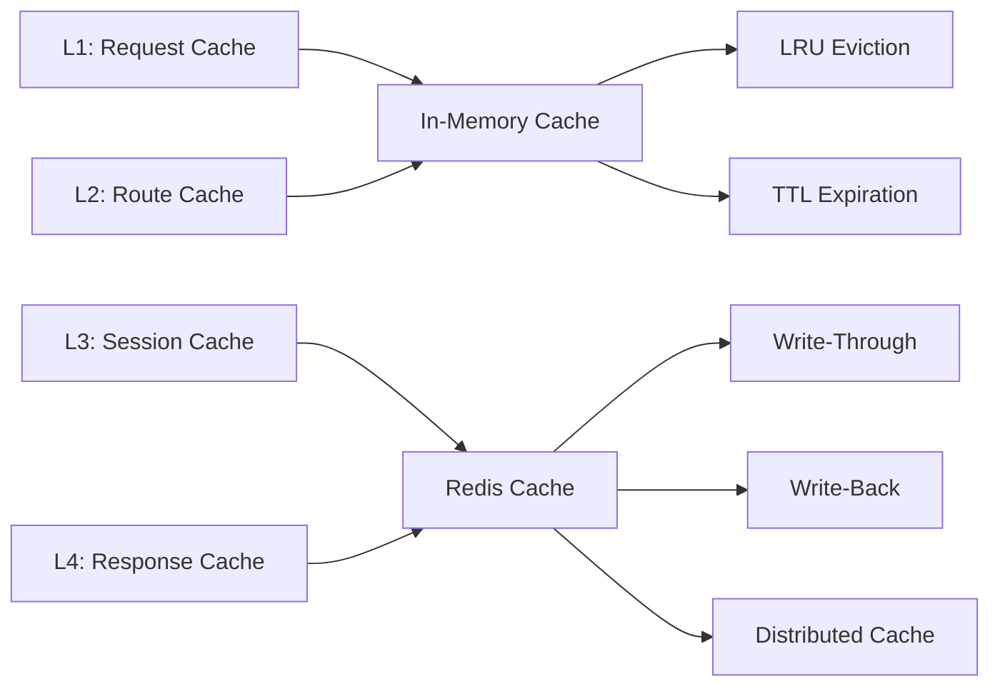

## 🌐 Scalability Architecture

### Horizontal Scaling

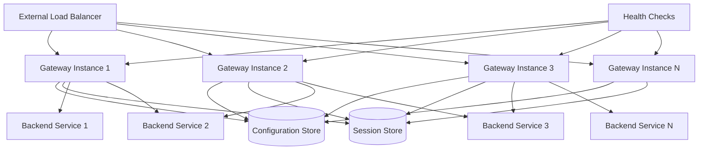

### Auto-Scaling Strategy

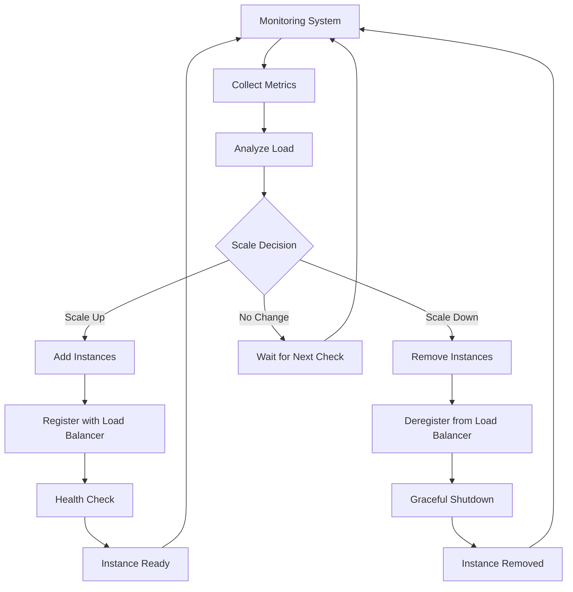

## 🔒 Security Architecture

### Security Layers

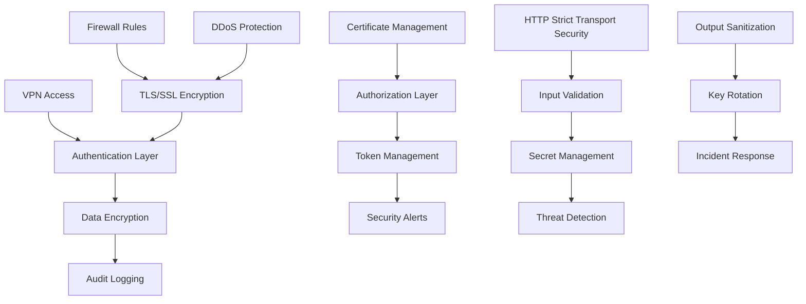

## 📊 Monitoring Architecture

### Observability Stack

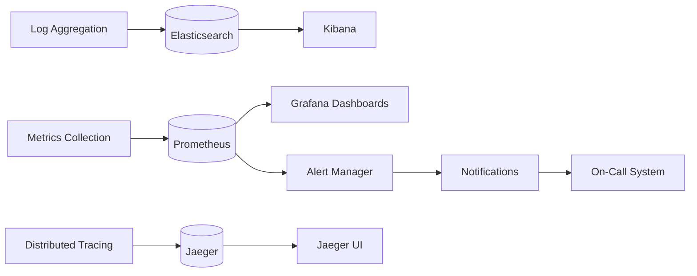

### Metrics Collection Flow

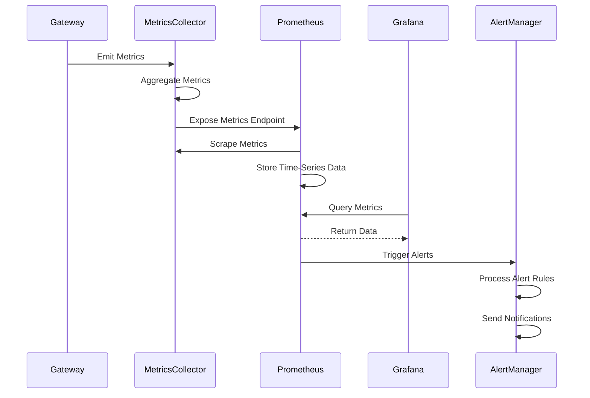

## 🏗️ Deployment Architecture

### Container Architecture

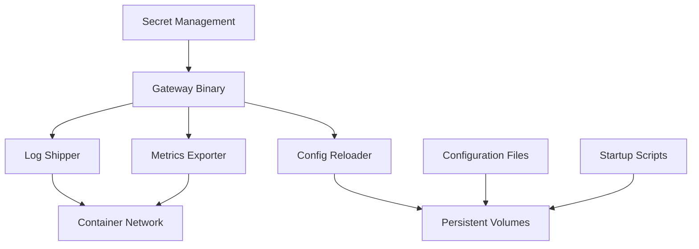

### Kubernetes Deployment

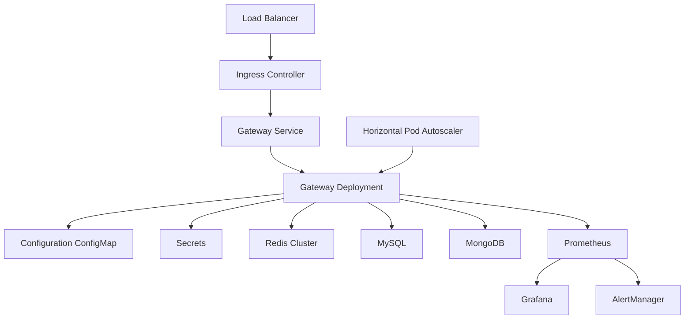

## 🔧 Technology Stack

### Core Technologies

| Component | Technology | Purpose |
|-----------|------------|---------|
| **Language** | Go 1.24+ | High-performance runtime |
| **Web Framework** | Gin | HTTP routing and middleware |
| **Configuration** | Viper | Configuration management |
| **Database** | GORM | ORM and database abstraction |
| **Caching** | go-redis | Redis client |
| **Metrics** | Prometheus | Metrics collection |
| **Logging** | Zap | Structured logging |
| **Testing** | Testify | Unit and integration testing |

### External Dependencies

| Service | Purpose | Alternatives |
|---------|---------|-------------|
| **MySQL** | Primary database | PostgreSQL, Oracle |
| **Redis** | Caching and sessions | Memcached, In-memory |
| **MongoDB** | Document storage | CouchDB, DynamoDB |
| **ClickHouse** | Analytics database | BigQuery, Snowflake |
| **Prometheus** | Metrics storage | InfluxDB, DataDog |
| **Jaeger** | Distributed tracing | Zipkin, AWS X-Ray |

## 📈 Performance Characteristics

### Benchmarks

| Metric | Value | Conditions |
|--------|-------|------------|
| **Requests/Second** | 50,000+ | 2 CPU, 4GB RAM |
| **Latency (P99)** | < 1ms | Local backend |
| **Latency (P99)** | < 50ms | Network backend |
| **Memory Usage** | < 100MB | Idle state |
| **CPU Usage** | < 5% | Idle state |
| **Concurrent Connections** | 10,000+ | Keep-alive enabled |

### Scalability Limits

| Resource | Limit | Bottleneck |
|----------|-------|------------|
| **Connections** | 100K+ | OS file descriptors |
| **Memory** | 8GB+ | Available RAM |
| **CPU** | 32+ cores | Go scheduler |
| **Network** | 10Gbps+ | Network interface |
| **Storage I/O** | 1000+ IOPS | Disk performance |

## 🔮 Future Architecture

### Planned Enhancements

1. **Plugin Architecture**: Dynamic plugin loading and management
2. **Service Mesh Integration**: Istio and Linkerd compatibility
3. **Edge Computing**: CDN integration and edge deployment
4. **AI/ML Integration**: Intelligent routing and threat detection
5. **GraphQL Support**: Native GraphQL proxy and transformation
6. **gRPC Support**: Full gRPC proxy with load balancing

### Roadmap

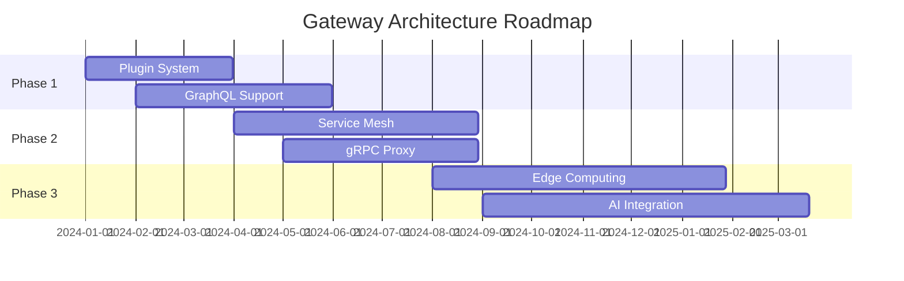

---

## 🔗 Related Documentation

- [Development Guide](development.md) - Development environment setup
- [Deployment Guide](deployment.md) - Production deployment strategies
- [Configuration Guide](configuration.md) - Configuration reference
- [API Reference](api-reference.md) - API documentation
- [Performance Tuning](advanced/performance.md) - Performance optimization

---

This architecture document is maintained by the Gateway development team and is updated regularly to reflect the current system design and future plans. 