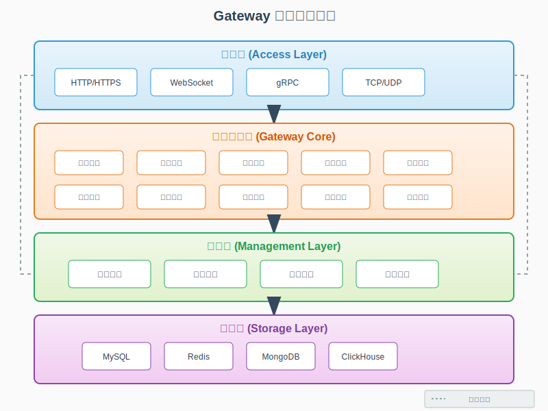

# FLUX Gateway - 项目介绍

## 📖 概述

FLUX Gateway 是一款功能强大的企业级微服务治理平台，集成了**高性能 API 网关**、**网络穿透服务**和**服务注册管理平台**三大核心能力，为现代分布式系统提供全方位的接入层解决方案。

## 🎯 核心能力

### 1️⃣ 高性能 API 网关

基于 Go 语言开发的现代化 API 网关，提供企业级的流量管理和服务治理能力。

#### 核心特性

- **🚀 高性能路由**
  - 基于 Go 协程的高并发处理能力
  - 毫秒级响应时间
  - 支持百万级 QPS

- **⚖️ 智能负载均衡**
  - 轮询（Round Robin）
  - 加权轮询（Weighted Round Robin）
  - 最少连接（Least Connection）
  - 一致性哈希（Consistent Hash）
  - IP Hash

- **🔒 安全防护**
  - JWT 认证
  - OAuth2.0 授权
  - API Key 认证
  - IP 白名单/黑名单
  - User-Agent 过滤
  - 域名访问控制
  - API 访问控制

- **🛡️ 流量控制**
  - 令牌桶限流
  - 漏桶限流
  - 固定窗口限流
  - 滑动窗口限流
  - 分布式限流

- **⚡ 熔断降级**
  - 自动故障检测
  - 服务熔断保护
  - 降级策略配置
  - 快速失败机制

- **🌐 CORS 跨域**
  - 灵活的跨域配置
  - 支持多域名配置
  - 预检请求优化

#### 应用场景

- **微服务网关**：统一的 API 入口和路由管理
- **API 管理平台**：完整的 API 生命周期管理
- **流量控制中心**：精细化的流量管理和限流
- **安全网关**：企业级的安全防护和认证授权

---

### 2️⃣ 网络穿透服务（FRP Tunnel）

基于 FRP（Fast Reverse Proxy）架构设计的内网穿透解决方案，支持多种协议的安全穿透。

#### 核心特性

- **🔌 多协议支持**
  - TCP 协议穿透
  - UDP 协议穿透
  - HTTP/HTTPS 协议穿透
  - STCP（安全 TCP）
  - SUDP（安全 UDP）
  - XTCP（点对点 TCP）

- **🎛️ 灵活配置**
  - 静态端口映射
  - 动态端口分配
  - 自定义域名绑定
  - 子域名支持
  - 虚拟主机配置

- **🔐 安全机制**
  - Token 认证
  - TLS 加密传输
  - 端到端加密
  - 访问控制列表

- **📊 监控管理**
  - 实时连接监控
  - 流量统计分析
  - 会话管理
  - 健康检查

- **🔄 高可用性**
  - 自动重连机制
  - 心跳保活
  - 连接池管理
  - 负载均衡

#### 应用场景

- **远程办公**：安全访问内网开发环境
- **设备管理**：远程管理内网设备和服务器
- **临时演示**：快速将本地服务暴露到公网
- **微信开发**：本地调试微信公众号和小程序
- **IoT 接入**：物联网设备的远程访问和管理

#### 架构组件

```
┌─────────────────────────────────────────────────────────┐
│                    隧道管理系统                          │
├─────────────────────────────────────────────────────────┤
│                                                         │
│  ┌──────────────┐      ┌──────────────┐               │
│  │ 隧道服务器    │      │ 隧道客户端    │               │
│  │ (控制端口)    │◄────►│ (动态连接)    │               │
│  └──────────────┘      └──────────────┘               │
│         │                      │                       │
│         │                      │                       │
│  ┌──────▼──────┐      ┌───────▼──────┐               │
│  │ 服务器节点   │      │ 服务配置     │               │
│  │ (静态映射)   │      │ (动态注册)   │               │
│  └─────────────┘      └──────────────┘               │
│         │                      │                       │
│         └──────────┬───────────┘                       │
│                    │                                   │
│         ┌──────────▼──────────┐                       │
│         │   连接会话管理       │                       │
│         │   流量监控统计       │                       │
│         └─────────────────────┘                       │
└─────────────────────────────────────────────────────────┘
```

---

### 3️⃣ 服务注册管理平台

提供完整的服务注册、发现和治理能力，支持多种服务注册中心。

#### 核心特性

- **📝 服务注册**
  - 自动服务注册
  - 手动服务注册
  - 批量服务导入
  - 服务元数据管理

- **🔍 服务发现**
  - 实时服务发现
  - 健康状态检查
  - 服务版本管理
  - 灰度发布支持

- **💾 注册中心集成**
  - Consul 集成
  - Etcd 集成
  - Nacos 集成
  - Eureka 集成
  - Zookeeper 集成

- **🎯 服务治理**
  - 服务分组管理
  - 服务标签管理
  - 服务权重配置
  - 服务路由策略

- **📊 监控告警**
  - 服务健康监控
  - 实例状态监控
  - 调用链追踪
  - 异常告警通知

#### 应用场景

- **微服务架构**：服务的注册、发现和治理
- **容器编排**：与 Kubernetes、Docker Swarm 集成
- **多云部署**：跨云服务的统一管理
- **服务网格**：与 Service Mesh 集成

---

## 🏗️ 系统架构

### 整体架构

<p align="center">
  
</p>

FLUX Gateway 采用分层架构设计，从下至上分为四层：

- **接入层**: 支持 HTTP/HTTPS、WebSocket、gRPC、TCP/UDP 等多种协议
- **网关核心层**: 包含路由、认证、限流、代理、监控、熔断、缓存、插件、安全、负载均衡等核心引擎
- **管理层**: 提供配置管理、服务发现、健康检查、日志管理等管理功能
- **存储层**: 支持 MySQL、Redis、MongoDB、ClickHouse 等多种存储系统

### 隧道架构 - 内网穿透原理

<p align="center">
  
</p>

#### 工作原理

FLUX Gateway 的内网穿透基于 FRP 架构设计，采用**控制与数据分离**的模式：

**① 服务端（公网）**
- **控制端口 (7000)**: 接受客户端注册、Token 认证、心跳保活
- **数据端口**: 
  - 静态映射端口（如 80, 8080, 2222 等）- 预配置的固定端口
  - 动态分配端口 - 客户端注册时动态分配
- **核心组件**: 会话管理、服务注册、连接跟踪、负载均衡、静态映射、流量转发

**② 客户端（内网）**
- **控制连接**: 连接服务端 7000 端口，进行 Token 认证和服务注册
- **服务管理**: 注册本地服务、自动重连、心跳保活
- **代理转发**: 接收服务端转发的流量，代理到本地服务

**③ 穿透流程**
1. 客户端通过控制端口连接服务端，完成认证和服务注册
2. 用户访问公网地址（如 example.com:80）
3. 服务端通过控制连接将用户请求转发到对应的客户端
4. 客户端将流量代理到本地服务（如 localhost:8080）
5. 响应数据原路返回，完成内网穿透

#### 支持模式

- **静态端口映射**: 在数据库中预配置固定的端口映射关系
- **动态服务注册**: 客户端启动时动态注册服务，服务端分配端口
- **多协议支持**: HTTP/HTTPS、TCP、UDP、WebSocket 等协议

## 🎯 适用对象

### 开发团队
- 微服务架构的开发团队
- 需要 API 网关的项目团队
- 需要内网穿透的开发者

### 运维团队
- 需要统一流量管理的运维团队
- 需要服务治理的运维人员
- 需要监控告警的 SRE 团队

### 企业用户
- 中小型互联网公司
- 传统企业数字化转型
- 需要混合云部署的企业

## 🔄 版本信息

- **当前版本**: v2.0.0
- **Go 版本**: 1.24+
- **许可证**: Apache License 2.0

## 📚 快速导航

- [开发指南](./02-快速开始.md) - 开发环境搭建和快速启动
- [安装部署](./03-安装部署.md) - 详细的安装部署指南
- [容器化部署](./04-容器化部署.md) - Docker 和 Kubernetes 部署

## 🤝 社区支持

- 📧 邮箱: fluxopensource@flux.com.cn
- 💬 GitHub Issues: [提交问题](https://github.com/fluxsce/gateway/issues)

---

<div align="center">

**[返回首页](../../README.md) • [English Version](../en/01-introduction.md)**

Made with ❤️ by FLUX Gateway Team

</div>

