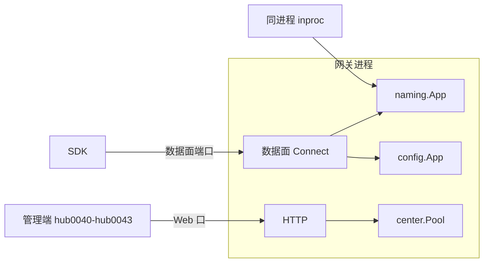
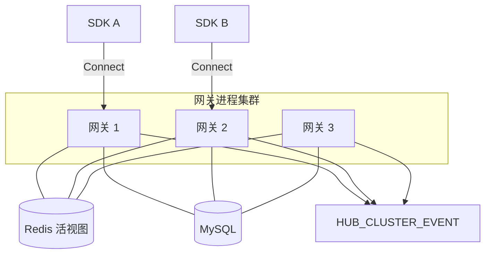
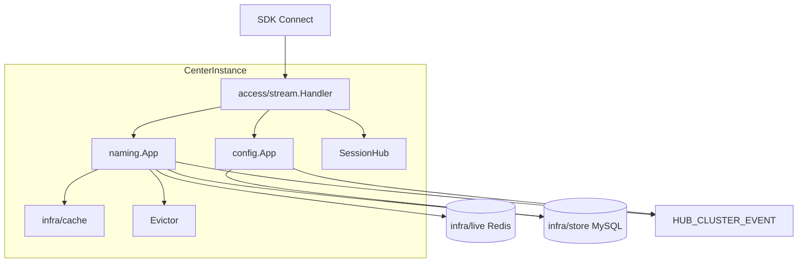
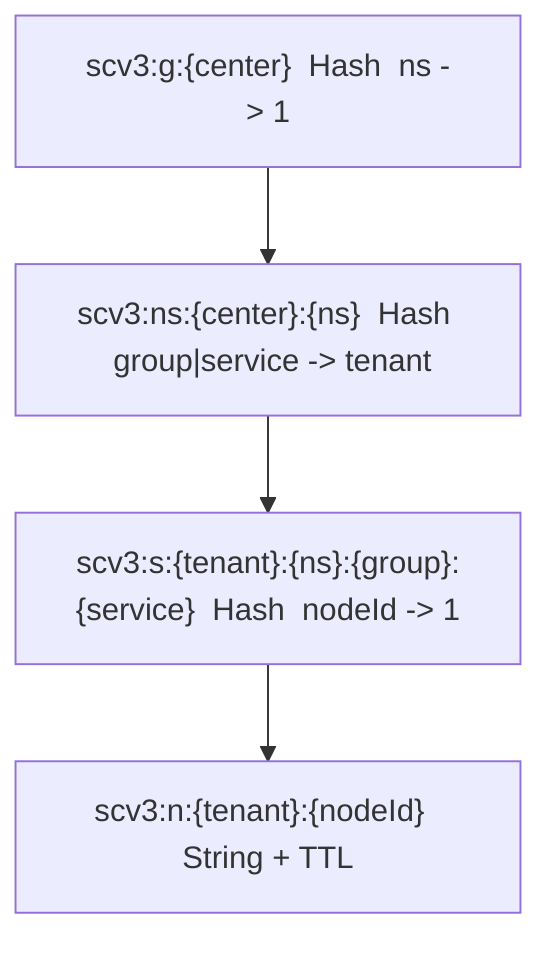
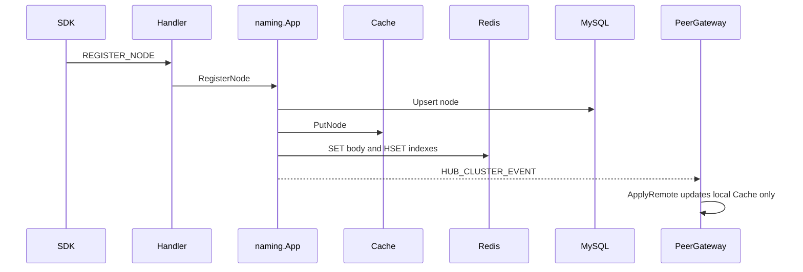
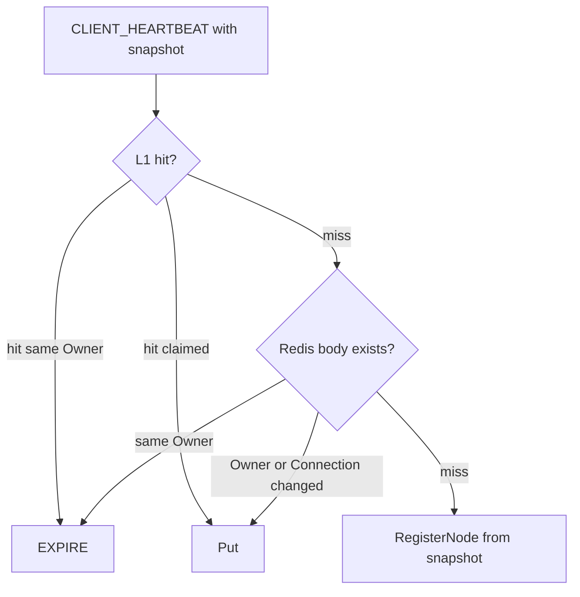
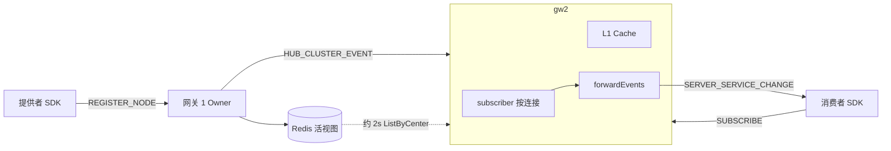
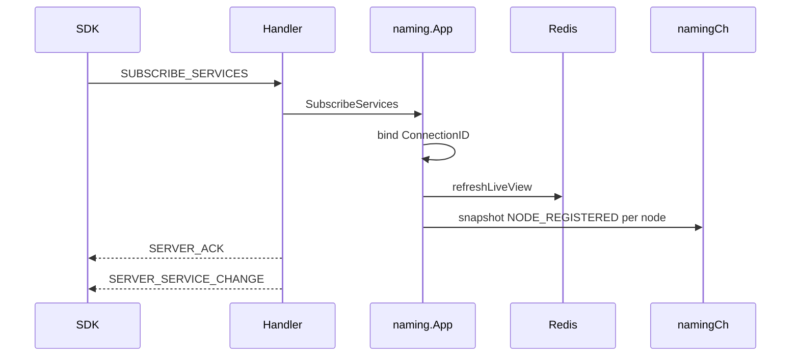
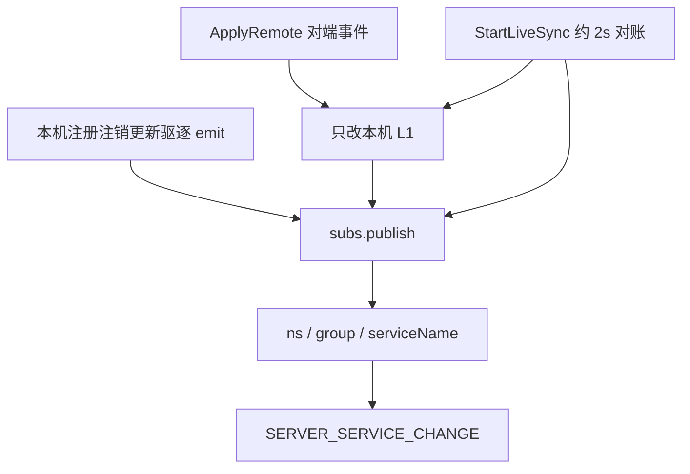

# Service Center v3 架构说明

| 项 | 说明 |
|---|---|
| 状态 | 与当前实现同步；`APILevel` 为 experimental |
| 读者 | SDK 使用方、管理端、实现与评审 |
| 范围 | 网关内嵌注册发现与配置中心（`internal/servicecenterv3`） |
| 非目标 | 独立注册中心产品、Distro / Raft、对外 Unary / OpenAPI 数据面 |
| 细节 | 包级约定以各子包 `doc.go` 为准；协议以 `proto/` 为准 |

业务调用不经过本组件。A 调用 B 始终直连发现到的 `ip:port`。本组件只维护「哪些节点当前可被发现」，并推送名单变更与已发布配置。

---

## 1. 术语

| 术语 | 含义 |
|---|---|
| CenterInstance | 一张中心实例卡片：独立监听地址 + 隔离运行时（Cache / Evictor / SessionHub / 流服务器） |
| RuntimeKey | `InstanceName:Environment`，进程内实例池键 |
| Service | 逻辑服务名（如 `order`），不是中心实例卡片 |
| Node | 某一 `ip:port` 实例。默认临时；持久节点超时后保留并标不健康 |
| Owner | 当前承接该 Node 数据面流的网关进程（`LocalGatewayID`）。按节点认领，不是整台网关的角色 |
| 活视图 | Redis 中的节点在线目录与正文。发现以它为准 |
| L1 Cache | 单网关进程内的服务 / 节点 / 命名空间表。不是 Redis 副本 |
| ConnectionID | 一条 gRPC `Connect` 流。数据面注销按连接裁剪 |

---

## 2. 系统边界

三个平面必须分开：

| 平面 | 入口 | 职责 |
|---|---|---|
| 数据面 | CenterInstance 监听口，`ServiceCenterStream.Connect` | 握手、注册、心跳、发现、订阅、配置 Watch |
| 管理面 | 网关 Web 口，进程内 `contract.Admin` | 实例生命周期、目录巡检、节点变更、配置发布 |
| 业务面 | 不经过本组件 | 调用方直连被调方地址 |

对外稳定面：

- 跨语言：双向流与 `proto/` 消息
- 进程内：`contract` 的 `Admin` / `Naming` / `Config` 与哨兵错误
- 本树在 `gateway/internal`，其它 Go module 不得 import

---

## 3. 部署与一致性模型

生产形态是网关进程集群。各节点拉起同一 `InstanceName` + `Environment` + 监听约定。  
SDK 配置多个 `serverAddress`，与其中一台建立一条流即可。每台网关都是注册 / 发现的对等主，不选举。

对齐依赖三件套，缺一则降级，不另建共识层：

| 组件 | 角色 |
|---|---|
| MySQL `HUB_SERVICE*` | 服务目录、节点审计、已发布配置 |
| Redis 活视图 | 节点是否存活、Owner、健康与管理端 `Status` |
| `HUB_CLUSTER_EVENT` | 注册 / 注销 / 更新 / 驱逐 / 配置发布 / 实例启停。心跳不发事件 |

**保证与不保证：**

| 读路径 | 保证 |
|---|---|
| `GetService` / `ListNodes` | 叠活视图。任意网关看到同一份在线集合（Redis 可用时） |
| 订阅推送 | 挂在承接流的网关。本机 emit 即时且带完整名单；副本先收无名单的增量事件，约 2s 对账补推。见 6.4 |
| 心跳 | 只续 `scv3:n` TTL，不改管理端 `Status`，不发事件 |
| Redis 不可用 | 退回 L1 + 库 + 事件。本机可用，跨网关及时性下降 |

Owner 只对「谁驱逐、谁清连接」有意义。发现不要求读到 Owner 所在网关。

---

## 4. 进程内结构

每个 CenterInstance 自持运行时，禁止跨实例共享 Cache。

| 层 | 包 | 职责 |
|---|---|---|
| 契约 | `contract` | 三个接口、`CallContext`、哨兵错误（`errors.Is`） |
| 数据面 | `access/stream` | 双向流；TenantID 只由鉴权写入 |
| 同进程 | `access/inproc` | `discoveryType=INTERNAL` 转发 |
| 装配 | `center` | `Pool`、`Instance`、启停与 Reload |
| 命名 | `naming` | 注册、发现、心跳、订阅、驱逐 |
| 配置 | `config` | 草稿、发布、历史、Watch；正文不缓存 |
| L1 | `infra/cache` | 进程内索引，键用冒号拼接 |
| 活视图 | `infra/live` | 集群在线目录与节点正文 |
| 持久化 | `infra/store` | `HUB_SERVICE*` |
| 协议 | `model` `proto` | 领域对象与 IDL |

---

## 5. 数据模型

### 5.1 权威来源

| 问题 | 权威 | 滞后 |
|---|---|---|
| 节点是否仍可被发现 | Redis `scv3:n` 是否存在（临时节点 TTL = `2 × HealthCheckTimeout`） | 发现当下叠加 |
| Owner、健康、管理端 `Status` | Redis 节点 JSON | `Put` 之后，其它网关下一次发现可见 |
| 服务定义、已发布配置、心跳审计 | MySQL | 心跳约 10s 节流落库 |
| 本进程数据面会话 | `SessionHub` | hub0041 不可见其它网关上的连接 |

L1 与 Redis 键分隔符均为 `:`。L1 是扁平 map，不镜像 Redis Hash 树。

### 5.2 Redis 目录

按中心 → 命名空间 → 服务 → 节点展开。单个 `scv3:s` 预期容纳数十个 nodeId；达到数百再考虑按 nodeId 分片。

约束：

- 仅 `scv3:n` 带 TTL。目录 Hash 无 per-field 过期；列出时摘掉正文已消失的 field，空 Hash 沿树删除。
- Redis Cluster 下节点正文逐个 `GET`。不使用 pipeline / 跨 slot `MGET`。
- MySQL `LastBeatTime` 只作审计与启动回灌，不作发现时钟。

### 5.3 隔离

- TenantID：鉴权写入（或实例自身 TenantID）。客户端不得自报租户。
- Namespace：鉴权后的工作空间，不是环境边界。
- Environment：`DEV` / `STAGING` / `PRODUCTION` 通过 RuntimeKey 隔离，可同名并存。

---

## 6. 关键路径

### 6.1 注册

`REGISTER_NODE` 隐含的服务只进入 L1，不写 `HUB_SERVICE`。最后一个临时节点离开后删除该缓存服务，不推 `SERVICE_DELETED`。

数据面 `DeregisterService` 只删除本 `ConnectionID` 下的节点。管理面 ConnectionID 为空，不得当作「某一个 SDK 离开」。

### 6.2 发现

`GetService` 每次按服务叠活视图，不以 L1 或 3s 窗口代替集群结果。  
`ListServices` 沿中心目录全量刷新。3s 新鲜窗口仅供 Evictor 避免重复全量拉取。

灌入活视图时：不得用更旧的 `LastBeatTime` 回退；`Status` 仍取活视图，保证管理端下线立即可见。本机 Owner 的 `ConnectionID` / Owner / `HealthyStatus` 以 L1 为准（心跳只续 TTL，JSON 可能旧）。

### 6.3 心跳与重连

- 稳态：`EXPIRE`。约 10s 回写 JSON 与库。
- SDK `restoreState`：心跳带原 `nodeId` 与快照，不再默认 `REGISTER_NODE`。
- Ping 与心跳共用 `heartbeatInterval`。Ping 只探测流存活。

| 断连原因 | 临时节点 | 活视图 | 重连 |
|---|---|---|---|
| `client_lost` | 立即驱逐 | `Delete` | 快照补注册 |
| `server_shutdown` | 保留，交还 Owner | 续 TTL | 多为 `GET + EXPIRE`；换网关则 `Put` 认领 |

已绑定到新 `ConnectionID` 的节点，旧连接的 `OnClientLost` 不再处理。

### 6.4 订阅

订阅挂在**承接该 SDK 流的那台网关**上，按 `ConnectionID` 绑定。没有集群级订阅表，也不是「A 服务代订」。心跳不产生订阅事件。

订阅当下：先入表，再叠活视图打快照。每个已有节点一条 `NODE_REGISTERED`；视图已追齐且服务无节点时推 `SERVICE_ADDED`。RPC 回 `SERVER_ACK`，快照与后续变更走 `SERVER_SERVICE_CHANGE`（`requestId` 为空）。

之后有三条推送源，都只投给**本机**匹配的订阅通道。通道满则阻塞，不丢事件。`ChangedNode.ConnectionID` 对外剥离。

| 来源 | 是否写 Redis / 库 | 是否 `NamingHook` | 事件里的名单 |
|---|---|---|---|
| 本机 `emit` | 变更路径已写 | 是。钩子中的 `Service.Nodes` 被清空以控制事件体积 | 当时 L1 完整名单 |
| `ApplyRemote` | 否 | 否，防回环 | 只有 `ChangedNode`；`Service.Nodes` 为空 |
| 活视图对账 | 否 | 否 | 新增或身份变化才补推，带对账后的 L1 名单 |
| 心跳 | 续 TTL | 否 | 不推 |

因此：发现任意网关等价；订阅即时性取决于消费者连在哪台。连在变更 Owner 上即时且名单完整；连在副本上先靠集群事件（增量节点），最多约 2s 对账补齐。`allNodes` 为空时不要覆盖本地表，应保留 `changedNode` 或再 `GetService`。

取消：`UNSUBSCRIBE_SERVICES` 按服务名；短名 `UNSUBSCRIBE` 清该连接全部命名订阅。断连先 `removeByConnection`。重连后 SDK 重订，服务端再推快照。

| opcode | 范围 |
|---|---|
| `SUBSCRIBE_SERVICES` | 指定服务名；名称为空则该组下全部服务 |
| `SUBSCRIBE_NAMESPACE` | 命名空间（可选组）下全部服务 |
| `UNSUBSCRIBE_SERVICES` | 去掉该连接上指定服务，其它订阅保留 |
| `UNSUBSCRIBE` | 去掉该连接全部命名订阅 |

### 6.5 配置

配置正文只在 MySQL，不进入活视图。`SAVE_CONFIG` 写草稿且不推送；`PUBLISH_CONFIG` 写 `HUB_SERVICE_CONFIG_DATA` 后推本机 Watch，对端网关收事件后各自读库再推。

---

## 7. SDK 契约

一个 `ServiceCenterClient` 对应一条 `Connect` 流，可注册多个服务名。

| 操作 | 语义 |
|---|---|
| `registerService` / `registerNode` | 空 `nodeId` 由服务端分配，须回写后用于心跳 / 注销 / 重连 |
| `unregisterNode(nodeId)` | 删除该节点，不断流 |
| `unregisterService(ns, group, name, null)` | 删除本客户端该服务下的节点，其它服务名不受影响 |
| `close()` | 注销本客户端全部节点并关闭流 |

自带 `nodeId`：`[A-Za-z0-9._:/-]{1,64}`，不得占用仍存活的不同 `ip:port` / 服务。

订阅事件中 `changedNode` 是本次变更。`allNodes` / `Service.Nodes` 仅在本机快照、本机 `emit` 与活视图对账补推时保证完整；副本上的集群事件可能为空，不得用空名单覆盖本地表。SDK 不维护权威地址表。分层见 6.4。

---

## 8. 管理面

| 模块 | 能力 | 限制 |
|---|---|---|
| hub0040 | 实例卡片、Start / Stop / Reload、令牌、Overview | Start 经集群事件在各网关拉起同一实例 |
| hub0041 | 命名空间用量、数据面会话 | 会话仅本进程 |
| hub0042 | 名单 / 详情叠 `ListNodes`（含活视图与 Owner）；EditNode / OfflineNode 走 `Naming.UpdateNode` | Add / Edit / DeleteService 仍写库表与旧缓存，不经过 v3 注销 |
| hub0043 | 草稿、发布、历史、回滚 | 仅发布后推 Watch |

下线单个运行实例：SDK 注销、`OfflineNode`，或等待 TTL。不要用控制台删服务代替摘节点。

---

## 9. 运行约束

- 集群节点共享同一 MySQL 与同一 Redis（`cache.default`，类型为 `redis` 且 Ping 成功才挂活视图）。
- `LocalGatewayID` 取 `svc.GetNodeId()`，按进程唯一。
- SDK 连接数据面端口，不是网关 Web 口。
- 实例 Stop：先下发 `SERVER_CLOSE(reason=server_shutdown)`，再关流。
- 容量假设：单服务数十节点；单中心数千服务时按目录分层访问，禁止把全集群节点放进一个 Redis 键。

当前已知缺口（实现如此，不是文档疏漏）：hub0042 服务增删未接 v3 Naming；hub0041 无集群会话总表；无管理面「按 nodeId 踢连接」专用口。
