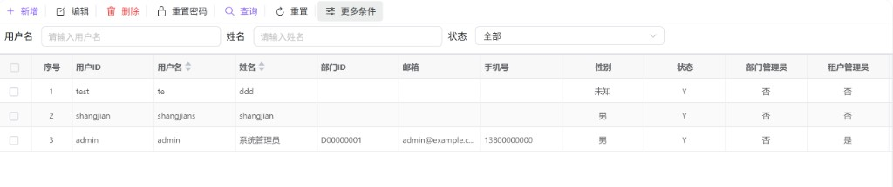
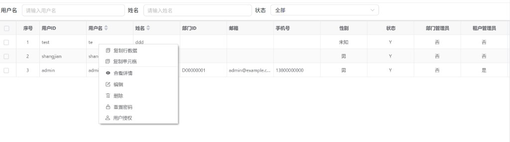

# 用户管理

在网关控制台中维护**当前租户下的系统用户**：按条件检索、分页浏览，并执行新增、编辑、查看、删除、重置密码与角色授权等操作。本文说明各区域的用途、典型流程与注意事项。

---

## 概述

**用户管理**面向租户管理员或具备相应权限的操作员，用于：

- 控制谁可以登录与使用控制台（启用 / 禁用、过期时间等）。  
- 维护账号资料与组织属性（部门、联系方式、管理员标记等）。  
- 为用户分配角色，从而间接控制菜单与数据权限（通过 **用户授权**）。

本页处理的是**租户内用户目录**；修改「当前登录者本人资料」一般在顶栏 **用户设置** 中完成，二者不要混淆（见文末对照）。

---

## 访问入口

在侧栏打开 **系统设置** → **用户管理**（具体菜单名称以当前环境为准）。

---

## 页面布局

页面分为上下两块：

1. **筛选与操作区**：输入查询条件，使用 **查询**、**重置**，以及 **新增**、**编辑**、**删除**、**重置密码** 等主操作。  
2. **用户列表**：展示查询结果，支持复选、排序（若列头可点）、分页与行内快捷菜单。

列表数据在点击 **查询**（或等价入口）后按当前条件从服务端拉取；**重置** 会清空筛选与分页状态并重新加载，便于回到「全量或默认条件」视图。

---

## 查找用户

### 主条件

| 条件 | 说明 |
|------|------|
| 用户名 | 按登录名模糊或精确匹配（占位提示为「请输入用户名」）。 |
| 姓名 | 按显示姓名筛选。 |
| 状态 | 全部、启用或禁用。 |

### 展开条件

点击 **更多条件** 可补充 **手机号**、**邮箱**，用于在账号量大时缩小结果集。

设置好条件后点击 **查询**；需要放弃当前筛选时可用 **重置**。

---

## 列表说明

表格集中展示账号与状态信息，常见列包括：**用户 ID**、**用户名**、**姓名**、**部门 ID**、**邮箱**、**手机号**、**性别**（界面展示为男 / 女 / 未知）、**状态**（启用 / 禁用标签）、**部门管理员**、**租户管理员**、**用户过期时间**、**最后登录时间**、创建与修改相关字段、**备注** 等；具体列以后台配置与版本为准，部分列支持排序。

- **复选框**：用于勾选一行或多行；当前版本工具栏上的 **编辑 / 删除 / 重置密码** 以「勾选优先、否则当前焦点行」的规则解析目标用户（若既未勾选也未点选行，界面会提示先选择用户）。  
- **分页**：翻页时会在保留当前筛选条件的前提下重新请求，避免跨页后条件丢失。

在行上右键可打开快捷菜单（见下一节）；若环境开启了复制能力，还可 **复制整行** 或 **复制单元格**，便于粘贴到工单或表格中排查问题。

---

## 工具栏操作

| 操作 | 用途与说明 |
|------|------------|
| **新增** | 打开「新增用户」表单，录入账号、初始密码及必填项后保存。 |
| **编辑** | 在已勾选行或当前选中行上打开「编辑用户」；不在此流程中修改密码，改密请用 **重置密码**。 |
| **删除** | 二次确认后删除目标用户；删除不可恢复。若删除后当前页为空且不是第一页，列表会自动回到上一页并刷新。 |
| **重置密码** | 二次确认；对话框会说明 **新密码将通过邮件发送给用户**（实际是否发信、发到哪里以后端与邮件服务配置为准）。 |

---

## 行右键菜单

在某一用户行上右键，可对该行直接执行（无需再在工具栏解析选中行）：

| 菜单项 | 说明 |
|--------|------|
| **查看详情** | 只读弹窗，用于核对字段而不误改数据。 |
| **编辑** | 与工具栏编辑等价，作用于当前行。 |
| **删除** | 与工具栏删除等价。 |
| **重置密码** | 与工具栏重置密码等价。 |
| **用户授权** | 打开角色授权对话框；保存成功后列表会刷新以反映权限变更。 |

---

## 新增、编辑与查看

三者共用同一套表单布局，通过标题区分：**新增用户**、**编辑用户**、**查看用户详情**。

### 页签结构

- **主信息**：用户 ID、用户名、姓名、部门 ID、联系方式、性别、状态、部门管理员 / 租户管理员、用户过期时间等可维护字段；**密码** 仅在 **新增** 时出现且为必填。  
- **自定义**：例如备注等扩展信息（以界面为准）。  
- **其他**：多为只读审计字段，如最后登录时间、创建人、修改时间等。

### 操作建议

- **新增**：按表单校验填写；用户 ID、用户名等唯一性以后端校验为准。  
- **编辑**：保存时会携带当前行的用户标识与租户上下文，确保更新的是正确记录。  
- **查看**：关闭即可，不产生保存请求。

---

## 用户授权（角色）

从行菜单进入 **用户授权** 后，为该用户勾选或取消角色并保存。角色与网关菜单、接口权限的对应关系由权限模型决定；若保存后菜单未如预期变化，可检查是否需重新登录或是否存在缓存策略。

---

## 常见问题

| 现象 | 可能原因与处理 |
|------|----------------|
| 提示先选择用户 | 工具栏操作依赖目标行：请先勾选表格中的用户，或单击一行使其成为当前行。 |
| 查询无结果 | 放宽条件或重置后重试；确认该租户下是否确有用户数据。 |
| 重置密码后未收到邮件 | 确认用户邮箱是否正确、SMTP 与后端接口是否已接通；界面文案仅说明预期行为。 |
| 删除后页码异常 | 已实现「删空当前页则回退一页」；若仍异常，记录操作步骤并反馈运维。 |

---

## 与「用户设置」的区别

| 能力 | 用户管理（本页） | 用户设置（顶栏入口） |
|------|------------------|----------------------|
| 范围 | 管理租户内**多个**系统用户 | 通常维护**当前登录用户**自身资料或偏好 |
| 典型操作 | 增删改、授权、重置他人密码 | 改密码、个人信息等（以产品为准） |

请勿将「给他人开账号」与「改自己的头像昵称」混在同一入口完成，以免权限与数据范围不符预期。
