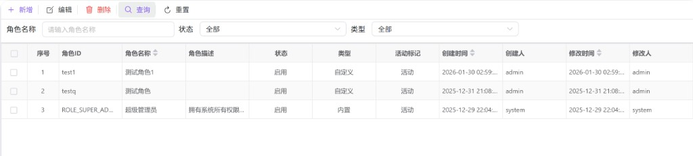
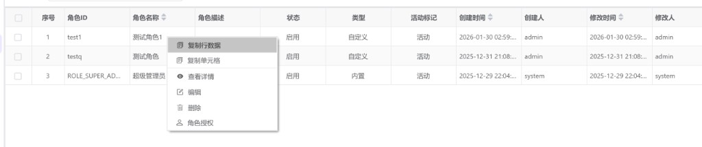
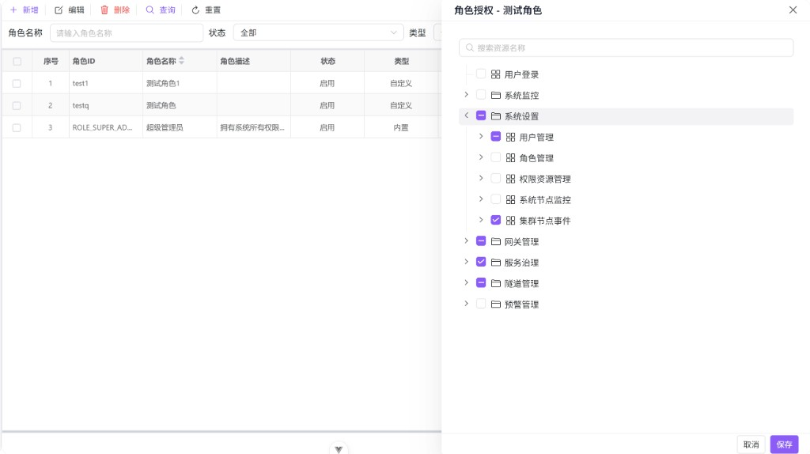

# 角色管理

在网关控制台中维护**角色**并为角色授予可访问的菜单/资源，用于构建清晰、可审计的权限体系。本文说明角色的概念、典型操作流程与授权注意事项。

---

## 概述

**角色**用于将一组权限打包复用，再分配给用户（通常在「用户管理」中完成用户与角色的关联）。在日常运维中，建议遵循：

- **最小权限原则**：只授予完成工作所必需的资源。
- **角色粒度清晰**：按岗位/职责拆分角色，避免“万能角色”泛滥。
- **内置与自定义分离**：内置角色通常用于系统保底能力；业务扩展使用自定义角色更易维护。

---

## 访问入口

侧栏 **系统设置** → **角色管理**。

---

## 页面布局

页面分为上下两块：

1. **筛选与操作区**：按角色名称、状态、类型筛选；提供 **新增**、**编辑**、**删除** 等主操作。
2. **角色列表**：分页展示角色信息，支持复选与右键快捷菜单，并可从行菜单进入 **角色授权**。

---

## 查找角色

| 条件 | 说明 |
|------|------|
| 角色名称 | 按角色名称检索（占位提示为「请输入角色名称」）。 |
| 状态 | 全部、启用或禁用。 |
| 类型 | 全部、内置或自定义。 |

设置条件后点击 **查询**；需要回到默认视图时使用 **重置**（会清空筛选并恢复分页初始状态）。

---

## 列表字段说明

常见列包括：**角色 ID**、**角色名称**、**角色描述**、**状态**（启用/禁用）、**类型**（内置/自定义）、**活动标记**（活动/非活动）、创建/修改时间与人员、备注等（具体列以版本与配置为准）。

- **复选与目标行规则**：工具栏的 **编辑/删除** 需要目标行；通常遵循「优先勾选行，否则使用当前点击的行」。若未选择任何行，界面会提示先选择角色。
- **分页**：翻页时会保留当前筛选条件重新查询，避免跨页后条件丢失。

---

## 工具栏操作

| 操作 | 用途与说明 |
|------|------------|
| **新增** | 新建一个角色，用于后续授权与分配给用户。 |
| **编辑** | 修改所选角色的基本信息（如名称、描述、状态等）。 |
| **删除** | 二次确认后删除角色；删除不可恢复。若删除后当前页为空且不是第一页，列表会自动回到上一页并刷新。 |

---

## 行右键菜单

在某一角色行上右键，可以对当前行直接执行常用动作：

| 菜单项 | 说明 |
|--------|------|
| **查看详情** | 只读查看角色字段，用于核对信息。 |
| **编辑** | 打开编辑对话框，作用于当前行。 |
| **删除** | 删除当前行角色（需二次确认）。 |
| **角色授权** | 打开授权抽屉，维护该角色拥有的菜单/资源。 |

---

## 新增、编辑与查看

三者共用同一套表单，通过标题区分：**新增角色**、**编辑角色**、**查看角色详情**。

### 基本信息

| 字段 | 说明 |
|------|------|
| 角色ID | 角色的唯一标识。 |
| 角色名称 | 建议使用可读性强的命名（如“运维只读”“网关管理员”等）。 |
| 角色描述 | 说明该角色的使用场景与边界，便于审计。 |
| 角色状态 | 启用/禁用。禁用后通常不应再为用户授予该角色（实际生效策略以后端权限模型为准）。 |
| 类型（内置标记） | 内置/自定义。内置角色一般建议谨慎修改与删除。 |
| 数据权限范围 | 用于描述数据级权限范围；界面提示为 JSON 格式。若组织未启用数据级权限，可保持为空或按规范填写。 |

### 其他信息

创建时间、创建人、修改时间、修改人、版本号等为审计字段，通常只读展示。

---

## 角色授权（资源/菜单）

从行菜单进入 **角色授权** 会打开抽屉，在树形资源列表中为角色勾选可访问项：

- **搜索**：在抽屉顶部输入关键词，快速定位资源名称。
- **树形勾选**：支持级联选择；建议按业务模块逐层展开配置。
- **保存**：保存后角色权限立即更新或在一定缓存周期后生效（以部署策略为准）。

### 授权建议

- **先建角色，再授权**：角色是权限容器，先稳定角色边界再给用户分配更可控。
- **避免给内置角色“叠加业务权限”**：业务权限变化频繁，放在自定义角色更易回滚与审计。
- **按最小权限逐步放开**：先满足“能用”，再按需求补齐；比事后回收权限成本更低。

---

## 常见问题

| 现象 | 可能原因与处理 |
|------|----------------|
| 提示先选择角色 | 工具栏操作依赖目标行：请先勾选一行，或单击一行使其成为当前行。 |
| 找不到要授权的资源 | 检查是否有资源树数据权限；或资源是否在「权限资源管理」中已登记并同步。 |
| 授权保存后菜单未变化 | 可能需要重新登录或等待缓存失效；也可能用户未分配该角色（需在「用户管理」中为用户授权角色）。 |
