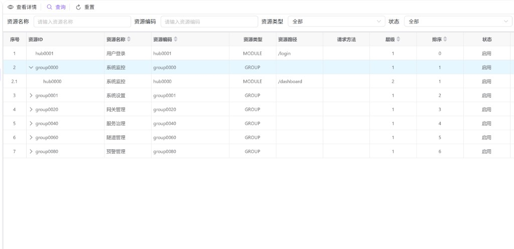
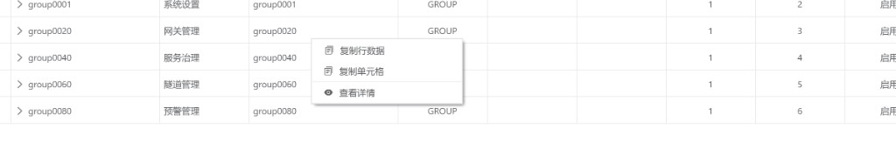

# 权限资源管理

本页维护控制台侧栏、菜单、按钮与接口等在权限体系中可引用的**资源目录**。资源以树形结构组织，供「角色管理」中的 **角色授权** 勾选使用。当前界面以**查询与查看**为主，便于核对路由、层级与启用状态，避免误改内置目录。

---

## 概述

**权限资源**回答的是「系统里有哪些可被授权的点」：

- **树形目录**：父节点多为分组或上级模块，子节点为具体页面、菜单或更细粒度项；展开/折叠箭头用于浏览层级。
- **与角色的关系**：角色不直接写死菜单，而是通过授权关联到资源 ID；资源变更会影响授权树的展示与生效范围（具体以后端策略为准）。
- **内置与自定义**：内置项通常随产品发布；自定义项用于租户扩展。修改内置资源前建议评估对全租户菜单与权限的影响。

---

## 访问入口

侧栏 **系统设置** → **权限资源管理**。

---

## 页面布局

1. **筛选与操作区**：按名称、编码、类型等条件过滤；提供 **查看详情**、**查询**、**重置**。
2. **资源树表**：整表以树展示，无分页；通过行前的展开图标逐层打开子资源。

---

## 查找资源

| 条件 | 说明 |
|------|------|
| 资源名称 | 按展示名称检索。 |
| 资源编码 | 按业务或程序侧使用的编码检索。 |
| 资源类型 | 全部，或限定为 **模块**、**菜单**、**按钮**、**接口** 之一。 |
| 状态 | 全部、启用或禁用。 |
| 类型（内置标记） | 全部、内置或自定义。 |

设置条件后点击 **查询**；**重置** 会清空筛选并重新加载默认视图。

---

## 列表字段说明

常见列包括：

| 列 | 说明 |
|----|------|
| 资源ID | 资源的唯一标识，授权树与接口中通常以此为主键引用。 |
| 资源名称 | 在列表与授权树中展示的名称。 |
| 资源编码 | 便于脚本或配置引用的稳定编码，常与资源 ID 一致或成对出现。 |
| 资源类型 | 模块、菜单、按钮、接口等；用于区分页面入口与接口类权限。若数据中存在其它类型值，以界面实际标签为准。 |
| 资源路径 | 前端路由或 API 路径等业务含义上的定位信息（菜单路径或接口路径）。 |
| 请求方法 | 对接口类资源常见（如 GET、POST）；非接口类可能为空。 |
| 层级 | 在树中的深度，便于理解父子关系。 |
| 排序 | 控制同层级下的展示顺序，影响侧栏或菜单排列。 |
| 状态 | 启用 / 禁用；禁用后一般不应再被授权使用（生效规则以后端为准）。 |
| 类型（表格列） | 内置 / 自定义。 |
| 活动标记 | 活动 / 非活动。 |
| 创建与修改信息 | 审计字段，用于追溯变更。 |
| 描述 | 资源的补充说明。 |

---

## 工具栏操作

| 操作 | 说明 |
|------|------|
| **查看详情** | 打开只读详情弹窗。需先**单击选中**表格中的某一行（或按产品规则选定当前行）；未选中时界面会提示先选择资源。 |
| **查询** | 按当前筛选条件刷新树表数据。 |
| **重置** | 清空筛选条件并重新加载。 |

---

## 行右键菜单

在任意资源行上右键，可快速：

| 菜单项 | 说明 |
|--------|------|
| **复制行数据** | 将整行信息复制到剪贴板，便于写工单或对照配置。 |
| **复制单元格** | 仅复制当前单元格内容。 |
| **查看详情** | 与工具栏「查看详情」等价，针对当前行打开只读详情。 |

---

## 查看详情弹窗

详情以多页签组织，常见分组包括：

- **基本信息**：资源 ID、名称、编码、类型、路径、请求方法、显示名称、图标、描述、状态、内置标记、活动标记、备注等。
- **层级关系**：父资源 ID、资源层级、排序顺序等，用于理解该节点在树中的位置。
- **其他信息**：创建/修改时间与人、版本号等只读审计字段。

查看模式下不会提交保存；若你所在环境后续开放了新增/编辑入口，仍以界面实际按钮为准。

---

## 与「角色管理」的协作

1. 在本页确认资源 ID、路径与层级是否正确、是否为启用状态。  
2. 在 **角色管理** 中打开某角色的 **角色授权**，在树中勾选对应资源。  
3. 再将该角色分配给 **用户管理** 中的用户。

若授权树中缺少某菜单，通常应回到本页核对该资源是否存在、是否禁用、父子关系是否正确。

---

## 常见问题

| 现象 | 可能原因与处理 |
|------|----------------|
| 提示先选择资源 | 使用工具栏「查看详情」前需先在树表中单击选中目标行。 |
| 列表与侧栏不一致 | 可能存在缓存或多环境配置差异；核对资源路径与启用状态，必要时重新登录或联系运维刷新权限缓存。 |
| 某节点类型显示为英文代码 | 数据中的类型值可能超出常见四类枚举，以数据库或后端定义为准并在文档中备案。 |
