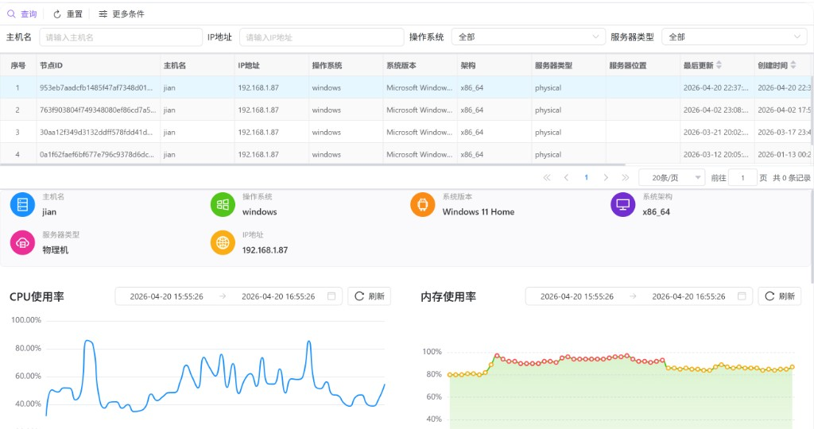

# 系统节点监控

在网关控制台中查看**已纳入监控的系统节点**运行状态：先在上方列表中定位并选择节点，再在下方监控面板查看 CPU、内存、磁盘、磁盘 IO、网络与进程等多维指标的时序趋势，用于巡检、容量评估与异常定位。

---

## 概述

**系统节点监控**面向运维与管理员，主要解决：

- **节点是否在线且可用**：通过“最后更新”等字段判断采集是否持续。
- **资源是否逼近上限**：CPU/内存/磁盘使用率是否长期处于高位或频繁触发预警区间。
- **异常定位**：结合磁盘 IO、网络与进程概览，缩小问题范围（计算/存储/网络/进程）。

本页为“节点维度”的监控视图：在同一页面内完成节点选择与多指标联动查看。

---

## 访问入口

侧栏 **系统设置** → **系统节点监控**。

---

## 使用流程

### 1. 在节点列表中定位目标

通过筛选条件缩小范围（支持 **更多条件** 展开），然后点击 **查询**。

常用筛选项：

| 条件 | 说明 |
|------|------|
| 主机名 | 按主机名检索。 |
| IP地址 | 按 IP 地址检索。 |
| 操作系统 | Linux / Windows / MacOS / Unix / 其他。 |
| 服务器类型 | 物理服务器 / 虚拟服务器 / 未知。 |
| 服务器位置（更多条件） | 机房、区域或部署位置等自定义字段。 |

### 2. 选择节点加载监控

在表格中**单击某一行**，系统将该行的 **节点 ID** 作为监控目标，并在下方加载对应指标数据。未选择节点时，下方会提示“请在上方列表中选择一个节点查看监控数据”。

### 3. 调整时间范围与刷新

每个图表都提供：

- **时间范围选择**：支持快捷项（如最近 1/6/12/24 小时等）或自定义区间。
- **刷新**：只刷新当前图表对应的数据。

当你在任一图表中更改时间范围后，系统会更新当前监控的时间窗口，并按新时间范围重新查询该图表数据。

---

## 节点列表字段说明

上方列表用于确认“当前查看的是哪台机器”，常见字段包括：

| 列 | 用途 |
|----|------|
| 节点ID | 节点唯一标识；选择节点与查询监控指标时使用。 |
| 主机名 / IP地址 | 资产定位与连通性排查的基础信息。 |
| 操作系统 / 系统版本 / 架构 | 用于区分平台差异（例如 Windows/Linux 指标口径、软件包兼容等）。 |
| 服务器类型 / 服务器位置 | 便于与容量规划策略、机房区域对应。 |
| 最后更新 | 判断监控采集是否持续；若长期不更新，可能是采集端离线或链路异常。 |
| 创建/修改信息 | 审计字段，用于追溯录入与变更。 |

---

## 监控面板说明

选择节点后，下方监控面板包含：

1. **服务器信息卡片**：展示主机名、操作系统、系统版本、架构、服务器类型与 IP 地址，便于快速确认目标节点。
2. **多指标图表**：按行展示 CPU/内存、磁盘/磁盘 IO、网络/进程等视图。

### CPU 使用率

用于观察总 CPU 使用率及其随时间变化的趋势。若长期高位（例如持续接近 80% 以上）或存在尖峰，建议结合进程与业务窗口进一步定位。

### 内存使用率

展示内存使用率趋势，并在明细提示中包含交换分区（swap）等信息（若采集侧上报）。当内存长期高位或 swap 频繁增长时，通常需要排查内存泄漏、缓存策略或容量不足。

### 磁盘使用率

用于观察磁盘空间占用趋势。磁盘接近满容量会导致写入失败、服务异常与连锁故障；建议在接近预警区间时就介入清理或扩容。

### 磁盘 IO

用于定位存储瓶颈：读写吞吐/延迟/IOPS（具体指标随采集数据而定）。若 IO 长期冲高但 CPU/内存正常，常见原因包括慢查询、批处理、日志爆量或大文件读写。

### 网络

展示上行/下行（或收发）流量趋势，便于识别突发流量、备份窗口或异常外联。网络与 CPU/IO 同时异常时，可优先检查上游依赖与网络策略。

### 进程

从主机层面汇总进程相关监控（如平均 CPU/内存占用等），帮助判断是否存在异常占用或与网关进程相关的波动。

---

## 空状态与排查

| 现象 | 含义与建议 |
|------|------------|
| 下方提示请选择节点 | 还未在上方表格中点击选择节点。 |
| 图表显示“暂无数据” | 在所选时间范围内没有采集数据；可扩大时间范围，或检查采集是否正常、节点是否在线。 |
| 最后更新长期不变 | 可能采集端离线、指标上报中断或网关与监控服务链路异常。 |

如需快速定位链路问题，建议按顺序检查：节点是否可达 → 采集代理是否在线 → 指标上报周期 → 网关服务与监控数据源连通性。
