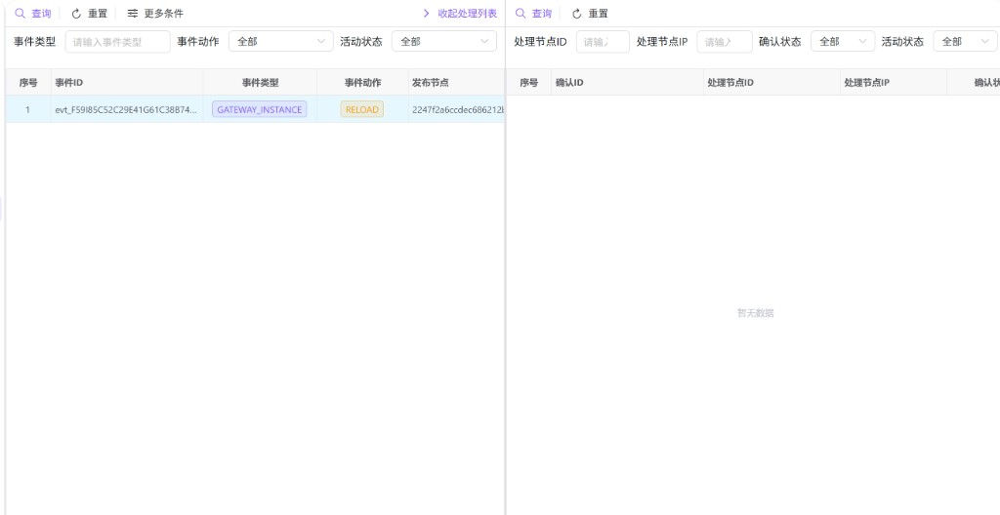

# 集群节点事件

用于在分布式环境中查看**集群事件**及其在各**处理节点**上的确认与执行结果：左侧为事件列表（谁在何时发布了什么），右侧为与当前选中事件关联的处理记录（各节点是否已收到、处理成功与否）。适合排查配置下发、网关实例联动、节点未同步等问题。

---

## 概述

**集群节点事件**面向运维与网关管理员，典型用途包括：

- **追踪一次集群级操作**：例如某节点触发的配置刷新、实例生命周期类动作等，对应列表中的事件类型与事件动作。
- **核对传播范围**：通过右侧处理列表，查看哪些节点生成了确认记录、状态是否为成功或仍在待处理。
- **定位失败节点**：结合确认状态、结果信息与重试次数，缩小到具体节点或网络链路。

事件类型、事件动作的具体取值由业务与后端定义；列表中可能出现如 `GATEWAY_INSTANCE` 与 `RELOAD` 等组合，含义以你们环境内的规范为准。

---

## 访问入口

侧栏 **系统设置** → **集群节点事件**。

---

## 页面布局

页面为**左右分栏**：

| 区域 | 作用 |
|------|------|
| 左侧 | **集群事件列表**：分页展示事件；单击某行可选中该事件，并驱动右侧刷新。 |
| 右侧 | **处理列表（确认列表）**：展示当前选中事件在各处理节点上的确认记录，可单独筛选与分页。 |

左侧工具栏提供 **收起处理列表 / 展开处理列表**，用于在宽屏上专注查看事件表，或重新展开右侧对照处理结果。

---

## 左侧：查询集群事件

### 筛选条件

| 条件 | 说明 |
|------|------|
| 事件类型 | 文本输入，支持按类型关键字过滤（占位提示为「请输入事件类型」）。 |
| 事件动作 | 下拉筛选；界面提供常见动作选项（如 CREATE、UPDATE、DELETE、REFRESH、INVALIDATE）。实际事件列表中也可能出现其它动作值（如 RELOAD），与网关业务扩展一致。 |
| 活动状态 | 全部、活动或非活动。 |

点击 **更多条件** 可补充 **发布节点ID**、**发布节点IP**，用于从发布源定位事件。

使用 **查询** 按条件加载列表；**重置** 清空条件并重新查询。

### 列表字段（常见）

| 列 | 说明 |
|----|------|
| 事件ID | 事件的唯一标识，用于与右侧处理记录关联。 |
| 事件类型 | 事件所属业务分类（如网关实例相关等）。 |
| 事件动作 | 对该类型资源执行的动作（如重载、刷新等）。 |
| 发布节点 / 发布节点IP | 产生或发布该事件的节点标识与地址。 |
| 事件时间 | 事件发生时间。 |
| 活动状态 | 活动或非活动。 |

### 行操作

- **单击行**：选中该事件，右侧处理列表会按该 **事件ID** 重新加载。
- **右键菜单**：支持 **查看详情**（打开事件详情对话框），以及复制行或单元格，便于粘贴到工单或日志系统。

---

## 右侧：查询事件处理（确认）记录

右侧数据依赖**左侧当前选中的事件**。未选中事件、或该事件尚无处理记录时，表格可能为空（例如显示「暂无数据」）。

### 筛选条件

| 条件 | 说明 |
|------|------|
| 处理节点ID | 按处理节点标识过滤。 |
| 处理节点IP | 按处理节点 IP 过滤。 |
| 确认状态 | 全部、待处理、成功、失败、跳过。 |
| 活动状态 | 全部、活动或非活动。 |

使用 **查询**、**重置** 与左侧类似；分页仅作用于当前处理列表。

### 列表字段（常见）

| 列 | 说明 |
|----|------|
| 确认ID | 单条处理记录的主键。 |
| 处理节点ID / 处理节点IP | 执行或回应该事件的节点。 |
| 确认状态 | 待处理、成功、失败、跳过等；用于判断该节点侧是否已完成。 |
| 处理时间 | 节点侧处理完成或状态变更的时间（无则显示为占位符）。 |
| 重试次数 | 失败重试等场景下的计数参考。 |
| 结果信息 | 失败原因、跳过原因等文本说明（若有）。 |
| 活动状态 | 活动或非活动。 |

右键 **查看详情** 可打开处理记录详情（会尽量拉取服务端最新详情）。

---

## 推荐排查流程

1. 在左侧用 **事件类型**、**事件动作** 或 **发布节点** 缩小范围，找到目标 **事件ID**。  
2. **单击选中** 该行，观察右侧是否出现各节点的确认记录。  
3. 在右侧用 **确认状态** 筛出「待处理」或「失败」，结合 **结果信息** 与 **处理节点IP** 登录对应节点或查看采集与网关日志。  
4. 若右侧始终无数据，确认是否已选中事件、事件是否确实会向多节点下发，以及节点连通性与后台任务是否正常。

---

## 常见问题

| 现象 | 可能原因与处理 |
|------|----------------|
| 右侧一直暂无数据 | 未在左侧选中事件；或该事件未产生处理记录；或筛选过严，尝试重置右侧条件。 |
| 部分节点长期待处理 | 对应节点离线、消费队列阻塞或版本不兼容；结合节点监控与日志排查。 |
| 事件动作在下拉里找不到 | 下拉为常用子集，列表仍可能展示其它动作值；以实际行数据与环境文档为准。 |
