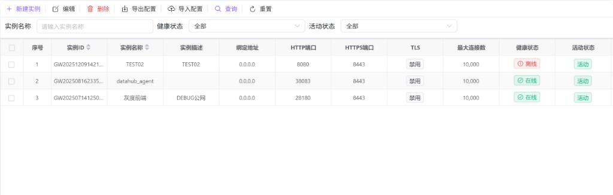
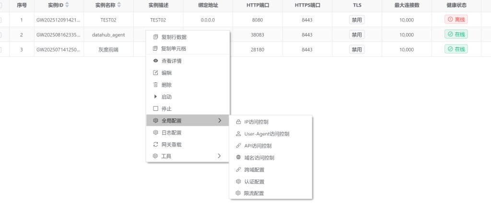
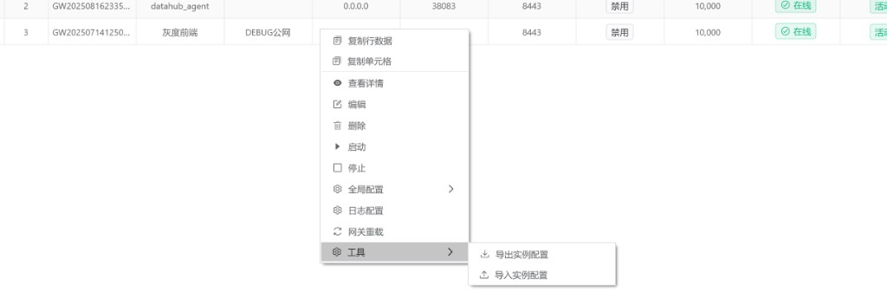
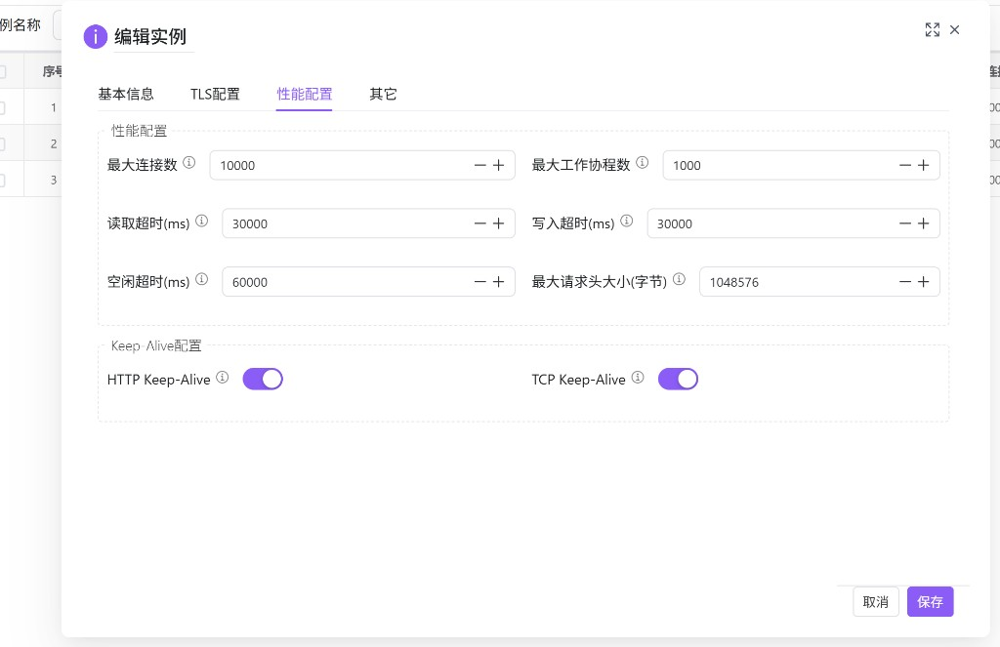

# 实例管理

用于创建与维护**网关实例**：配置监听地址与端口、TLS、安全与性能参数，并执行实例的启动/停止、网关重载，以及导入/导出实例配置。适合在多实例、多环境下做统一管理与标准化交付。

---

## 概述

一个**网关实例**通常对应一套独立的监听端口与运行参数（HTTP/HTTPS、TLS、连接与超时、限流/认证/跨域等）。本页侧重“实例维度”的生命周期与配置入口：

- **实例生命周期**：新增、编辑、删除、启动、停止。
- **配置变更生效**：保存配置后可通过 **网关重载** 让实例重新加载配置（具体生效策略以后端实现与部署方式为准）。
- **配置复用**：通过导入/导出把实例及关联配置在环境之间迁移或做备份。

---

## 访问入口

侧栏 **网关管理** → **实例管理**。

---

## 查找与查看实例

### 筛选条件

| 条件 | 说明 |
|------|------|
| 实例名称 | 按名称检索（占位提示为「请输入实例名称」）。 |
| 健康状态 | 全部、健康或不健康（通常与在线/离线心跳相关）。 |
| 活动状态 | 全部、活动或非活动。 |

点击 **查询** 按条件加载列表；**重置** 清空条件并回到默认视图。

### 列表字段（常见）

| 列 | 说明 |
|----|------|
| 实例ID | 实例唯一标识。 |
| 实例名称 / 实例描述 | 便于区分用途与环境。 |
| 绑定地址 | 监听的网卡地址，常见为 `0.0.0.0`（监听全部接口）。 |
| HTTP端口 / HTTPS端口 | 实例对外提供服务的端口；HTTPS 端口通常在启用 TLS 后生效。 |
| TLS | 启用/禁用。 |
| 最大连接数 | 并发连接上限的关键指标。 |
| 健康状态 | 在线/离线（或健康/不健康）状态提示。 |
| 活动状态 | 活动/非活动。 |

---

## 工具栏操作

| 操作 | 用途与说明 |
|------|------------|
| **新建实例** | 创建一个新的网关实例。 |
| **编辑** | 编辑所选实例；若未选中行会提示先勾选/点击选择。 |
| **删除** | 二次确认后删除实例；删除不可恢复。 |
| **导出配置** | 导出当前所选实例的配置（Excel），用于备份或迁移。 |
| **导入配置** | 从 Excel 导入实例及关联配置，用于环境初始化或批量交付。 |

---

## 右键菜单与常用动作

在列表行上右键，可快速执行实例相关操作与进入配置入口。

### 基础操作

| 菜单项 | 说明 |
|--------|------|
| 查看详情 | 查看实例完整配置（只读）。 |
| 编辑 | 打开编辑对话框并回显实例配置。 |
| 删除 | 删除实例（需二次确认）。 |
| 启动 / 停止 | 控制实例运行状态（需二次确认）。 |
| 网关重载 | 重新加载配置，常用于让变更尽快生效（需二次确认）。 |

### 全局配置（以实例为作用域）

全局配置用于为单个实例配置安全与治理能力，常见入口包括：

- **IP访问控制**：按客户端 IP 放行/拦截规则。
- **User-Agent访问控制**：按 UA 放行/拦截规则。
- **API访问控制**：按接口路径、方法或策略做访问控制（以界面为准）。
- **域名访问控制**：按 Host/域名做放行与限制。
- **跨域配置**：配置 CORS 相关响应头与策略。
- **认证配置**：配置认证方式与参数（如令牌校验等，以界面为准）。
- **限流配置**：配置限流策略与阈值（以界面为准）。

这些配置通常与实例 ID 绑定；配置保存后，建议视情况执行 **网关重载** 或按发布策略等待生效。

### 日志配置

**日志配置**用于控制网关访问日志的内容、输出目标与清理/预警策略。若实例尚未绑定日志配置，进入时会提示先创建或补齐日志配置（具体联动策略以当前环境为准）。

常见能力包括：

- **内容控制**：是否记录请求体/响应体/请求头，最大报文大小等。
- **输出目标**：文件、数据库、MongoDB、Elasticsearch、ClickHouse 等（以界面选项为准）。
- **清理与预警**：保留天数、轮转策略、敏感字段脱敏与预警通道等。

---

## 新建与编辑实例（表单概览）

实例表单通常按页签组织：**基本信息**、**TLS配置**、**性能配置**、**其它**。建议先完成基本信息与端口，再按需启用 TLS 与治理能力。

### 基本信息（常见）

- **实例名称**：建议包含环境与用途（如 `prod-gw-01`）。
- **绑定地址**：默认 `0.0.0.0`；若需要限制网卡，可填具体地址。
- **HTTP端口 / HTTPS端口**：按规划填写，避免与宿主端口冲突。
- **自动启动**：决定实例是否在系统启动或托管流程中自动拉起（含义以部署方式为准）。

### TLS 配置（常见）

- **启用TLS**：开启 HTTPS/TLS 加密传输。
- **TLS版本**：建议至少启用 TLS 1.2；旧版本不安全。
- **证书/私钥**：上传证书与私钥（支持常见扩展名），或按系统存储策略保存到数据库。

### 性能配置（常见）

- **最大连接数**、**工作协程数**、各类超时（读/写/空闲）、请求头上限等会影响吞吐与资源占用；建议按压测结果逐步调整。

#### 典型问题：客户端读取超时与“报文被拦截”

当出现“客户端读取超时”“请求卡住后被断开”“大报文/慢上传容易失败”等现象时，通常需要优先检查本页的超时与限额参数（并与上游 LB、WAF、客户端 SDK 的超时配置一起对齐）。

| 现象 | 常见原因 | 建议调整方向 |
|------|----------|--------------|
| **客户端读取超时**（请求发送到一半或刚建立连接就断开） | **读取超时(ms)** 过小，慢网络/大请求体导致服务端在读取请求头/请求体阶段超时 | 适当**增大读取超时**；同时检查上游是否有更短的超时导致提前断链 |
| **响应写回超时**（服务端已有处理但客户端收不到完整响应） | **写入超时(ms)** 过小，或下游响应慢/大响应体 | 适当**增大写入超时**；排查下游耗时与响应体大小 |
| **长连接空闲后被断开**（间歇性请求、SSE/长轮询） | **空闲超时(ms)** 过小，或 Keep-Alive 配置不匹配 | 适当**增大空闲超时**；确认 **HTTP Keep-Alive / TCP Keep-Alive** 开关策略与上游一致 |
| **大请求头被拒**（Cookie/鉴权头很大，出现 4xx/连接中断等） | **最大请求头大小(字节)** 过小 | 评估风险后**增大请求头上限**；同时治理过大的 Cookie/Header |
| **高并发下排队/拒绝连接** | **最大连接数** 或 **最大工作协程数** 不匹配，导致资源打满或新连接被拒 | 结合压测与机器资源逐步上调；同时关注 CPU/内存与 GC/线程模型（以网关实现为准） |

说明：

- **“报文拦截”**在不同环境可能由多种策略触发（访问控制、WAF、上游代理限制、网关自身限额/超时）。如果现象与大报文、慢链路强相关，优先从 **读取/写入/空闲超时** 与 **请求头上限** 排查更高效。
- 调参后若需要快速生效，建议对目标实例执行一次 **网关重载**（或按你们的发布链路执行）。

---

## 导入与导出建议

- **导出**：在变更前导出作为备份；或用于从测试环境同步到生产前的“配置快照”。
- **导入**：用于批量初始化实例；导入后建议核对端口、证书、外部依赖地址等环境差异项，并执行一次 **网关重载**（若需要）。

---

## 常见问题

| 现象 | 可能原因与处理 |
|------|----------------|
| 提示先选择实例 | 工具栏/导出等操作依赖目标行：请先勾选或单击选中实例。 |
| 实例显示离线/不健康 | 检查实例进程是否运行、心跳链路是否正常、端口是否被占用；必要时尝试启动并观察日志。 |
| 保存配置后未生效 | 可能需要执行 **网关重载** 或等待配置发布链路完成；检查是否保存到了正确实例。 |
| 导入失败或导入后异常 | 常见为环境差异（端口冲突、证书不匹配、依赖地址不同）；建议先在测试环境验证导入文件。 |
