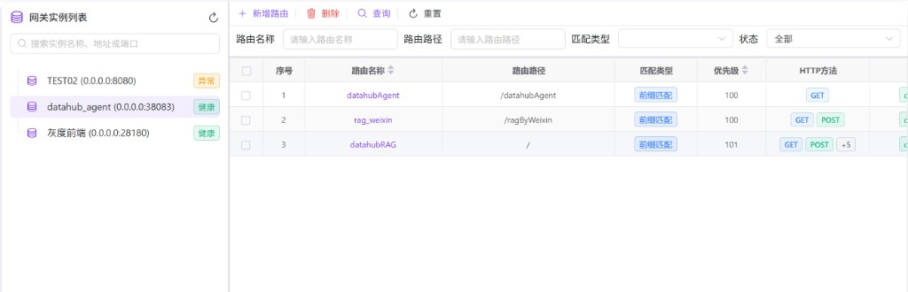
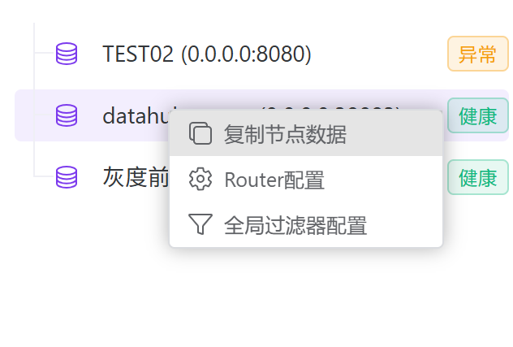
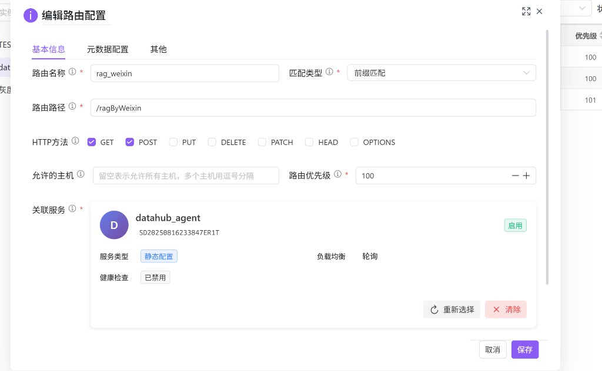
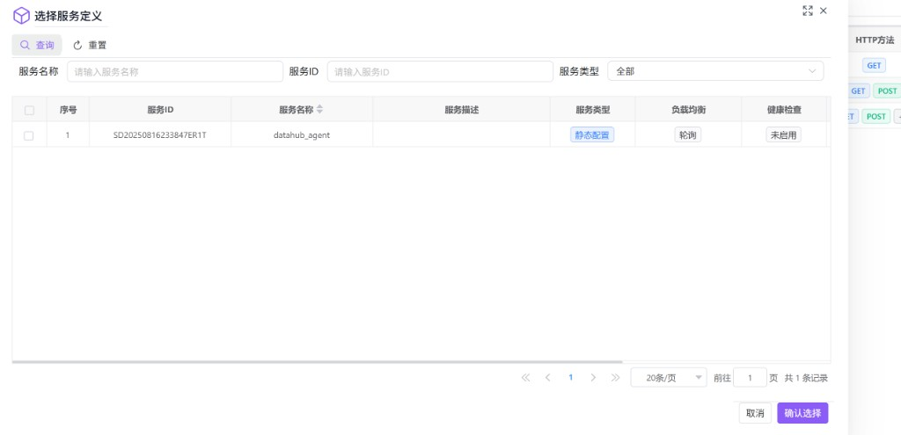
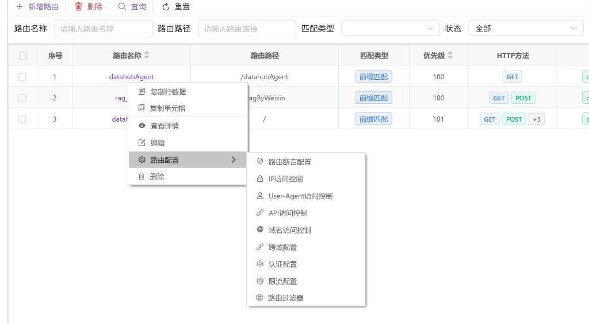

# 路由管理

用于在指定**网关实例**下维护路由规则：定义如何匹配请求（路径、方法、优先级等），以及命中后关联的目标服务，并通过断言、过滤器与访问控制等能力完成治理。

---

## 概述

路由管理关注两件事：

- **请求如何命中**：通过路由路径 + 匹配类型（精确/前缀/正则）+ HTTP 方法等规则匹配。
- **命中后如何转发与治理**：关联服务定义，并按需配置断言、过滤器、访问控制、跨域、认证、限流等。

本模块为“实例维度”配置：左侧先选择网关实例，右侧只展示该实例下的路由配置。

---

## 访问入口

侧栏 **网关管理** → **路由管理**。

---

## 页面布局

页面为左右分栏：

| 区域 | 说明 |
|------|------|
| 左侧 | **网关实例列表**：选择实例；支持过滤与刷新；并提供实例级的 **Router配置** 与 **全局过滤器配置** 入口。 |
| 右侧 | **路由配置列表**：对所选实例的路由进行查询、新增、编辑、删除，以及进入各类路由级治理配置。 |

---

## 操作说明

### 1. 选择目标网关实例

在左侧 **网关实例列表** 中：

- 可用搜索框按“实例名称、地址或端口”过滤。
- 单击某一实例后，右侧路由列表会切换为该实例的数据。

实例节点右键菜单提供实例级入口（以当前版本为准）：

- **Router配置**：实例级 Router 参数（缓存、性能、错误处理等）。
- **全局过滤器配置**：实例级全局过滤器链路。

说明：实例级配置通常作为“全局默认策略”；路由级配置用于对单条路由做更细粒度控制。

### 2. 新增路由

在右侧点击 **新增路由**，填写基本信息：

- **路由名称**：建议可读且可追踪（例如含业务域/环境）。
- **路由路径**：建议以 `/` 开头。
- **匹配类型**：
  - **精确匹配**：路径必须完全一致。
  - **前缀匹配**：以指定前缀开头即可命中（常用于一组 API）。
  - **正则匹配**：复杂匹配模式，建议审慎使用。
- **HTTP 方法**：为空通常表示不限制（全部）。
- **优先级**：数值越小优先级越高；多条规则同时命中时，优先级更高的先匹配。
- **关联服务**：选择转发目标服务定义（来自代理模块的服务定义）。

选择关联服务时，会弹出服务选择窗口：

保存后，路由将出现在列表中。

### 3. 编辑、查看与删除

- **查看详情**：只读核对字段。
- **编辑**：修改路由匹配规则、优先级、方法、关联服务等。
- **删除**：支持单条删除；工具栏也支持批量删除（需先勾选）。

### 4. 路由级治理配置（右键菜单）

在路由行上右键，可进入路由级治理能力：

常见入口说明：

- **路由断言配置**：为路由增加额外匹配条件或校验逻辑。
- **IP / User-Agent / API / 域名访问控制**：对命中该路由的请求执行放行/拦截。
- **跨域配置**：配置 CORS 相关策略。
- **认证配置**：配置认证方式与参数（以界面为准）。
- **限流配置**：为路由设置限流策略与阈值（以界面为准）。
- **路由过滤器**：为单条路由配置过滤器链路（与实例级全局过滤器互补）。

---

## 推荐配置顺序

1. 在「代理管理（hub0022）」中创建好服务定义与节点。  
2. 在本页选择实例，新增路由并关联服务。  
3. 先用断言/访问控制把“该放行谁、拦截谁”定义清楚，再按需要加认证与限流。  
4. 变更后按实例发布策略重载/刷新（若需要）。

---

## 常见问题

| 现象 | 可能原因与处理 |
|------|----------------|
| 右侧列表为空 | 先确认左侧已选择实例；或筛选条件过严，尝试重置。 |
| 命中路由不符合预期 | 检查 **匹配类型**、**路由路径** 与 **优先级**（数值越小优先级越高）。 |
| 修改后未生效 | 可能需要按实例的发布策略执行重载/刷新；同时确认修改的是正确实例与正确路由。 |
| 关联服务后仍 502/连接失败 | 回到「代理管理（hub0022）」检查服务节点地址/协议/端口与健康状态。 |
