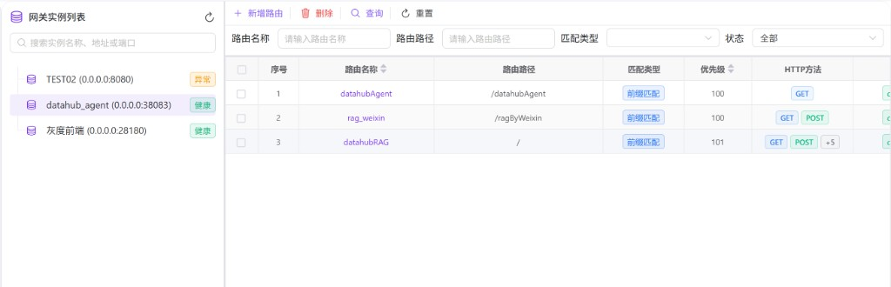
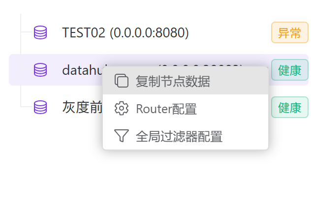
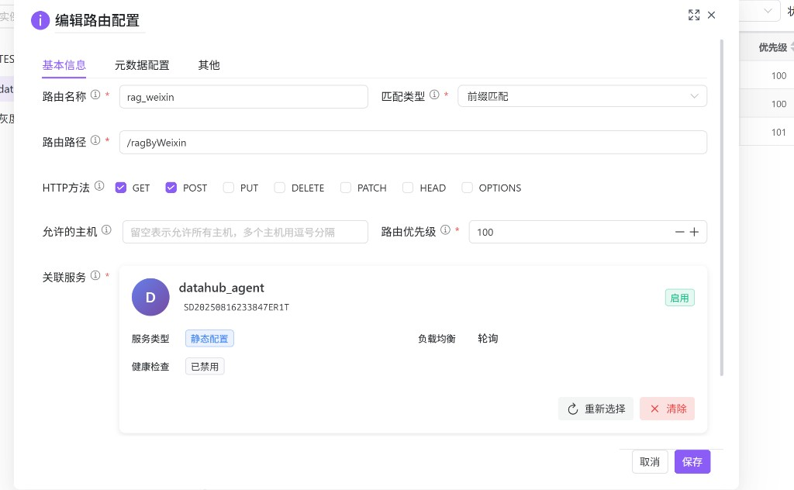
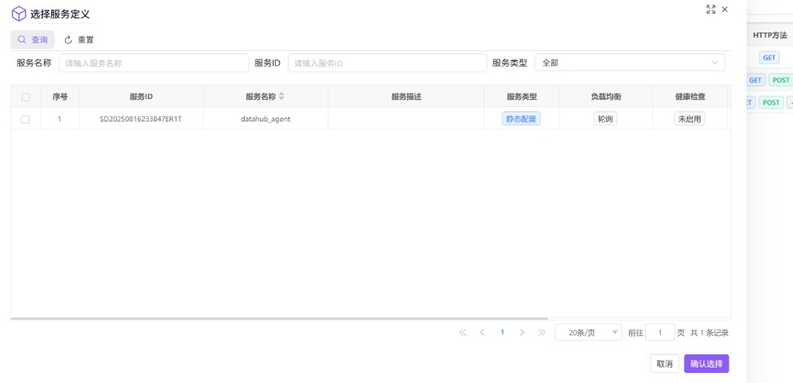
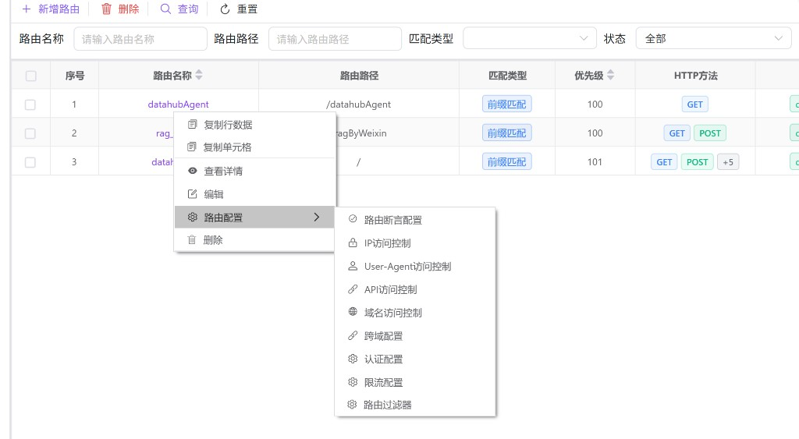

# 路由管理

用于在指定**网关实例**下维护路由规则：定义如何匹配请求（路径、方法、优先级等），以及命中后关联的目标服务，并通过断言、过滤器与访问控制等能力完成治理。

---

## 概述

路由管理关注两件事：

- **请求如何命中**：通过路由路径 + 匹配类型（精确/前缀/正则）+ HTTP 方法等规则匹配。
- **命中后从哪出响应**：先选后端——默认**服务代理**（必须关联已管理的服务），或**静态资源**（从本机文件夹提供网页和文件），或**重定向**（回 301/302/307/308）；再按需配置断言、过滤器、访问控制、跨域、认证、限流等。

本模块为“实例维度”配置：左侧先选择网关实例，右侧只展示该实例下的路由配置。

---

## 访问入口

侧栏 **网关管理** → **路由管理**。

---

## 页面布局

页面为左右分栏：

| 区域 | 说明 |
|------|------|
| 左侧 | **网关实例列表**：选择实例；支持过滤与刷新；并提供实例级的 **Router配置** 与 **全局过滤器配置** 入口。 |
| 右侧 | **路由配置列表**：对所选实例的路由进行查询、新增、编辑、删除，以及进入各类路由级治理配置。 |

---

## 操作说明

### 1. 选择目标网关实例

在左侧 **网关实例列表** 中：

- 可用搜索框按“实例名称、地址或端口”过滤。
- 单击某一实例后，右侧路由列表会切换为该实例的数据。

实例节点右键菜单提供实例级入口（以当前版本为准）：

- **Router配置**：实例级 Router 参数（缓存、性能、错误处理等）。
- **全局过滤器配置**：实例级全局过滤器链路。

说明：实例级配置通常作为“全局默认策略”；路由级配置用于对单条路由做更细粒度控制。

### 2. 新增路由

在右侧点击 **新增路由**，填写基本信息：

- **路由名称**：建议可读且可追踪（例如含业务域/环境）。
- **路由路径**：建议以 `/` 开头。
- **匹配类型**：
  - **精确匹配**：路径必须完全一致。
  - **前缀匹配**：以指定前缀开头即可命中（常用于一组 API）。
  - **正则匹配**：复杂匹配模式，建议审慎使用。
- **HTTP 方法**：为空通常表示不限制（全部）。
- **优先级**：数值越小优先级越高；多条规则同时命中时，优先级更高的先匹配。
- **后端**：默认 **服务代理**，必须选择当前实例下已启用的服务定义。选 **静态资源** 时不选服务，保存后填写网站文件目录。选 **重定向** 时同页填写状态码（301/302/307/308）和目标：站点内绝对路径 `/#/datahublogin`，或绝对地址 `https://域名/#/datahublogin` / `{scheme}://{host}/#/datahublogin`。301/308 永久且可缓存，302/307 临时且 `no-store`；要保留原 HTTP 方法用 307/308。
- **关联服务**：仅服务代理显示；未选择时不能保存。

选择关联服务时，会弹出服务选择窗口：

保存后，路由将出现在列表中。

### 3. 编辑、查看与删除

- **查看详情**：只读核对字段。
- **编辑**：修改路由匹配规则、优先级、方法、关联服务等。
- **删除**：支持单条删除；工具栏也支持批量删除（需先勾选）。

### 4. 路由级治理配置（右键菜单）

在路由行上右键，可进入路由级治理能力：

常见入口说明：

- **路由断言配置**：为路由增加额外匹配条件或校验逻辑。
- **IP / User-Agent / API / 域名访问控制**：对命中该路由的请求执行放行/拦截。
- **跨域配置**：配置 CORS 相关策略。
- **认证配置**：配置认证方式与参数（以界面为准）。
- **限流配置**：为路由设置限流策略与阈值（以界面为准）。
- **静态资源**：后端选「静态资源」后在此填写本机目录。详见下方「静态资源」。
- **路由过滤器**：为单条路由配置过滤器链路（与实例级全局过滤器互补）。

---

## 静态资源

命中路由后从**本机目录**读文件并直接响应，不再转发上游。适合 Vue / React 打包结果、说明站点、与接口共用同一网关端口的前端。对象存储、另一台 HTTP 服务请走「服务代理」。

### 配置入口

1. 新增或编辑路由时，**后端**选 **静态资源**（不要选服务代理，也不要填关联服务）。
2. 保存后会打开静态资源表单；也可在路由行右键 → **静态资源**。
3. 按实例发布策略**重载网关**后生效。

### 路径怎么对应到文件

先锁定网站目录，再按路由相对路径在该目录里找文件，规则放最后。只认本页配置，不读路由「转发」里的剥前缀 / 重写路径（静态路由也不展示那两项）。

| 顺序 | 网关 | 作用 |
|------|------|------|
| 1 | 路由匹配 | 先命中这条静态路由 |
| 2 | 网站文件目录（可含 `{v1,v2}`） | 锁定安全边界；占位符用剥前缀后第一段选目录 |
| 3 | 按路由路径找文件（剥前缀） | 在已锁定目录里取相对路径；正则剥字面前缀。关掉则整段 URI 留着拼 |
| 4 | 查找路径重写（可选） | 只改目录内相对路径，不能换根，也不改浏览器地址 |
| 5 | 文件 / 索引 / SPA | 在已锁定目录里出文件 |

改浏览器能看到的 URI，用**路由过滤器**，不要写在本页。

表单按处理顺序分为：**站点根目录** → **路径映射** → **重写规则** → **错误页面**。重写只调整已选定根目录内的查找路径，不得更换根目录。

### 表单字段

| 字段 | 说明 |
|------|------|
| 网站文件目录 | 文件系统访问边界。访问者不能读到该目录外。多个目录只差一段名字时，可写成 `/var/www/app-{v1,v2}/dist`：剥前缀后第一段路径须等于或以其项为前缀（最长优先），再展开到对应目录；展开结果必须仍在花括号前的父目录内。名单外返回 403。后续重写不得变更已选定的根目录。 |
| 按路由路径找文件 | 子路径托管时建议开。路由 `/app` 时，`/app/index.html` 读目录里的 `index.html`。 |
| 单页应用刷新不报错 | history 路由时打开。无后缀的缺失路径回退索引；带 `.js` / `.css` 的缺失仍 404。根目录含允许名单时，先回退第一段下的索引。 |
| 打开目录时的默认文件 | 默认 `index.html`，多个用逗号分隔。 |
| 查找路径重写 | 可选。目录锁定之后才改目录内相对路径，不能换根。 |
| 找不到 / 无权访问时显示 | 根目录内页面，如 `/404.html`。状态码仍是 404/403。 |
| 浏览器缓存（秒） | 普通文件的 max-age。HTML / 索引 / SPA 固定不缓存；带内容哈希的 js/css 用长缓存。`0` 表示普通文件也不缓存。 |
| 使用已压好的文件 | 目录里有同名 `.br` / `.gz` 且浏览器接受时直接输出。 |
| 只允许这些文件类型 | 留空不额外限制。隐藏文件（以点开头）始终不提供，`.well-known` 除外。 |
| 单个文件最大字节数 | `0` 不限制。超限 413。 |
| 跟随软链接 | 默认关。开启后目标仍须在网站目录内。 |

只处理 GET / HEAD。不会列出目录。目录请求缺尾斜杠时 301 到带 `/` 的地址。

### 推荐配法

| 场景 | 路由 | 静态资源要点 |
|------|------|----------------|
| 整站挂在 `/` | 前缀 `/` | 目录指到 `dist`，按需开 SPA。 |
| 前端在 `/app`，接口在 `/api` | 前缀 `/app` | 打开「按路由路径找文件」和 SPA；前端打包 `base` 与 `/app` 一致。 |
| 多个目录只差一段名字 | 前缀如 `/apps` | 目录写成 `/var/www/app-{v1,v2}/dist`，打开剥前缀。不要用路由正则 `$1` 拼磁盘路径。 |
| 登录壳 + datahub 微前端 | 见 `docs/zh-CN/08-静态资源托管.md` 场景五 | `/datahub01webVue` 用正则，根目录 `{d10,d12,...}` 按路径占位选目录，不必重写。d01/d05 单独正则并写死 `d50-web`。301/302 放 Ingress。 |
| 文件改名 | 任意 | 仅在「查找路径重写」加一行。 |

跨域、认证、限流仍用该路由右键配置。预检 OPTIONS 由跨域处理，不会按静态 GET/HEAD 拒绝。

### 访问日志与告警

静态流量单独降噪，避免一个页面带出几十条 js/css 记录：

- 成功命中（200 / 301 / 304 等）不写访问日志。
- 404 / 403 / 413 / 405 / 5xx 仍写，备注 `static_result=...; static_path=磁盘路径`。
- 4xx 与读文件超时不告警；仅 5xx 按实例告警配置发送。

### 常见问题（静态）

| 现象 | 处理 |
|------|------|
| 保存后页面仍是旧的 | 按实例重载 / 发布。 |
| 打开空白或 js 404 | 子路径是否打开「按路由路径找文件」；前端 `base` 是否与路由前缀一致。 |
| 刷新 `/user/1` 变成 404 | 打开「单页应用刷新不报错」。 |
| 根目录带 `{v1,v2}` 却 403 | 剥前缀后第一段不在允许名单，或未打开剥前缀导致第一段对不上。 |
| 想用 nginx 的 `$1` 拼目录 | 不要这样配。用前缀 + `{v1,v2}`，或一条路由一个固定目录。 |

---

## 推荐配置顺序

1. 在「代理管理（hub0022）」中创建好服务定义与节点（纯静态路由可跳过）。  
2. 在本页选择实例，新增路由：API 选「服务代理」并关联服务；前端选「静态资源」，保存后填写网站文件目录。  
3. 先用断言/访问控制把“该放行谁、拦截谁”定义清楚，再按需要加认证与限流。  
4. 变更后按实例发布策略重载/刷新（若需要）。后端未配置时，该路由无法加载。

---

## 常见问题

| 现象 | 可能原因与处理 |
|------|----------------|
| 右侧列表为空 | 先确认左侧已选择实例；或筛选条件过严，尝试重置。 |
| 命中路由不符合预期 | 检查 **匹配类型**、**路由路径** 与 **优先级**（数值越小优先级越高）。 |
| 修改后未生效 | 可能需要按实例的发布策略执行重载/刷新；同时确认修改的是正确实例与正确路由。 |
| 关联服务后仍 502/连接失败 | 回到「代理管理（hub0022）」检查服务节点地址/协议/端口与健康状态。 |
| 静态资源 404 / 空白页 | 见上文「常见问题（静态）」；确认目录在网关进程所在机器上，且已重载。 |
| 保存静态资源报错 | 升级库需先执行静态托管表的建表或补列脚本，再保存并重载。 |
