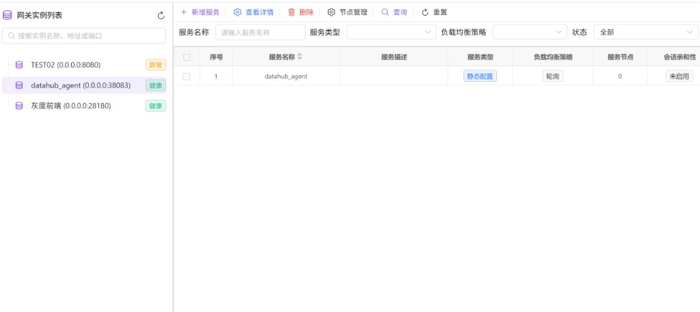
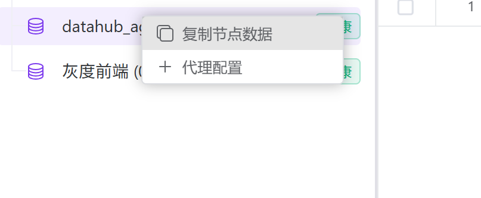
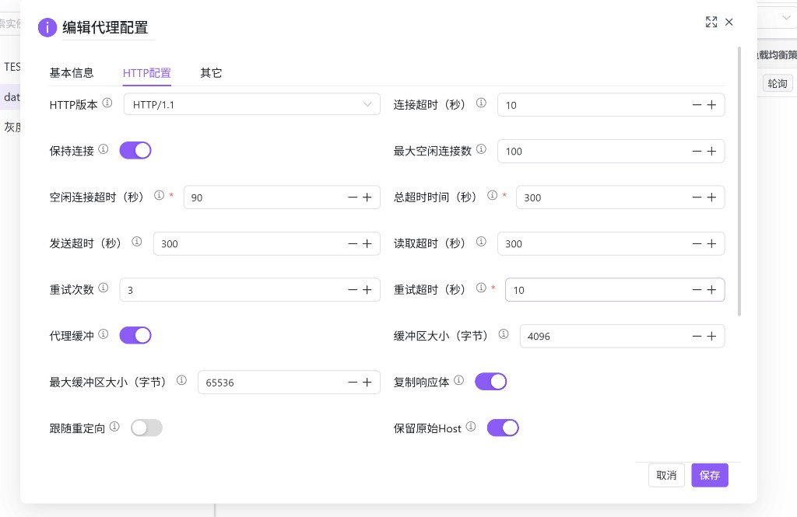
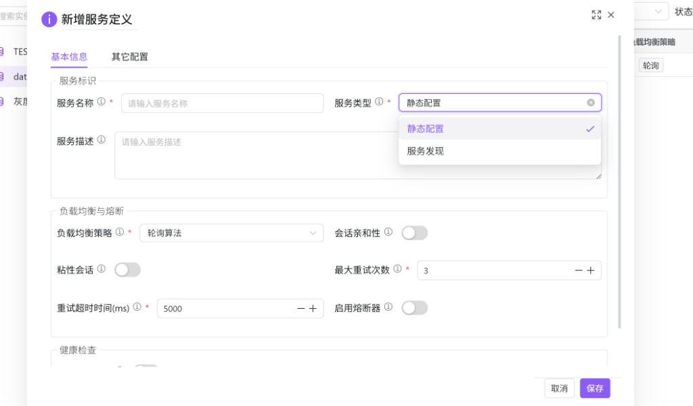
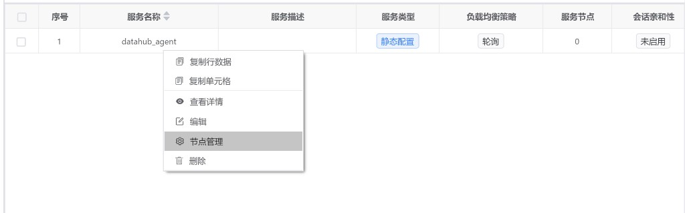
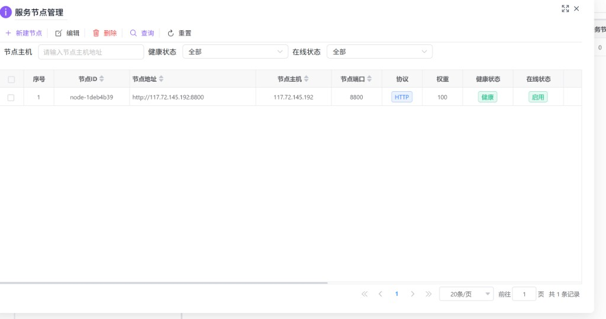

# 代理管理

用于在指定**网关实例**下维护“转发代理能力”的核心对象：**服务定义**与**服务节点**，并对实例配置代理相关的连接与超时参数（代理配置）。本模块通常与「路由管理（hub0021）」配合使用：路由负责“如何匹配请求”，代理负责“命中后转发到哪里、怎么转发”。

---

## 概述

代理管理聚焦三类工作：

- **选择网关实例**：左侧实例列表决定你正在维护哪个实例的代理配置与服务目录。
- **维护服务定义**：右侧服务列表维护服务名称、服务类型（静态/服务发现）、负载均衡、会话亲和性、熔断与健康检查等。
- **维护服务节点**：对静态服务配置具体的节点地址、协议、权重与启用状态（服务发现型服务通常由注册中心发现，节点管理的使用方式以你们环境为准）。

---

## 访问入口

侧栏 **网关管理** → **代理管理**。

---

## 页面布局

页面为左右分栏：

| 区域 | 说明 |
|------|------|
| 左侧 | **网关实例列表**：刷新、搜索过滤、选择实例；并提供实例级的 **代理配置** 入口。 |
| 右侧 | **服务定义列表**：对所选实例的服务定义进行查询、新增、编辑、删除与节点管理。 |

---

## 操作说明

### 1. 选择目标网关实例

在左侧 **网关实例列表** 中：

- 可通过搜索框按“实例名称、地址或端口”过滤。
- 单击某一实例后，右侧服务列表将切换到该实例（查询参数使用该实例 ID 作为 `proxyConfigId`）。

### 2. 配置实例级代理参数（可选）

对实例节点右键打开菜单，进入 **代理配置**。

代理配置对话框按代理类型展示不同页签（如 HTTP/WebSocket/TCP/UDP）；常用的 HTTP 配置包含连接超时、读写超时、重试次数、缓冲区大小、是否保持连接、是否保留原始 Host 等。

建议：若出现上游请求慢、长连接、或大响应体等场景导致超时，可先从此处对齐连接与读写超时，并与上游 LB/WAF/客户端 SDK 的超时保持一致。

### 3. 新增服务定义

在右侧点击 **新增服务**，填写服务标识与策略。

常见字段说明：

- **服务名称**：服务的唯一标识，建议与业务域一致，便于路由引用与排障。
- **服务类型**：
  - **静态配置**：手工维护节点列表（常用于固定后端地址）。
  - **服务发现**：由服务注册中心发现实例（是否需要手工节点管理以环境实现为准）。
- **负载均衡策略**：轮询、随机、IP 哈希、最少连接、加权轮询、一致性哈希等。
- **会话亲和性**：用于让同一会话尽量落到同一后端节点。
- **熔断/健康检查**：用于提升不稳定后端场景下的可用性（具体参数项以界面为准）。

---

## 服务定义列表

### 查询条件

| 条件 | 说明 |
|------|------|
| 服务名称 | 按服务名称筛选。 |
| 服务类型 | 静态配置 / 服务发现。 |
| 负载均衡策略 | 按策略筛选。 |
| 状态 | 启用 / 禁用。 |

### 工具栏操作

| 操作 | 说明 |
|------|------|
| 新增服务 | 创建服务定义。 |
| 查看详情 | 查看所选服务的详细信息。 |
| 删除 | 支持批量删除（需先勾选）。 |
| 节点管理 | 打开服务节点管理对话框（针对所选服务）。 |

### 行右键菜单

在服务行上右键可快速执行：查看详情、编辑、节点管理、删除。

---

## 服务节点管理

在服务行菜单或工具栏中进入 **节点管理**，可维护该服务的后端节点。

常见字段含义：

- **节点协议**：HTTP/HTTPS。
- **节点主机/端口**：后端服务地址；表单会根据协议、主机、端口自动生成节点 URL。
- **节点权重**：用于加权类负载均衡策略。
- **健康状态/在线状态/启用状态**：用于判断节点是否参与转发（具体生效策略以网关实现为准）。

---

## 与路由管理的关系

- **代理管理（hub0022）**：定义“可被转发的服务与节点”，并为实例配置代理/连接策略。
- **路由管理（hub0021）**：定义“请求如何命中路由，以及命中后关联哪个服务定义”。

通常建议先在本页创建好服务定义与节点，再在路由中关联服务。

---

## 常见问题

| 现象 | 可能原因与处理 |
|------|----------------|
| 右侧列表为空 | 先确认左侧已选择实例；未选择实例时不会发起服务列表查询。 |
| 节点健康但仍无法访问 | 检查节点协议/端口是否正确、网络是否可达、上游路由是否已关联该服务。 |
| 超时或连接被断开 | 优先对齐实例级 **代理配置** 中的连接/读写/总超时，并排查上游 LB/WAF 与客户端超时是否更短。 |
