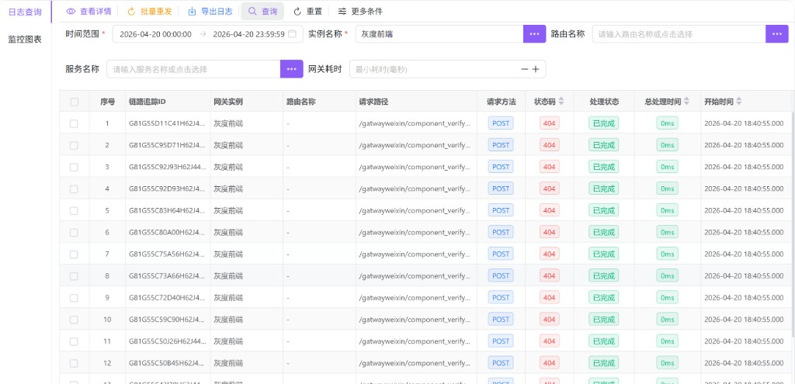
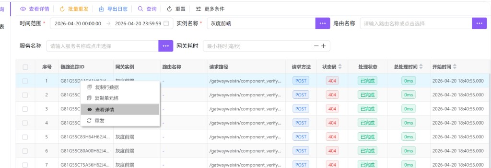
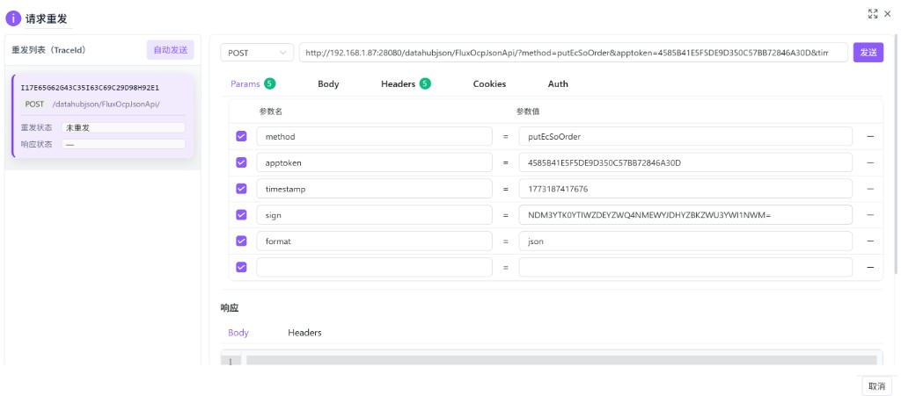
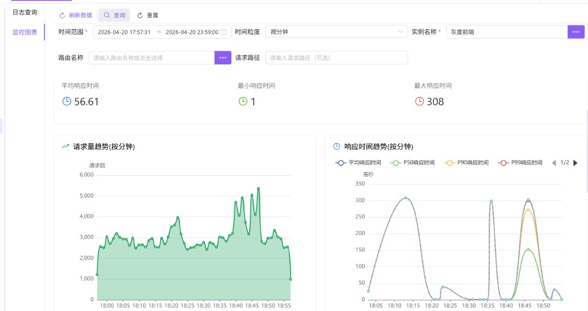
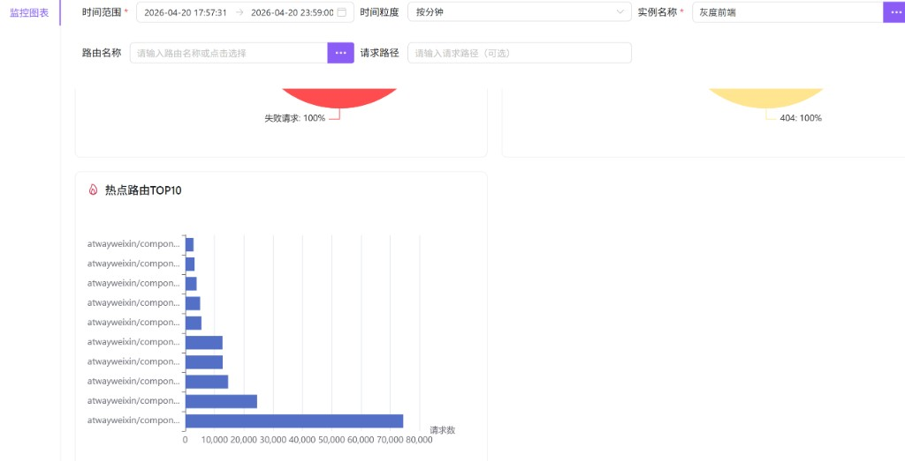

# 网关日志管理（hub0023）

按**网关实例**查询与浏览访问日志，支持条件筛选、导出、单条详情（含后端追踪）、请求重发，以及同一实例维度下的**监控图表**（概览与趋势）。日志数据按实例分片存储，因此**列表、导出、详情与监控类查询都必须指定网关实例**（界面中的「实例名称」会同步绑定后端的 `gatewayInstanceId`）。

---

## 概述

| 能力 | 说明 |
|------|------|
| 日志查询 | 按时间范围、实例、路由、服务、耗时等条件分页查询访问日志。 |
| 详情与追踪 | 打开「后端日志详情」对话框，查看主表信息与后端服务追踪链。 |
| 导出 | 按当前查询条件导出；仍受所选实例约束。 |
| 批量重发 | 将勾选的多条日志载入「请求重发」弹窗；单次最多 **100** 条，超出部分不会进入弹窗。 |
| 监控图表 | 在选定时间粒度下查看总请求、成功/失败、响应时间以及请求量与耗时趋势等。 |

---

## 访问入口

侧栏 **网关管理** → **网关日志管理**。

页面为左侧标签布局：

- **日志查询**：主列表与筛选、工具栏、表格右键菜单。
- **监控图表**：在同一模块内切换，筛选条件与日志页类似，但**时间范围不得超过 24 小时**（表单校验）。

---

## 日志查询

### 必填条件

| 条件 | 说明 |
|------|------|
| **时间范围** | 按网关开始处理时间筛选；支持快捷项（今天、昨天、最近 1/6/24 小时、最近 7 天等，以界面为准）。 |
| **实例名称** | 必选。决定查询哪套实例上的访问日志；可通过名称旁的「…」打开选择器。未选实例时，**查询**、**导出日志** 等会提示先选择实例。 |

### 主区域常用条件

| 条件 | 说明 |
|------|------|
| **路由名称** | 可输入或点击「…」从路由选择器选择；路由列表会按当前已选实例过滤。 |
| **服务名称** | 同上，与服务选择器联动实例。 |
| **网关耗时** | 「最小耗时」阈值，单位毫秒，用于筛掉耗时过低的记录。 |

### 「更多条件」展开项

点击 **更多条件** 后，还可填写：**链路追踪 ID**、**请求路径**、**客户端 IP**、**请求方法**、**代理类型**、**状态码**、**后端状态码**、**重置状态**、**用户标识**，以及开关 **仅非 200 状态**（快速只看异常响应）。

### 工具栏与查询流程

1. 选择 **时间范围** 与 **实例名称**（可再填路由、服务、耗时等）。
2. 点击 **查询** 刷新列表（从第一页开始）；**重置** 会恢复表单默认（时间仍可能默认当天、实例若接口有默认则可能保留）。
3. **更多条件** 用于展开或收起上述扩展筛选项。

| 按钮 | 说明 |
|------|------|
| **查看详情** | 对当前**选中行**（表格勾选或焦点行）打开「后端日志详情」；未选中时会提示先选择一行。 |
| **批量重发** | 将**已勾选**的多条记录打开「请求重发」；未勾选会提示选择；超过 100 条时仅前 100 条进入弹窗并给出提示。 |
| **导出日志** | 按当前条件导出，**必须先选实例**。 |
| **查询 / 重置** | 同常规搜索表单行为。 |

### 列表列与含义（常见列）

表格以后端返回与配置为准，常见列包括：

| 列 | 含义 |
|----|------|
| 序号 | 当前页内行号。 |
| 链路追踪 ID | 全链路关联 ID，详情与重发均依赖该字段。 |
| 网关实例 | 处理该请求的网关实例名称。 |
| 路由名称 | 匹配到的路由；无则显示为 `-`。 |
| 请求路径 | 实际请求路径（可能较长，悬停可看完整内容）。 |
| 请求方法 | HTTP 方法，以标签形式展示。 |
| 状态码 | 网关侧 HTTP 状态码（如 404、500）；颜色仅作区分，**不代表**处理状态列的语义。 |
| 处理状态 | 网关内部处理生命周期（如已完成等），与 HTTP 状态码独立。 |
| 总处理时间 | 端到端耗时，单位毫秒。 |
| 开始时间 | 请求开始时间。 |

### 表格右键菜单

在数据行上右键，除表格组件自带的 **复制行数据**、**复制单元格外**，还可：

| 菜单项 | 说明 |
|--------|------|
| **查看详情** | 与工具栏「查看详情」相同，针对**右键所在行**。 |
| **重发** | 仅针对该行打开「请求重发」（与批量入口为同一弹窗，列表中可含单条）。 |

工具栏「查看详情」依赖**当前选中行**；右键「查看详情」针对**右键那一行**。若习惯点选一行再操作，两种方式等价。

---

## 详情与请求重发

### 后端日志详情

- 依赖该行的 **traceId** 与 **gatewayInstanceId**。若数据不完整，界面会提示从列表重新打开。
- 对话框标题形如：`后端日志详情 - <TraceId>`。
- 内容分区包括：**基本信息**、**请求信息**、**响应信息**、**时间跟踪**、**路由信息** 等；若有错误、请求/响应头体，会按需展示。
- 下方 **后端服务追踪** 以多 Tab 展示各后端跳转，含转发信息、时间、响应及可选的转发体、响应体等。

### 请求重发弹窗

从 **批量重发**（多选）或右键 **重发**（单条）进入。

- **左侧「重发列表（TraceId）」**：本次带入的所有 Trace；可切换查看每一条的拼装结果。卡片上会显示 **重发状态**、**响应状态** 等摘要。
- **自动发送**：按列表顺序对尚未自动执行过的条目依次加载并发送（适合批量回归；请注意对下游环境的冲击）。
- **右侧**：类似 HTTP 调试客户端，可切换 **Params / Body / Headers / Cookies / Auth**，修改后点击 **发送** 手动重放。
- **响应** 区域展示本次重发的响应 Body 与 Headers。
- **取消** 关闭弹窗；全屏按钮可放大编辑区域。

重发数据来自该条日志的详情接口拼装，用于排障与复现；修改参数后发送的是**新请求**，请谨慎在生产环境使用。

---

## 监控图表

切换到 **监控图表** 标签后，先选择 **时间范围**（**必填，且跨度不超过 24 小时**）、**时间粒度**（按分钟 / 按小时 / 按天）、**实例名称**，可选 **路由名称**、**请求路径**，再点击 **查询**。

工具栏 **刷新数据** 会在保持当前表单条件的情况下重新拉取监控接口数据。

### 监控概览

展示 **总请求数**、**成功请求数**、**失败请求数**，以及 **平均 / 最小 / 最大响应时间**（毫秒）。用于快速判断所选时段内流量规模与延迟水平。

### 图表说明

- **请求量趋势（按当前粒度）**：单位时间内请求条数随时间变化，用于看流量高峰与低谷。
- **响应时间趋势（按当前粒度）**：通常包含平均、P50、P90、P99 等曲线；**P99** 表示 99% 的请求耗时低于该值，对长尾延迟敏感。
- 若界面提供图表区分页或轮播（如 **1/2**），可切换查看其余监控图。

- **请求指标分布**：成功与失败请求占比（例如失败占比升高时需结合日志查询排查）。
- **状态码分布**：各 HTTP 状态码占比（如 404、502 集中时需检查路由或上游）。
- **热点路由 TOP10**：访问量最高的路由排行，便于发现热点路径与容量规划。

---

## 使用建议与说明

- **先选实例再查**：与存储分片一致，避免误查或空结果。
- **日志查询** 与 **监控图表** 的时间含义均为网关侧时间范围；监控页额外限制 **24 小时**，避免单次聚合压力过大。
- **状态码**（HTTP）与 **处理状态**（网关内部）同时出现时，排查问题建议两者对照，并结合详情中的后端追踪。

---

## 开发与数据约定（简述）

面向二次开发时：网关日志相关 API 在发请求前会校验 **gatewayInstanceId**（去空白后非空）；缺失时由前端拦截并提示用户。列表、详情、导出、监控概览与图表等查询均携带实例维度。重置类写操作参数以后端定义为准。
