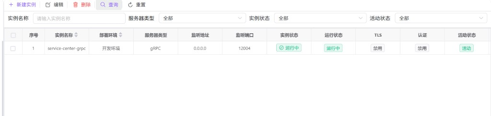
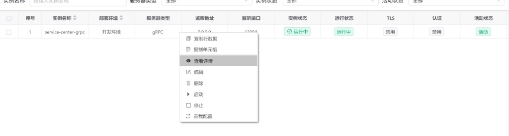
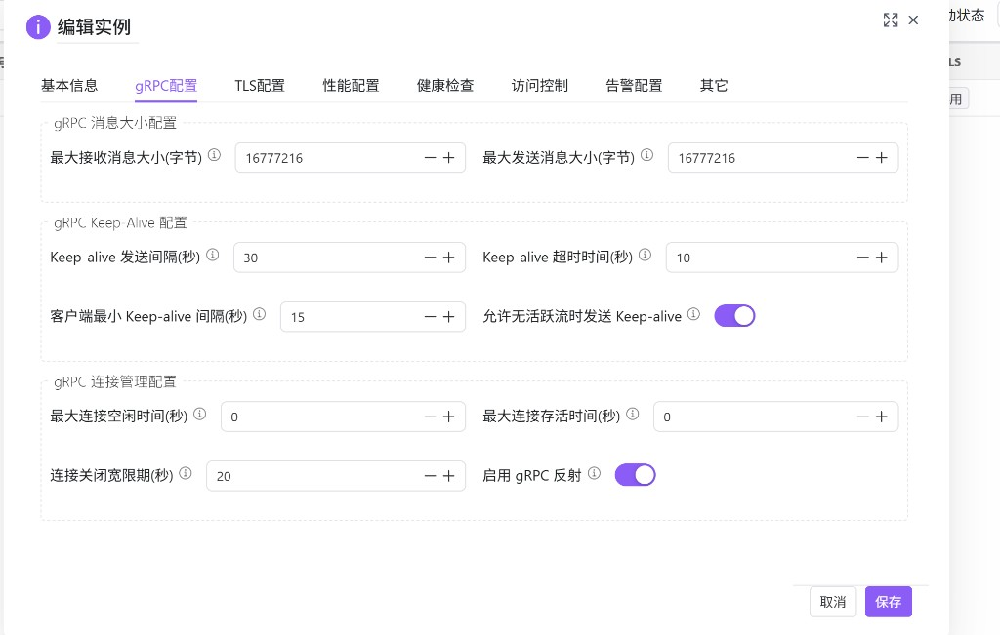

# 服务中心实例管理（hub0040）

本模块用于在控制台中**登记、配置与运维「服务中心」进程实例**（监听地址、端口、gRPC/TLS、健康检查、访问控制、告警等）。业务应用侧若使用 Java，可通过官方 **[Flux Service Center SDK for Java](https://github.com/fluxsce/flux-service-center-sdk-java)** 连接已部署的服务中心，完成**服务注册与发现、配置订阅**等能力；SDK 中的 `serverHost` / `serverPort`（或集群 `serverAddress`）需指向**应用网络可达**的服务中心地址，通常与本页实例的**监听地址、监听端口**及实际部署拓扑一致。网关其它能力会消费服务中心中的注册信息，因此常将「连上服务中心并完成注册」口语化称为接入体系或网关侧服务发现链路的一环。



---

## 概述

| 能力 | 说明 |
|------|------|
| 实例维护 | 新增、编辑、查看详情、删除服务中心实例配置。 |
| 条件查询 | 按实例名称、服务器类型、实例状态、活动状态筛选列表。 |
| 生命周期 | 启动、停止实例；重载配置使部分参数在不重启进程的情况下生效（以后端能力为准）。 |
| 多维配置 | 基本信息、gRPC、TLS、性能、健康检查、访问控制、告警、其它元数据等分 Tab 维护。 |

---

## 访问入口

侧栏 **服务治理** → **服务中心实例管理**。

---

## 列表与筛选

### 筛选条件

| 字段 | 说明 |
|------|------|
| **实例名称** | 模糊或精确匹配实例名（占位：请输入实例名称）。 |
| **服务器类型** | 全部 / gRPC / HTTP。 |
| **实例状态** | 全部 / 停止 / 启动中 / 运行中 / 停止中 / 异常。 |
| **活动状态** | 全部 / 活动 / 非活动。 |

填写条件后点击 **查询** 刷新列表；**重置** 清空筛选并重新查询。

### 工具栏

| 按钮 | 说明 |
|------|------|
| **新建实例** | 打开「新增实例」对话框，填写各 Tab 后保存。 |
| **编辑** | 对**当前勾选行**或**当前焦点行**（未勾选时）拉取详情并打开「编辑实例」。未选中任何行时会提示先选择。 |
| **删除** | 同上，删除选中的一条实例配置；操作前一般有确认对话框。 |
| **查询 / 重置** | 与筛选表单联动。 |

---

## 表格列说明

列表支持勾选、分页及列排序（若列头可排序）。常见列含义如下：

| 列 | 含义 |
|----|------|
| 实例名称 | 实例唯一标识，与 SDK 中命名空间、服务名等组合使用时的逻辑名区分：此处为**服务中心实例**名称。 |
| 部署环境 | 开发环境 / 预发布环境 / 生产环境。 |
| 服务器类型 | 如 gRPC、HTTP。 |
| 监听地址 | 进程绑定地址，如 `0.0.0.0` 表示监听所有网卡。 |
| 监听端口 | 对外服务端口，需与防火墙及客户端/SDK 连接配置一致。 |
| 实例状态 | 停止、启动中、运行中、停止中、异常等，以标签展示。 |
| 运行状态 | 由实例状态推导：运行中为进程处于 `RUNNING` 时，否则显示已停止。 |
| TLS / 认证 | 是否启用 TLS、是否启用访问认证。 |
| 活动状态 | 活动表示接受调度或对外服务（以产品定义为准）；非活动可理解为维护或下线态。 |
| 状态消息 / 最后状态变更时间 / 最后健康检查时间 | 运维排障与存活观测。 |
| 创建与修改信息 | 审计字段。 |

---

## 右键菜单

在表格行上右键，除通用的 **复制行数据**、**复制单元格** 外，还可：



| 菜单项 | 说明 |
|--------|------|
| **查看详情** | 只读打开对话框，数据从后端拉取最新。 |
| **编辑** | 与工具栏编辑相同，针对当前行。 |
| **删除** | 删除当前行对应实例。 |
| **启动** | 启动该实例对应的服务中心进程（需后端与 Agent 支持）。 |
| **停止** | 停止进程，确认后执行。 |
| **重载配置** | 在不停止进程的前提下重新加载配置（具体生效范围以后端为准）。 |

启动、停止、重载前界面会弹出确认框，请避免在生产高峰期误操作。

---

## 新增 / 编辑 / 查看实例

新增时标题为 **新增实例**；编辑为 **编辑实例**；查看为 **查看实例详情**。对话框支持最大化，底部为 **取消** 与 **保存**（查看模式下表单为只读）。

### 配置 Tab 一览

与界面一致，依次为：

1. **基本信息**：实例名称、部署环境、服务器类型、监听地址、监听端口、活动状态、备注等。  
2. **gRPC配置**：消息大小、Keep-Alive、连接管理、是否启用 gRPC 反射等。  
3. **TLS配置**：启用 TLS、mTLS、证书与私钥上传等。  
4. **性能配置**：并发流、读写缓冲等。  
5. **健康检查**：检查间隔与超时（表单内提示：客户端心跳建议小于检查间隔）。  
6. **访问控制**：启用认证、IP 白名单/黑名单。  
7. **告警配置**：是否启用告警、渠道及多类告警开关。  
8. **其它**：创建/修改时间与操作人（只读）。

### gRPC 配置示例（编辑实例）



| 分组 | 字段 | 说明 |
|------|------|------|
| gRPC 消息大小 | 最大接收/发送消息大小(字节) | 单条消息上限，默认常见为 16MB 量级，可按业务报文大小调整。 |
| gRPC Keep-Alive | 发送间隔、超时、客户端最小间隔 | 控制连接保活行为，避免过长空闲被中间设备断开。 |
|  | 允许无活跃流时发送 Keep-alive | 无 RPC 流时是否仍发送 ping，按网络环境与安全策略选择。 |
| gRPC 连接管理 | 最大连接空闲/存活时间 | `0` 常表示不限制；具体语义见字段旁说明。 |
|  | 连接关闭宽限期(秒) | 主动断开前允许在途请求完成的窗口。 |
|  | 启用 gRPC 反射 | 便于使用 grpcurl 等工具调试，生产环境可按安全要求关闭。 |

保存前请核对 **监听端口** 与机器上实际监听、负载均衡转发端口一致，避免 SDK 或网关连错地址。

---

## Java 客户端：使用 SDK 连接服务中心

官方仓库：**[fluxsce/flux-service-center-sdk-java](https://github.com/fluxsce/flux-service-center-sdk-java)**（服务注册发现、配置管理中心 Java SDK）。

### Maven 依赖（版本以仓库 README 为准）

```xml
<dependency>
    <groupId>com.flux</groupId>
    <artifactId>flux-service-center-sdk-java</artifactId>
    <version>2.0.6</version>
</dependency>
```

### 最小连接与注册示例（摘自仓库说明）

将 `serverHost` / `serverPort` 替换为可访问本页实例所在机器的地址与 **监听端口**（例如截图中的 `12004`）；`namespaceId` 等与业务命名约定对齐。

```java
import com.flux.servicecenter.client.StreamBasedServiceCenterClient;
import com.flux.servicecenter.config.ServiceCenterConfig;
import com.flux.servicecenter.model.*;

ServiceCenterConfig config = new ServiceCenterConfig()
    .setServerHost("192.168.1.100")
    .setServerPort(12004)
    .setNamespaceId("my-namespace");

try (StreamBasedServiceCenterClient client = new StreamBasedServiceCenterClient(config)) {
    client.connect();
    ServiceInfo service = new ServiceInfo()
        .setServiceName("user-service")
        .setServiceType("HTTP");
    NodeInfo node = new NodeInfo()
        .setIpAddress("192.168.1.200")
        .setPortNumber(8080);
    RegisterServiceResult result = client.registerService(service, node);
    // 服务发现、配置监听等见仓库 README
}
```

### 与本页配置的对应关系

| 控制台配置 | SDK / 运维侧 |
|------------|----------------|
| 监听地址 / 端口 | 客户端应连接**可被路由到的 IP/DNS + 端口**；若监听 `0.0.0.0`，对外仍使用机器真实 IP 或 VIP。 |
| 启用 TLS / mTLS | 与 `ServiceCenterConfig#setEnableTls`、证书路径等一致，需双向配置。 |
| 启用认证 | 与 `setUserId` / `setPassword` 等认证方式一致，见仓库 **认证配置** 章节。 |
| 健康检查间隔 | SDK 心跳 `heartbeatInterval` 等应小于或适配控制台健康检查说明，避免被误判下线。 |

生产环境建议使用 README 中的 **集群地址** `setServerAddress("host1:port1,host2:port2,...")`、TLS 与优雅关闭等最佳实践。

---

## 使用建议

- 同一部署环境下 **实例名称 + 部署环境** 通常唯一，删除前确认无业务仍连接该实例。  
- 修改端口或 TLS 后，需同步更新所有 Java SDK 与网关侧连接配置，并安排滚动重启或重载。  
- 更多 API（服务发现、配置监听、回滚等）以 **[GitHub 仓库 README](https://github.com/fluxsce/flux-service-center-sdk-java/blob/master/README.md)** 为准。
