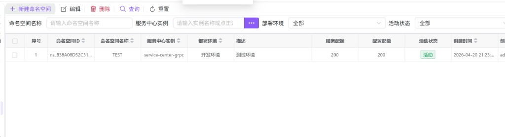
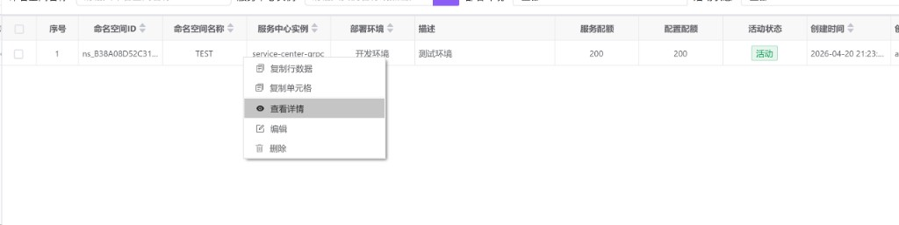

# 命名空间管理（hub0041）

命名空间用于在某一 **服务中心实例** 下划分逻辑边界，承载 **服务列表**、**配置中心** 等数据的隔离与配额控制。创建命名空间前，请先在 **服务中心实例管理（hub0040）** 中准备好可用的实例。

---

## 概述

| 能力 | 说明 |
|------|------|
| 命名空间 CRUD | 新建、编辑、查看详情、删除（含批量删除）。 |
| 与实例绑定 | 每个命名空间必须关联一个服务中心实例；部署环境随所选实例自动带出且不可手改。 |
| 配额 | 可限制命名空间下服务数量、配置数量（0 表示无限制）。 |
| 活动状态 | 控制命名空间是否处于可用态（活动 / 非活动）。 |

---

## 访问入口

侧栏 **服务治理** → **命名空间管理**。

---

## 列表与筛选

### 筛选条件

| 字段 | 说明 |
|------|------|
| **命名空间名称** | 按名称筛选（占位：请输入命名空间名称）。 |
| **服务中心实例** | 通过「…」选择器选择实例，用于只看某实例下的命名空间。 |
| **部署环境** | 全部 / 开发环境 / 预发布环境 / 生产环境。 |
| **活动状态** | 全部 / 活动 / 非活动。 |

使用 **查询** 刷新列表；**重置** 清空条件后重新查询。

### 工具栏

| 按钮 | 说明 |
|------|------|
| **新建命名空间** | 打开「新增命名空间」对话框。 |
| **编辑** | 必须在表格中 **勾选且仅勾选一行**，否则会提示「请先选择」或「只能编辑一个命名空间」。 |
| **删除** | 支持 **多选勾选** 后批量删除；确认框中会提示删除条数且操作不可恢复。 |
| **查询 / 重置** | 与筛选表单一致。 |

---

## 表格列说明

| 列 | 含义 |
|----|------|
| 命名空间 ID | 唯一标识（主键），可与 SDK、配置中的 `namespaceId` 对应。 |
| 命名空间名称 | 展示用名称，与 ID 均受格式与长度校验（见下文表单说明）。 |
| 服务中心实例 | 该命名空间所属实例名称。 |
| 部署环境 | 与实例环境一致：开发 / 预发布 / 生产。 |
| 描述 | 业务说明文案。 |
| 服务配额 / 配置配额 | 上限数字；为 **0** 时在列表中显示为 **无限制**。 |
| 活动状态 | 活动 / 非活动。 |
| 创建时间、创建人、修改时间、修改人 | 审计信息。 |

---

## 右键菜单

在数据行上右键，除 **复制行数据**、**复制单元格** 外，还可：

| 菜单项 | 说明 |
|--------|------|
| **查看详情** | 只读对话框，数据从后端拉取最新。 |
| **编辑** | 与工具栏编辑等价，针对当前行。 |
| **删除** | 删除当前命名空间单行；删除前有确认框。 |

---

## 新增 / 编辑 / 查看命名空间

对话框标题：**新增命名空间**、**编辑命名空间**、**查看命名空间详情**。支持最大化；**保存** 提交，**取消** 关闭。

### Tab：基本信息

| 字段 | 说明 |
|------|------|
| **命名空间 ID** | 必填；1～32 位，仅字母、数字、下划线。可不填由系统生成（以界面提示为准）。 |
| **命名空间名称** | 必填；同样 1～32 位字母、数字、下划线。 |
| **服务中心实例** | 必填；选择后 **部署环境** 会根据实例自动填充且为只读。 |
| **部署环境** | 由实例决定，不可编辑。 |
| **命名空间描述** | 可选多行文本。 |
| **活动状态** | 开关：活动 / 非活动。 |

### Tab：配额配置

| 字段 | 说明 |
|------|------|
| **服务数量配额限制** | 该命名空间下允许注册的最大服务数；**0** 表示无限制。 |
| **配置数量配额限制** | 该命名空间下配置条数上限；**0** 表示无限制。 |

### Tab：其它

备注、创建/修改时间与操作人（后四项在编辑、查看时多为只读）。

---

## 使用建议

- 先创建 **服务中心实例（hub0040）**，再在本页选择对应实例创建命名空间，避免无实例可选。  
- 删除命名空间前，确认其下 **服务列表、配置中心** 等数据已迁移或不再需要，避免误删导致业务中断。  
- **编辑** 依赖表格 **勾选单行**；若只单击高亮而未勾选，工具栏编辑可能无效，请勾选左侧复选框。

---

## 配套：预警渠道（hub0080）

下列界面属于 **预警管理 → 预警服务配置（hub0080）**，与命名空间同属平台治理能力。告警渠道用于发送邮件、钉钉、企业微信等通知；在 **服务中心实例（hub0040）** 的告警 Tab 中配置渠道名称时，会与此处维护的渠道对应。

### 筛选与工具栏

| 筛选项 | 说明 |
|--------|------|
| 渠道名称、渠道类型、启用状态、默认渠道 | 与列表列一致，支持组合查询。 |

| 按钮 | 说明 |
|------|------|
| **新增渠道** | 打开新增告警渠道配置对话框。 |
| **删除** | 删除 **当前单击选中（高亮）** 的一行配置；未点击选中行时会提示先选择。 |
| **查询 / 重置** | 刷新列表或清空条件。 |

列表中 **启用状态** 列可直接通过开关切换（无需进入编辑对话框）。

### 右键菜单

| 菜单项 | 说明 |
|--------|------|
| **查看详情 / 编辑** | 打开对话框查看或修改完整配置。 |
| **复制** | 基于当前渠道复制为新配置，**渠道名称需重新填写**。 |
| **重载配置** | 使配置立即生效（确认后执行）。 |
| **设为默认** | 将未指定渠道时的默认告警出口设为本渠道。 |
| **预警测试** | 发送测试消息；**未启用** 的渠道无法测试。 |
| **删除** | 删除该渠道配置。 |

### 编辑对话框（基本信息 Tab 示例）

对话框标题为 **新增告警渠道配置** / **编辑告警渠道配置** / **查看告警渠道配置详情**。Tab 包括：

1. **基本信息**：渠道名称（英文、数字、下划线）、渠道类型、渠道描述、优先级（1～10，数字越小优先级越高）、默认渠道、启用状态、默认模板名称（可「…」选择模板）等。  
2. **渠道配置**：按渠道类型展示 SMTP、Webhook 等分组字段（以界面为准）。  
3. **其他信息**：扩展与审计类字段。

更完整的字段说明可单独维护在 [预警服务配置（hub0080）](./hub0080.md) 文档中。
