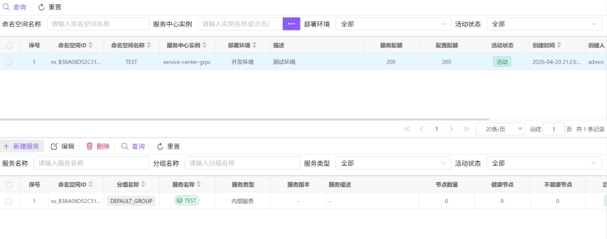
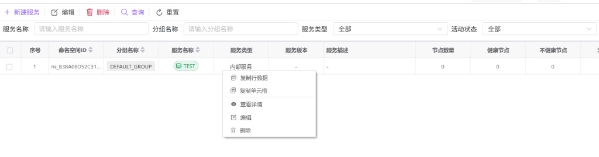

# 服务列表（hub0042）

本页在**上下分栏**中同时展示 **命名空间** 与 **服务**：先在上方选中一个命名空间，再在下方对该空间内的服务做查询、新建、编辑、删除及查看详情。命名空间的新增与删改请在 **[命名空间管理（hub0041）](./hub0041.md)** 完成；本页内嵌的命名空间列表以筛选与查看为主。

---

## 概述

| 能力 | 说明 |
|------|------|
| 命名空间选择 | 单击命名空间行，加载该空间下的服务列表。 |
| 服务维护 | 新建、编辑、删除服务；支持按名称、分组、类型、活动状态筛选。 |
| 服务详情 | 全页展示服务元数据与**服务实例列表**（节点健康情况）。 |
| 与注册中心对齐 | 服务类型支持内部服务、Nacos、Consul、Eureka、ETCD、ZooKeeper 等（与表单选项一致）。 |

---

## 访问入口

侧栏 **服务治理** → **服务列表**。

---

## 上半区：命名空间列表（内嵌）

- **筛选**：命名空间名称、服务中心实例（「…」选择器）、部署环境、活动状态；使用 **查询** / **重置** 刷新列表。  
- **行单击**：选中该命名空间，并**自动加载**下方「该命名空间下」的服务列表。  
- **右键菜单**：仅提供 **查看详情**（内嵌场景下不提供命名空间的编辑/删除，完整 CRUD 请使用 [hub0041](./hub0041.md)）。  

未选中命名空间时，下方服务的 **查询**、**新建服务** 以及分页会受限：界面会提示「请先在上方命名空间列表中选择一个命名空间」；取消选择命名空间时，下方服务列表会被清空。

---

## 下半区：服务列表

### 筛选条件

| 字段 | 说明 |
|------|------|
| **服务名称** | 占位：请输入服务名称。 |
| **分组名称** | 占位：请输入分组名称。 |
| **服务类型** | 全部 / 内部服务 / Nacos / Consul / Eureka / ETCD / ZooKeeper。 |
| **活动状态** | 全部 / 活动 / 非活动。 |

查询结果始终限定在**当前选中的命名空间**内（由程序自动带上 `namespaceId`）。

### 工具栏

| 按钮 | 说明 |
|------|------|
| **新建服务** | 打开「新增服务」对话框；**命名空间 ID** 从当前选中行自动带入且不可改。未选命名空间时会提示先选择。 |
| **编辑** | 优先使用**勾选行**；若无勾选则使用**当前高亮行**。必须且仅能选中 **1** 条，否则会提示「请先选择」或「只能编辑一个服务」。 |
| **删除** | 支持勾选**多条**批量删除，确认后逐条调用删除接口。 |
| **查询 / 重置** | 刷新服务列表或清空服务筛选条件（仍需已选命名空间）。 |

### 表格列说明

| 列 | 含义 |
|----|------|
| 命名空间 ID | 所属命名空间；与上方选中行一致。 |
| 分组名称 | 逻辑分组，常见为 `DEFAULT_GROUP`；列表中以标签样式展示。 |
| 服务名称 | 注册服务名；列表中以圆角标签展示。 |
| 服务类型 | 如内部服务、Nacos 等。 |
| 服务版本 / 服务描述 | 无内容时显示为 `-`。 |
| 节点数量 / 健康节点 / 不健康节点 | 反映已注册实例规模与健康度，便于一眼判断是否需要排查节点或网络。 |
| 活动状态 | 活动 / 非活动。 |
| 创建与修改信息 | 审计字段。 |

分组、服务名称的标签颜色由名称哈希稳定映射，**`DEFAULT_GROUP`** 使用固定默认色系，便于快速识别。

### 右键菜单

| 菜单项 | 说明 |
|--------|------|
| **复制行数据 / 复制单元格** | 表格通用能力。 |
| **查看详情** | 进入**全页「服务详情」**（非弹窗简要查看）：左侧为服务基本信息与元数据 JSON，右侧为 **服务实例列表**，可结合节点展示做运维排查。 |
| **编辑** | 打开「编辑服务」对话框（拉取最新详情后再编辑）。 |
| **删除** | 删除当前行对应服务（有确认流程）。 |

---

## 新增 / 编辑服务对话框

- **新增**：标题为 **新增服务**。  
- **编辑**：标题为 **编辑服务**；**分组名称**、**服务名称** 为联合主键的一部分，编辑模式下**不允许修改**（以界面禁用状态为准）。

### Tab：基本信息

| 字段 | 说明 |
|------|------|
| **命名空间 ID** | 必填、只读，来自上方选中的命名空间。 |
| **分组名称** | 必填，默认常见为 `DEFAULT_GROUP`。 |
| **服务名称** | 必填。 |
| **服务类型** | 必填，默认内部服务。 |
| **服务版本** | 可选。 |
| **服务描述** | 可选多行。 |
| **活动状态** | 开关。 |

### Tab：服务配置

| 字段 | 说明 |
|------|------|
| **保护阈值** | 0.00～1.00，表示健康实例比例低于该值时触发保护策略。 |
| **外部服务配置** | JSON，用于外部注册中心等连接信息。 |
| **服务元数据 / 服务标签 / 服务选择器** | JSON 文本，扩展字段与路由选择逻辑。 |

### Tab：其它

备注及创建/修改审计字段（只读为主）。

---

## 服务详情页

从右键 **查看详情** 进入后，顶部为 **服务详情** 标题，提供：

- **编辑服务**：关闭详情页并打开编辑对话框。  
- **返回**：回到上下分栏列表视图。  

详情中会展示 **服务实例列表**；实例区域支持刷新（具体按钮以界面为准）。**集群配置**、**节点编辑** 等若在界面中提示「开发中」，表示后续版本开放。

---

## 使用建议

1. 先确认 **[服务中心实例（hub0040）](./hub0040.md)** 与 **[命名空间（hub0041）](./hub0041.md)** 已就绪，再在本页选择命名空间维护服务。  
2. 观察 **健康节点 / 不健康节点**：长期为 0 可能是尚未注册实例，或 SDK 未连上对应命名空间。  
3. 批量删除前请确认下游无硬编码依赖该 `groupName + serviceName`。
