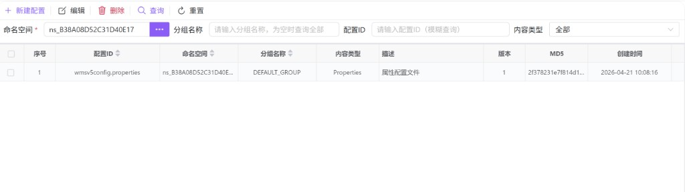
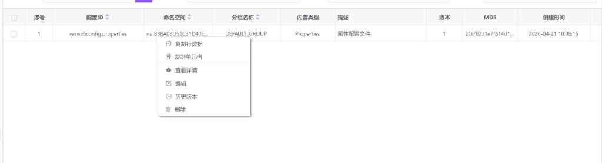
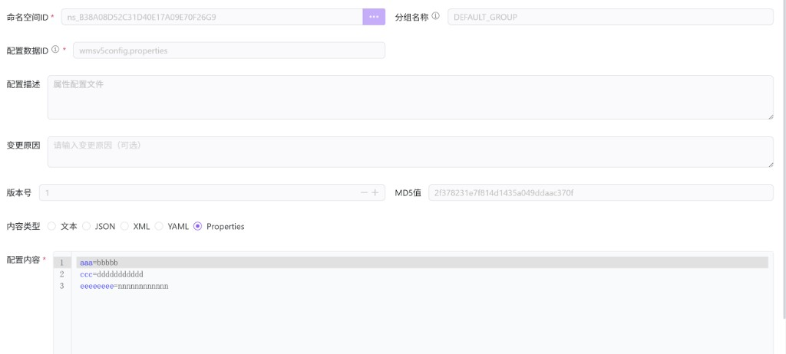
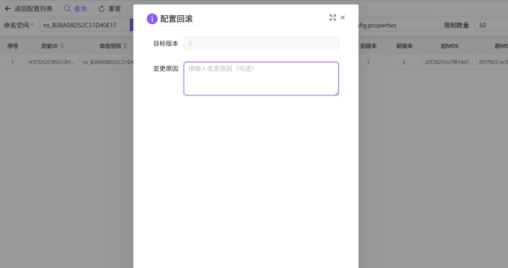

# 配置中心（hub0043）

在选定 **命名空间** 下集中管理配置项（Data ID / 分组 / 内容类型 / 版本与 MD5），支持新建、编辑、删除、查看详情，并可在 **配置历史** 中审计变更、查看单次修改详情及执行 **回滚**。本模块与 **[命名空间管理（hub0041）](./hub0041.md)** 配合使用：搜索区「命名空间」通过选择器绑定 `namespaceId`。

---

## 概述

| 能力 | 说明 |
|------|------|
| 配置列表 | 按命名空间（必填）、分组、配置 ID、内容类型筛选并分页展示。 |
| 新建 / 编辑 / 查看 | 使用**全页表单视图**（非弹窗）：从列表进入，编辑完成后 **发布** 或 **保存**，通过 **返回列表** 回到表格。 |
| 删除 | 支持当前行或勾选批量删除，均有确认提示。 |
| 历史与回滚 | 从列表右键进入历史页；历史列表支持查看详情、回滚到指定版本（会再经二次确认）。 |

---

## 访问入口

侧栏 **服务治理** → **配置中心**。

同一页面内在 **配置列表** 与 **配置历史** 两个视图间切换（由列表右键「历史版本」进入历史，历史中 **返回配置列表** 回到列表）。

---

## 配置列表

### 命名空间为必填

搜索表单中 **命名空间** 为必填项（带校验）。未选择命名空间时点击 **查询**，会提示「请先选择命名空间」，且不会加载列表。**新建配置**、**编辑**、**删除** 在点击前同样会校验是否已选择命名空间。

命名空间通过「…」打开 **[hub0041](./hub0041.md)** 中的命名空间选择器进行选择。

### 其它筛选项

| 字段 | 说明 |
|------|------|
| **分组名称** | 可选；占位：请输入分组名称，为空时查询全部。 |
| **配置 ID** | 可选；支持模糊查询。 |
| **内容类型** | 全部 / 文本 / JSON / XML / YAML / Properties。 |

### 工具栏

| 按钮 | 说明 |
|------|------|
| **新建配置** | 进入表单视图新增；若列表搜索区已选命名空间，会带入表单中的 **命名空间 ID**（表单内为只读选择器）。 |
| **编辑** | 优先使用表格 **当前单击行**；若无当前行，则使用 **勾选且仅一条** 记录。未选中时提示先选择。 |
| **删除** | 若有 **当前单击行**，则对该行发起删除确认；否则按 **勾选的多行** 批量删除（确认框中列出配置 ID）。 |
| **查询 / 重置** | 刷新列表或重置筛选（仍需命名空间才能查出数据）。 |

### 表格列

常见列包括：**配置 ID**、**命名空间**、**分组名称**、**内容类型**（界面展示为中文，如 Properties）、**描述**、**版本**、**MD5**、**创建时间**、**创建人** 等。MD5 用于比对配置内容是否变化。

### 右键菜单

| 菜单项 | 说明 |
|--------|------|
| **复制行数据 / 复制单元格** | 表格通用能力。 |
| **查看详情** | 进入表单视图，模式为只读，无底部提交按钮。 |
| **编辑** | 拉取详情后进入可编辑表单视图。 |
| **历史版本** | 切换到 **配置历史** 子视图，并自动带上当前行的命名空间、分组、配置 ID，默认 **限制数量** 为 50 且自动查询。 |
| **删除** | 删除当前行对应配置（单独确认框）。 |

---

## 新建 / 编辑 / 查看（表单视图）

列表与表单通过 **返回列表** 切换。提交按钮文案：**新增** 为 **发布**，**编辑** 为 **保存**；查看模式不显示提交按钮。

### 主要字段

| 字段 | 说明 |
|------|------|
| **命名空间 ID** | 必填；表单内为只读选择器，通常来自列表页已选命名空间。 |
| **分组名称** | 默认常见为 `DEFAULT_GROUP`，可按业务修改（以环境约定为准）。 |
| **配置数据 ID** | 必填，即配置主键（如 `xxx.properties`）。 |
| **配置描述** | 可选。 |
| **变更原因** | 可选；建议重大变更时填写，便于历史审计。 |
| **版本号 / MD5 值** | 只读，由系统在发布或保存后维护。 |
| **内容类型** | 单选：文本、JSON、XML、YAML、Properties；会切换下方编辑器的语言高亮与校验模式。 |
| **配置内容** | 必填；使用代码编辑器（高度约 400px），请保证内容与所选 **内容类型** 一致，避免解析失败。 |

---

## 配置历史与回滚

从配置列表右键 **历史版本** 进入后，顶部工具栏包含 **返回配置列表**（回到主列表视图）。

### 历史列表筛选

| 字段 | 说明 |
|------|------|
| **命名空间** | 必填。 |
| **分组名称** | 必填（从列表带入时常为 `DEFAULT_GROUP`）。 |
| **配置 ID** | 必填。 |
| **限制数量** | 默认 50，用于限制拉取的历史条数。 |

使用 **查询 / 重置** 刷新历史表。历史表 **不分页**。

### 历史表列与右键

表格展示 **历史 ID**、命名空间、分组、配置 ID、**变更类型**（创建 / 更新 / 删除 / 回滚 等标签）、**旧版本 / 新版本**、**旧 MD5 / 新 MD5**、变更原因、变更人、变更时间等。

右键菜单：

- **查看详情**：进入只读详情视图（含基本信息与历史中的配置内容 Tab），顶部 **返回列表** 回到历史表。  
- **回滚**：打开 **配置回滚** 对话框。

### 配置回滚对话框

- **目标版本**：只读展示，来自所选历史记录中的新版本号（即要回滚到的目标版本语义，以后端为准）。  
- **变更原因**：可选。  
点击 **确定** 后，还会弹出 **二次确认**（提示将创建新的配置版本等），确认后执行回滚并刷新历史列表。

---

## 使用建议

1. 先在 **[命名空间管理（hub0041）](./hub0041.md)** 创建命名空间，再在本页选择该空间维护配置。  
2. 修改生产配置前建议使用 **历史版本** 确认当前版本与 MD5，必要时先 **查看详情** 备份内容。  
3. **内容类型** 与实际文本不一致时，可能导致客户端或服务端解析失败，发布前请自检语法。  
4. 回滚会产生新版本链路，请在变更原因中写清业务背景，便于排障。
