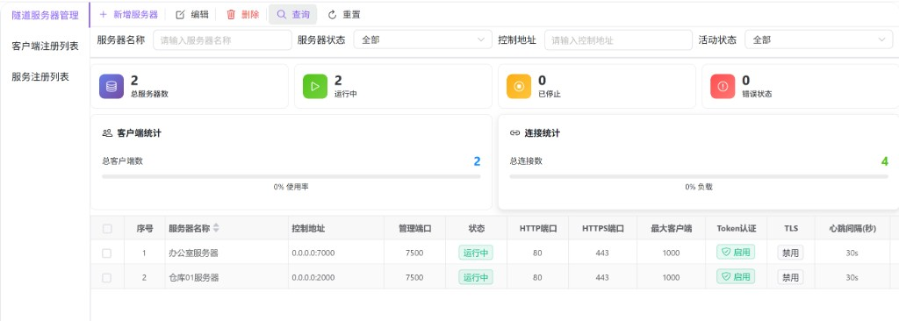
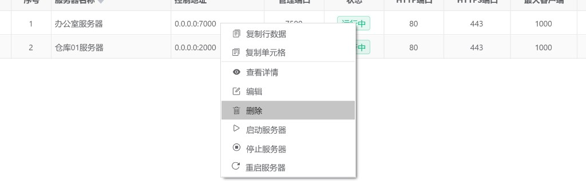
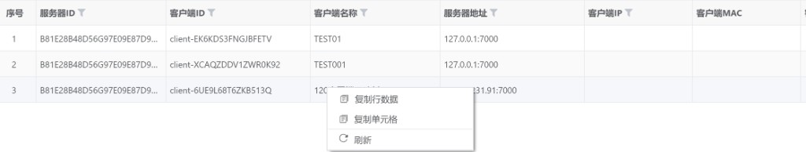
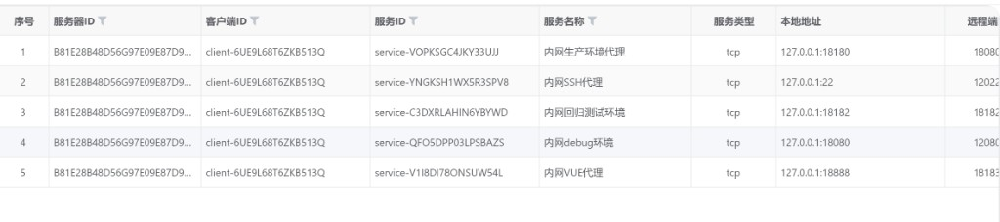

# 隧道服务器（hub0060）

在 **FRP 类隧道路由** 场景下，集中维护隧道服务端配置（控制端口、管理面板、HTTP/HTTPS 虚拟主机、客户端上限、Token/TLS、心跳等），查看汇总统计与运行态的 **已注册客户端**、**已注册服务**。同一页面通过左侧标签切换三个子视图。

---

## 概述

| 区域 | 说明 |
|------|------|
| **隧道服务器管理** | 条件查询、统计卡片、分页列表；支持新增/编辑/查看配置弹窗，以及启动、停止、重启与删除（均会二次确认）。 |
| **客户端注册列表** | 展示当前已连接到隧道服务端的客户端运行时信息；列头支持输入过滤；右键可刷新列表。 |
| **服务注册列表** | 展示客户端已注册的代理服务（本地地址与远程端口等）；列头支持输入过滤；右键可刷新列表。 |

---

## 访问入口

侧栏 **隧道管理** → **隧道服务器**。

---

## 页面结构（左侧标签）

1. **隧道服务器管理**：配置型数据，带统计与工具栏。  
2. **客户端注册列表**：运行时客户端列表。  
3. **服务注册列表**：运行时服务列表。

当前实现中，客户端与服务列表的「按某台服务器过滤」依赖传入的服务器 ID；父页面若未下发该参数，则接口以 **空参数** 拉取 **全部服务器** 下的注册数据（与代码中 `tunnelServerId || ''` 一致）。

---

## 隧道服务器管理

### 加载与统计

- **列表数据**：进入本标签后，需点击 **查询** 才会按当前筛选条件请求列表（页面挂载时仅会拉取顶部 **统计** 数据）。  
- **统计卡片**：展示总服务器数、运行中、已停止、错误状态；下方为 **客户端统计**（总客户端数 + 使用率进度条）与 **连接统计**（总连接数 + 负载进度条）。使用率/负载百分比由前端按固定上限换算展示，用于直观参考。

### 筛选项

| 字段 | 说明 |
|------|------|
| **服务器名称** | 占位：请输入服务器名称。 |
| **服务器状态** | 全部 / **运行中** / **已停止** / **错误**。 |
| **控制地址** | 占位：请输入控制地址（可与列表中「IP:控制端口」展示对照）。 |
| **活动状态** | 全部 / **活动** / **非活动**。 |

**查询** 按条件刷新列表并回到分页第一页逻辑由搜索表单与分页联动处理。**重置** 清空条件后再次查询。

### 工具栏

| 按钮 | 说明 |
|------|------|
| **新增服务器** | 打开多 Tab 表单弹窗，填写后保存创建。 |
| **编辑** | 取 **已勾选行**；若无勾选，则取 **当前高亮（点击）行**。未选中任何目标时提示先选择。编辑前会再请求一次详情以保证数据最新。 |
| **删除** | 与 **编辑** 相同的选中规则，但仅处理 **一条** 记录：确认后删除该隧道服务器（非多选批量删除）。 |
| **查询** / **重置** | 与筛表单联动。 |

### 表格列（主要）

含左侧 **勾选** 与 **序号**。数据列包括：**服务器名称**（可排序；运行中名称高亮样式）、**控制地址**（由控制 IP 与控制端口拼接）、**管理端口**、**状态**（运行中 / 已停止 / 错误 / 未知）、**HTTP 端口**、**HTTPS 端口**、**最大客户端**、**Token 认证**（启用/禁用标签）、**TLS**（启用/禁用）、**心跳间隔(秒)**、**心跳超时(秒)**、**启动时间**、**创建时间**、**创建人**、**活动状态** 等；底部分页。

### 新增 / 编辑 / 查看

使用同一弹窗组件，标题随模式变化，例如 **新增隧道服务器**、**编辑隧道服务器**、**查看隧道服务器详情**。表单分为 **基础配置**、**网络配置**、**安全配置**、**高级配置**、**其他信息** 等 Tab，涵盖控制地址与端口、管理面板端口、HTTP/HTTPS 端口、最大客户端数、每客户端端口上限、允许端口范围、Token/TLS 及证书路径、心跳与日志级别、备注与活动状态等；查看模式下字段为只读，确认不会提交写操作。

### 右键菜单

| 菜单项 | 说明 |
|--------|------|
| **复制行数据** / **复制单元格** | 表格内置，便于复制配置信息。 |
| **查看详情** | 只读打开上述表单弹窗。 |
| **编辑** | 拉取最新详情后进入编辑弹窗。 |
| **删除** | 删除当前行对应服务器，需确认。 |
| **启动服务器** | 确认后调用启动接口，成功后刷新列表。 |
| **停止服务器** | 确认后停止（提示将断开客户端连接），成功后刷新列表。 |
| **重启服务器** | 确认后重启，成功后刷新列表。 |

---

## 客户端注册列表

展示已注册客户端：**服务器 ID**、**客户端 ID**、**客户端名称**、**服务器地址**（地址与端口拼接）、**客户端 IP**、**客户端 MAC**、**客户端版本**、**操作系统**、**连接状态**（已连接 / 已断开 / 连接中 / 错误 等映射文案）、**服务数量**、**认证状态**、**最后心跳** 等。多列带表头 **筛选图标**，可在列头输入关键字过滤。

**右键**：复制行数据、复制单元格、**刷新**（重新请求列表）。

---

## 服务注册列表

展示已注册服务：**服务器 ID**、**客户端 ID**、**服务 ID**、**服务名称**、**服务类型**（如 tcp）、**本地地址**（本地 IP 与本地端口拼接）、**远程端口**、**服务状态**、**连接数**、**总连接数**、**注册时间**、**最后活动时间** 等；其中 ID 与名称列支持表头输入过滤。

**右键**：复制行数据、复制单元格、**刷新**（重新请求列表）。

---

## 与隧道客户端（hub0062）的关系

**hub0060** 侧重 **隧道服务端（frps 类）** 的配置与运行态监控；**隧道客户端（frpc 类）** 则 **单独部署** 在内网或业务侧主机上，在 **[隧道客户端（hub0062）](./hub0062.md)** 中维护其连接参数与「隧道服务」条目，向本页所配置的 **控制地址/端口** 发起长连，并把 **本机本地端口上的业务** 暴露到隧道服务端对外监听地址上。

整体穿透关系可参考同一张 **[架构原理图](../images/tunnel_architecture.svg)**（hub0062 文档中亦引用）。实际是否已连接、已注册多少客户端/服务，以本模块 **客户端注册列表**、**服务注册列表** 与服务器运行状态为准。
