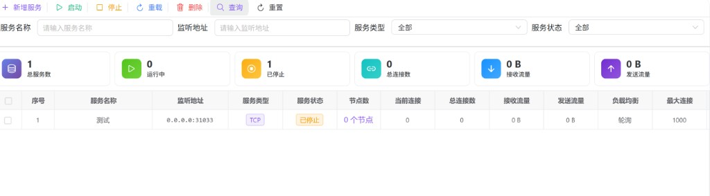
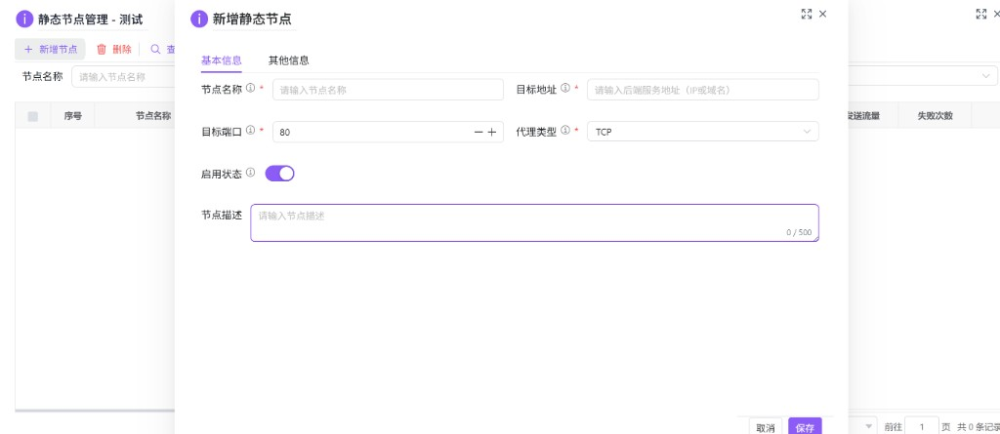

# 静态映射（hub0061）

维护 **静态代理服务**（在指定监听地址上接受连接，并按负载均衡策略转发到多个 **后端节点**），并查看运行态的连接数与流量汇总。支持服务的生命周期操作（启动、停止、重载配置、删除）、配置弹窗维护，以及在某服务下管理 **静态节点**（后端目标地址与端口等）。

---

## 概述

| 能力 | 说明 |
|------|------|
| 服务列表 | 按名称、监听地址、类型、状态筛选；分页列表展示连接与流量等指标。 |
| 统计卡片 | 总服务数、运行中、已停止、总连接数、接收/发送流量汇总（在 **查询** 成功后随列表一并刷新）。 |
| 工具栏 | **新增服务**；**启动 / 停止 / 重载 / 删除** 均针对 **一条** 目标服务（勾选优先，无勾选时用当前点击行）。 |
| 行内与右键 | **节点数** 列可点击打开「静态节点管理」弹窗；表格 **状态** 列为启用开关；右键提供查看、编辑、管理节点、启停与重载等。 |
| 节点子页 | 在节点弹窗内维护该服务下的后端节点（新增、删除、查看/编辑、行内启停）。 |

---

## 访问入口

侧栏 **隧道管理** → **静态映射**。

---

## 加载说明

页面打开后需点击 **查询** 才会请求服务列表；同时会刷新顶部 **统计卡片**。**重置** 清空筛选条件后再查询。

---

## 筛选条件

| 字段 | 说明 |
|------|------|
| **服务名称** | 占位：请输入服务名称。 |
| **监听地址** | 占位：请输入监听地址（可与列表中「监听 IP:端口」对照）。 |
| **服务类型** | 全部 / **TCP** / **UDP**。 |
| **服务状态** | 全部 / **运行中** / **已停止** / **错误**。 |

---

## 工具栏（服务）

| 按钮 | 说明 |
|------|------|
| **新增服务** | 打开「新增静态服务」多 Tab 表单弹窗。 |
| **启动** | 取 **已勾选行**；若无勾选，则取 **当前高亮（点击）行**。未选中时提示先选择。 |
| **停止** | 同上，一条服务。 |
| **重载** | 同上，对该服务重载运行时配置。 |
| **删除** | 同上，删除 **一条** 服务（确认后执行）。 |
| **查询** / **重置** | 与筛选表单联动。 |

---

## 统计卡片

共六项：**总服务数**、**运行中**、**已停止**、**总连接数**、**接收流量**、**发送流量**（流量按字节格式化展示，无数据时多为 `0 B`）。

---

## 服务表格列（主要）

含左侧 **勾选** 与 **序号**。数据列包括：**服务名称**、**监听地址**（监听 IP 与监听端口拼接展示）、**服务类型**（TCP/UDP 标签）、**服务状态**（运行中 / 已停止 / 错误）、**节点数**（可点击文案如「N 个节点」打开节点管理）、**当前连接**、**总连接数**、**接收流量**、**发送流量**、**负载均衡**（轮询 / 最少连接 / 随机 等文案）、**最大连接**、**状态**（启用开关，切换会调用更新接口）、**描述**、**启动时间**、**创建时间** 等；底部分页。

---

## 服务表单弹窗（新增 / 编辑 / 查看）

标题随模式为 **新增静态服务**、**编辑静态服务**、**查看静态服务详情**。可见 Tab 主要包括：

- **基本信息**：服务名称、服务类型、监听地址与监听端口、启用状态、服务描述等。  
- **网络配置**：如连接超时等（部分表单项在代码中因后端未对接而隐藏，以界面为准）。  
- **负载均衡**：负载均衡类型、健康检查类型与 URL、检查间隔与超时等（健康检查相关字段会随类型联动显示）。  
- **其他信息**：备注及创建/修改只读字段等。  

其中 **TLS 配置** Tab 在模型中默认隐藏（后端暂未实现 TLS 时前端不展示）。

---

## 右键菜单（服务）

| 菜单项 | 说明 |
|--------|------|
| **复制行数据** / **复制单元格** | 表格内置。 |
| **查看详情** | 只读打开服务表单。 |
| **编辑** | 拉取详情后进入编辑。 |
| **管理节点** | 打开 **静态节点管理** 弹窗（与点击「节点数」列效果一致）。 |
| **启动** / **停止** / **重载配置** / **删除** | 针对当前行，删除与生命周期类操作一般会二次确认。 |

---

## 静态节点管理（弹窗）

从服务的 **节点数** 列或右键 **管理节点** 进入。标题默认为 **静态节点管理 -** 后跟当前 **服务名称**。

### 筛选与工具栏

- 筛选项：**节点名称**、**目标地址**、**节点状态**、**健康状态**（选项与列表数据一致即可）。  
- **新增节点**：打开下方节点表单。  
- **删除**：使用表格 **当前高亮行**（`getCurrentRecord`）：需先 **单击** 选中一行再点删除；**非** 按多选勾选批量删除（与工具栏 tooltip 文案可能不一致时，以实际交互为准）。  
- **查询** / **重置**：刷新节点分页列表。

### 节点表格

含勾选列与序号，列包括：**节点名称**、**目标地址**、**目标端口**、**代理类型**、**节点状态**、**健康状态**、**当前连接**、**总连接数**、**接收/发送流量**、**失败次数**、**最后检查**、行内 **状态** 开关、**描述**、**创建时间** 等。

右键菜单：**查看详情**、**编辑**、**删除**；并含复制行等内置项。

### 新增 / 编辑节点表单

弹窗标题为 **新增静态节点** / **编辑静态节点** / **查看静态节点详情**。默认可见 Tab 为 **基本信息** 与 **其他信息**（**高级配置** Tab 在模型中默认隐藏）。

**基本信息** 中常见字段：

| 字段 | 说明 |
|------|------|
| **节点名称** | 必填。 |
| **目标地址** | 必填，后端 IP 或域名。 |
| **目标端口** | 必填，数字，默认 **80**。 |
| **代理类型** | 必填，默认 **TCP**（与 UDP 等选项一致）。 |
| **启用状态** | 开关，默认启用（`Y`/`N`）。 |
| **节点描述** | 可选，多行，最多 **500** 字。 |

保存成功后关闭弹窗并刷新节点列表；父页面会在弹窗关闭/刷新回调中同步刷新服务列表与统计（以实际接口为准）。

---

## 与隧道服务器（hub0060）的关系

**hub0060** 管理隧道路由 **服务端进程** 与注册视图；**hub0061** 管理的是 **静态代理服务及其后端节点**，用于入口监听与多目标负载均衡，二者职责不同，可按部署架构组合使用。
