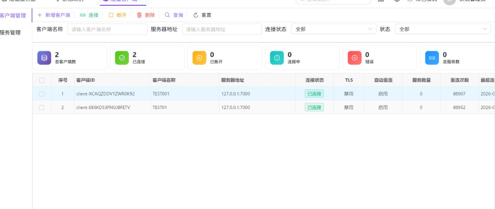
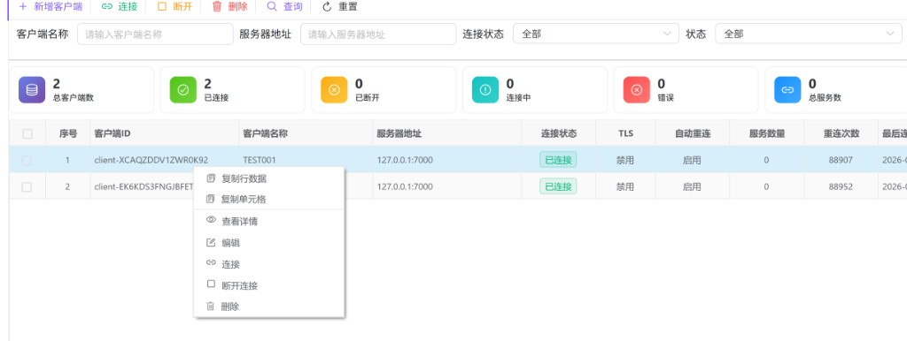
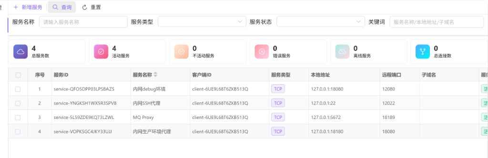
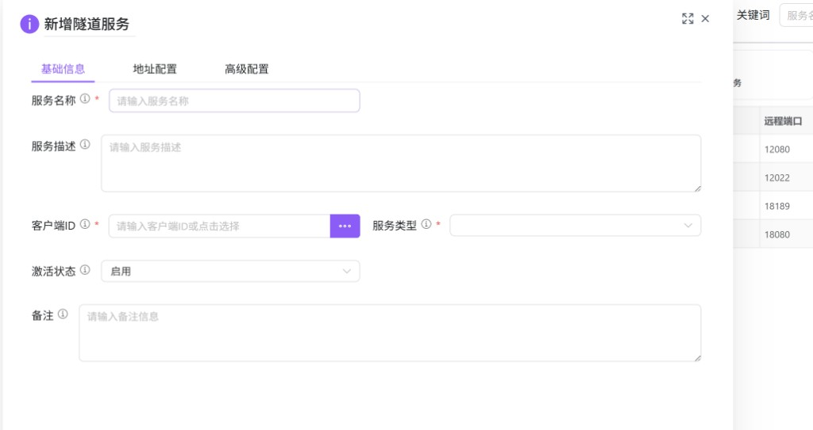
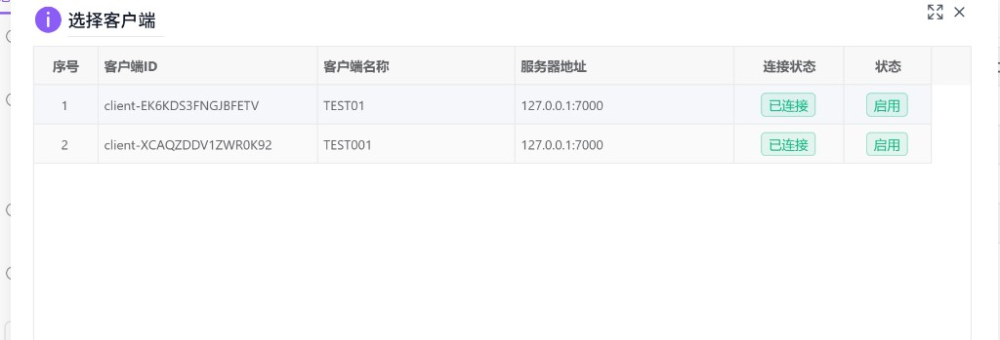
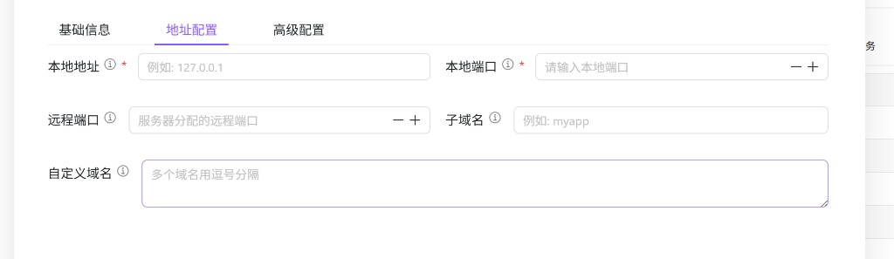

# 隧道客户端（hub0062）

本模块维护的是 **单独部署的隧道客户端服务**（典型形态类似 FRP 的 **frpc**）：进程运行在内网或业务主机上，使用此处配置的参数 **主动连接远程 [隧道服务器（hub0060）](./hub0060.md)** 的控制端口；在控制连接之上，再把 **本机已监听的端口服务**（如内网 Web、SSH、MQ 等）按「隧道服务」条目注册到服务端，从而在 **隧道服务端** 一侧获得公网或出口网络可达的 **远程端口、子域名或自定义域名** 等访问入口。

控制台负责 **客户端与服务条目的持久化配置**、**连接/断开/删除** 等运维操作；实际转发仍由 **客户端进程 + 服务端进程** 协同完成。

---

## 架构与数据流

下图概括 **互联网用户 → 隧道服务端 → 隧道客户端 → 内网本地服务** 的关系（控制面与数据面与常见 FRP 模型一致；图中「静态映射」对应 **[静态映射（hub0061）](./hub0061.md)** 能力，与本文「动态注册的隧道服务」可并存于同一套隧道体系中）。

| 角色 | 说明 |
|------|------|
| **隧道服务端** | 部署在公网或统一出口，配置见 **[hub0060](./hub0060.md)**；提供控制端口、数据端口及 HTTP/TCP/UDP 等转发。 |
| **隧道客户端** | **与控制台分离部署** 的长驻服务，按本模块中的 **服务器地址、端口、Token** 等连接上述服务端。 |
| **隧道服务** | 在 **服务管理** 中配置：声明 **本地地址与端口**（内网真实监听点）以及希望在服务端暴露的 **远程端口/域名** 等，由客户端向服务端注册后生效。 |

页面左侧为 **Tab**：**客户端管理**、**服务管理**。

---

## 访问入口

侧栏 **隧道管理** → **隧道客户端**。

---

## 客户端管理

### 加载与统计

- 进入 **客户端管理** 标签后，会 **自动加载** 客户端分页列表，并请求顶部 **统计卡片**（总客户端数、已连接、已断开、连接中、错误、总服务数；文案来自模块 i18n，与界面一致）。  
- 点击 **查询** 会按筛选条件重新拉取列表并再次刷新统计；**重置** 清空条件后查询。

### 筛选项

| 字段 | 说明 |
|------|------|
| **客户端名称** | 占位：请输入客户端名称。 |
| **服务器地址** | 占位：请输入服务器地址。 |
| **连接状态** | 全部 / **已连接** / **已断开** / **连接中** / **错误**。 |
| **状态** | 全部 / **启用** / **禁用**（对应配置中的活动标记）。 |

### 工具栏

| 按钮 | 说明 |
|------|------|
| **新增客户端** | 打开「新增隧道客户端」表单弹窗。 |
| **连接** | 取 **已勾选行**；若无勾选，则取 **当前高亮（点击）行**。对 **一条** 客户端发起连接。 |
| **断开** | 同上规则，断开 **一条** 客户端连接。 |
| **删除** | 同上规则，删除 **一条** 客户端记录（具体是否二次确认以后端与弹窗为准）。 |
| **查询** / **重置** | 与筛选表单联动。 |

**编辑** 未放在工具栏，请通过表格 **右键菜单** 进入编辑。

### 表格列（主要）

含 **勾选** 与 **序号**。数据列包括：**客户端 ID**、**客户端名称**、**服务器地址**（地址与端口拼接）、**连接状态**（标签）、**TLS**（启用/禁用文案）、**自动重连**（启用/禁用）、**服务数量**、**重连次数**、**最后连接时间**、**最后心跳**、**状态**（启用/禁用标签）、**创建时间** 等；底部分页。

### 客户端表单弹窗（新增 / 编辑 / 查看）

标题为 **新增隧道客户端**、**编辑隧道客户端**、**查看隧道客户端详情**。Tab 包括 **基本信息**（名称、描述、状态、备注）、**连接配置**（服务器地址、端口、认证令牌、TLS 等）、**高级配置**（自动重连、重试与心跳等）。查看模式下为只读，确认不提交写操作。

### 右键菜单

| 菜单项 | 说明 |
|--------|------|
| **复制行数据** / **复制单元格** | 表格内置。 |
| **查看详情** | 只读打开客户端表单。 |
| **编辑** | 拉取最新详情后进入编辑。 |
| **连接** / **断开连接** | 对当前行执行连接或断开。 |
| **删除** | 删除当前行对应客户端。 |

---

## 服务管理

### 加载与统计

- 切换到 **服务管理** 时，挂载阶段会拉取 **统计卡片**（总服务数、活动服务、不活动服务、错误服务、离线服务、总连接数）。  
- **服务列表** 需在点击 **查询** 后加载（与 `TunnelServiceManagement` 注释一致）；**重置** 清空筛选后再查询可刷新列表。  
- 每次 **查询** 成功后会再次刷新统计。

### 筛选项

| 字段 | 说明 |
|------|------|
| **服务名称** | 占位：请输入服务名称。 |
| **服务类型** | 下拉：TCP / UDP / HTTP / HTTPS / STCP / SUDP / XTCP 等（与配置项一致）。 |
| **服务状态** | 下拉：**活动** / **不活动** / **错误** / **离线**。 |
| **关键词** | 占位：服务名称/本地地址/子域名，用于组合检索。 |

### 工具栏

| 按钮 | 说明 |
|------|------|
| **新增服务** | 打开「新增隧道服务」表单弹窗。 |
| **查询** / **重置** | 与筛选表单联动。 |

**编辑**、**删除** 请使用表格 **右键菜单**（当前工具栏未提供独立的编辑、删除按钮）。

### 表格列（主要）

含 **勾选** 与 **序号**。列包括：**服务 ID**、**服务名称**、**客户端 ID**、**服务类型**（标签）、**本地地址**（本地 IP 与本地端口拼接）、**远程端口**、**子域名**、**服务状态**（活动/不活动/错误/离线 等标签）、**当前连接**、**总连接数**、**注册时间**、**最后活动**、**状态**（启用/禁用标签）等；底部分页。

### 新增 / 编辑隧道服务表单

弹窗标题为 **新增隧道服务**、**编辑隧道服务**、**查看隧道服务详情**。分为三个 Tab：**基础信息**、**地址配置**、**高级配置**。

**基础信息** 示例（节选）：

- **服务名称**（必填）、**服务描述**、**客户端 ID**（必填）：可手输，或点击右侧 **…** 打开 **选择客户端** 对话框。  
- **服务类型**（必填）、**激活状态**（启用/禁用）、**备注** 等。

**选择客户端** 弹窗标题为 **选择客户端**，表格中可查看客户端 ID、名称、服务器地址、连接状态、状态等；**单击行** 选择并回填客户端 ID。

**地址配置** Tab 示例：

- **本地地址**、**本地端口**（必填）。  
- **远程端口**（可选，占位说明由服务器分配时可留空或按提示填写）。  
- **子域名**、**自定义域名**（多域名逗号分隔）等，用于 HTTP/HTTPS 类场景。

**高级配置** 中含加密、压缩、密钥、最大连接数、带宽限制、HTTP 认证、Host 头重写、健康检查等字段（以表单实际展示为准）。

### 右键菜单（服务）

| 菜单项 | 说明 |
|--------|------|
| **查看详情** | 只读查看服务配置。 |
| **注册服务** | 向运行环境注册当前服务（若后端支持）。 |
| **注销服务** | 注销运行态服务。 |
| **编辑** | 拉取详情后编辑。 |
| **删除** | 删除该条服务配置。 |
| **复制行数据** / **复制单元格** | 表格内置。 |

---

## 与 hub0060 / hub0061 的关系

| 模块 | 关系 |
|------|------|
| **[hub0060](./hub0060.md)** | 隧道 **服务端** 部署与运行态；本页客户端的 **服务器地址、端口、认证信息** 必须与 hub0060 中该实例的监听及安全配置一致，否则无法建立控制连接或注册服务。 |
| **[hub0061](./hub0061.md)** | **静态映射** 在网关/服务端侧做多后端负载与端口策略（与架构图中「静态映射」示意对应）；与本页由 **隧道客户端动态注册** 的 **隧道服务** 是不同配置路径，可按架构组合使用。 |
