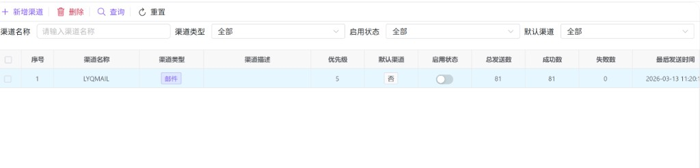
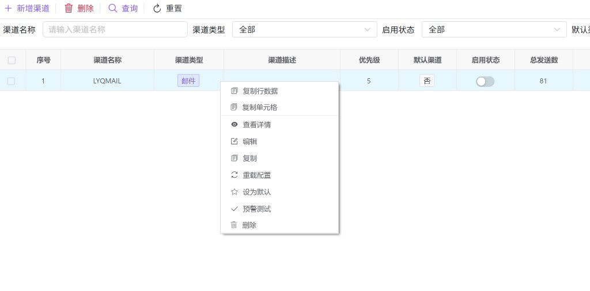
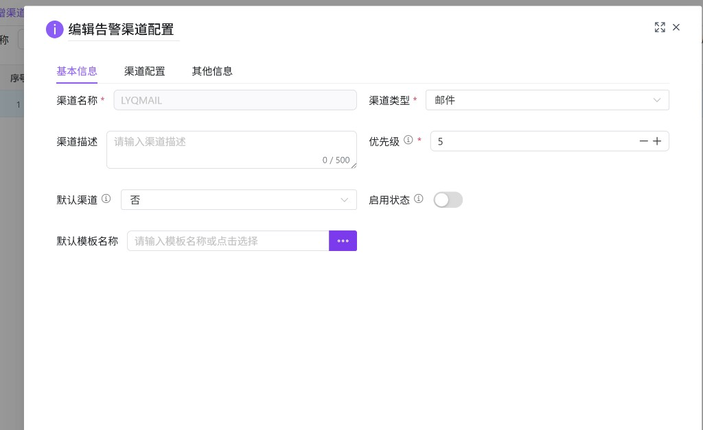
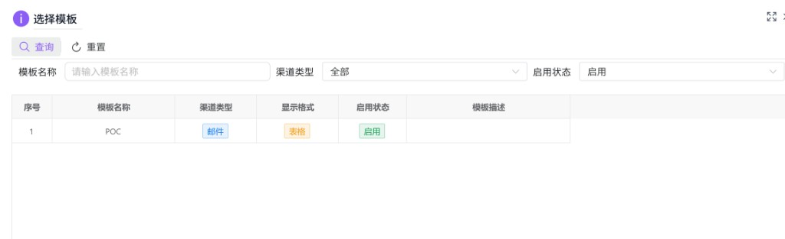
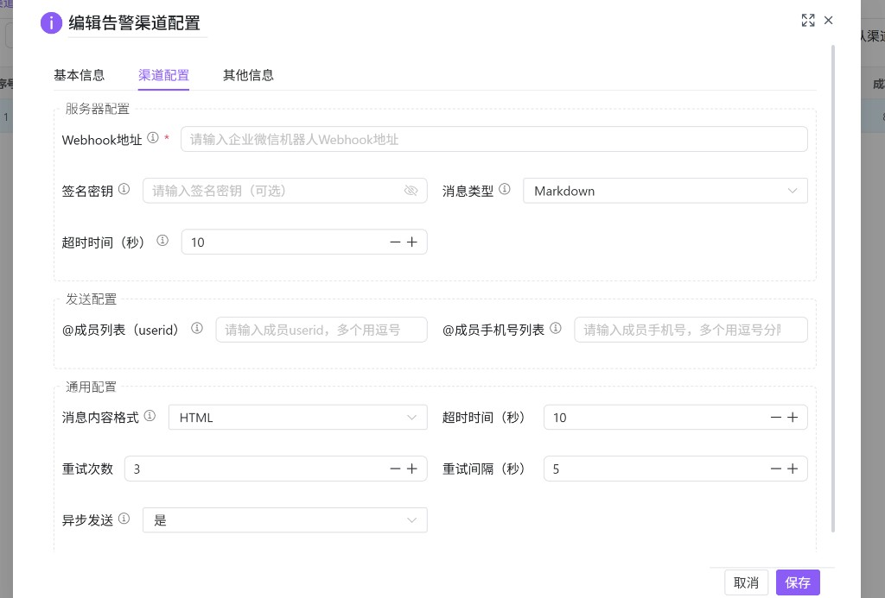

# 预警服务配置（hub0080）

维护告警**渠道**（邮件、QQ、企业微信、钉钉、Webhook、短信等）的连接参数、发送策略与默认模板，供预警引擎在发送通知时选用。列表中可查看发送统计、快速启停渠道，并支持重载配置、设为默认、复制渠道与预警测试。

---

## 概述

| 能力 | 说明 |
|------|------|
| 渠道 CRUD | **新增 / 编辑 / 查看** 使用弹窗表单；**删除** 入口存在，当前前端在确认后会提示能力尚未接入（以界面提示为准）。 |
| 启停 | 列表「启用状态」列内 **开关** 直接切换，会调用更新接口写回 `activeFlag`。 |
| 默认渠道 | 将某一渠道设为未指定渠道时的默认出口。 |
| 重载配置 | 使内存/缓存侧配置与存储一致并尽快生效。 |
| 预警测试 | 对已启用渠道发起一次测试投递（弹窗内可编辑测试内容）。 |
| 复制 | 基于现有渠道快速新建一条配置（需重新填写 **渠道名称**）。 |

与 **[服务中心实例（hub0040）](./hub0040.md)** 告警配置中的「渠道名称」对应：实例侧填写的是此处维护的渠道名称。

---

## 访问入口

侧栏 **预警管理** → **预警服务配置**。

---

## 列表与筛选

### 筛选项

| 字段 | 说明 |
|------|------|
| **渠道名称** | 精确匹配查询（占位：请输入渠道名称）。 |
| **渠道类型** | 全部 / 邮件 / QQ / 企业微信 / 钉钉 / Webhook / 短信。 |
| **启用状态** | 全部 / 启用 / 禁用。 |
| **默认渠道** | 全部 / 是 / 否。 |

使用 **查询** 刷新列表，**重置** 清空条件。

### 工具栏

| 按钮 | 说明 |
|------|------|
| **新增渠道** | 打开「新增告警渠道配置」弹窗。 |
| **删除** | 需先在表格中 **单击** 一行使其成为当前高亮行，再点删除；未选中行时会提示先点击选择。删除确认后，若后端未开放接口，界面会提示 **删除功能暂未实现**（与当前前端实现一致）。 |
| **查询 / 重置** | 与筛选区一致。 |

### 表格列说明

常见列包括：**渠道名称**、**渠道类型**（彩色标签）、**渠道描述**、**优先级**（1～10，**数字越小优先级越高**）、**默认渠道**（是/否）、**启用状态**（行内开关）、**总发送数 / 成功数 / 失败数**、**最后发送时间**、创建与修改时间等。

---

## 右键菜单

| 菜单项 | 说明 |
|--------|------|
| **复制行数据 / 复制单元格** | 表格通用能力。 |
| **查看详情** | 只读打开「查看告警渠道配置详情」。 |
| **编辑** | 打开「编辑告警渠道配置」。 |
| **复制** | 以当前渠道为模板进入 **新增** 流程，**渠道名称** 清空，需填写新名称后保存。 |
| **重载配置** | 确认后调用重载接口并刷新列表展示。 |
| **设为默认** | 若已是默认渠道会提示无需重复设置；否则二次确认后设为默认。 |
| **预警测试** | 仅 **已启用** 的渠道可测；未启用会提示无法测试。 |
| **删除** | 与工具栏删除逻辑相同（含「暂未实现」提示，以后端接入为准）。 |

---

## 新增 / 编辑 / 查看弹窗

标题分别为：**新增告警渠道配置**、**编辑告警渠道配置**、**查看告警渠道配置详情**。支持最大化与关闭；查看模式提交即关闭，不调用保存接口。

### Tab：基本信息

| 字段 | 说明 |
|------|------|
| **渠道名称** | 必填；英文、数字、下划线，最长 32 字符，作为主键展示在列表中。 |
| **渠道类型** | 必填；决定「渠道配置」Tab 下展示哪些分组（见下节）。 |
| **渠道描述** | 可选，最多约 500 字（以界面计数为准）。 |
| **优先级** | 必填，1～10。 |
| **默认渠道** | 是否作为未指定渠道时的默认路由。 |
| **启用状态** | 开关；禁用后该渠道不会被调度，且无法进行 **预警测试**。 |
| **默认模板名称** | 可输入或点击 **「…」** 打开模板选择窗口；列表会按当前 **渠道类型** 过滤可选模板（与 **[预警模板管理（hub0081）](./hub0081.md)** 中数据对应）。 |

---

### Tab：渠道配置

按 **渠道类型** 动态展示 **服务器配置**、**发送配置** 等分组；下方 **通用配置** 对各类型均可见（消息内容格式、超时、重试、异步发送等）。

**企业微信** 示例（与代码字段一致）：

| 分组 | 典型字段 |
|------|----------|
| 服务器配置（企业微信） | Webhook 地址（必填）、签名密钥（可选）、消息类型（文本 / Markdown）、超时时间（秒）。 |
| 发送配置（企业微信） | @成员 userid 列表、@成员手机号列表（多值逗号分隔，可选）。 |
| 通用配置 | 消息内容格式（文本 / HTML / Markdown）、超时时间（秒）、重试次数、重试间隔（秒）、是否异步发送。 |

**邮件**：SMTP 地址、端口、用户名、密码、发件人、TLS、收件人/抄送/密送等。  

**QQ**：Webhook 地址、签名密钥、@所有人、@指定用户等。  

**钉钉 / Webhook / 短信**：若界面仅展示「通用配置」而无独立服务器分组，请以当前版本界面为准；后续版本可能扩展表单项。

---

### Tab：其他信息

备注及创建人、创建时间、修改人、修改时间（多为只读）。

---

## 预警测试

在渠道已 **启用** 的前提下，通过右键 **预警测试** 打开测试弹窗，可查看或微调测试标题与正文，提交后由后端向该渠道投递一条测试消息。失败时请关注接口返回的错误信息。

---

## 使用建议

1. 先配置好 **渠道配置** Tab 中的连接参数，保存后再做 **预警测试**，避免无效重试。  
2. 多渠道并存时，用 **优先级** 与 **默认渠道** 约定主备出口。  
3. 修改 Webhook 或 SMTP 密码后建议执行 **重载配置**，并观察 **成功数 / 失败数** 是否异常增长。  
4. 模板正文与变量由 **[hub0081](./hub0081.md)** 维护；此处仅绑定 **默认模板名称**。
