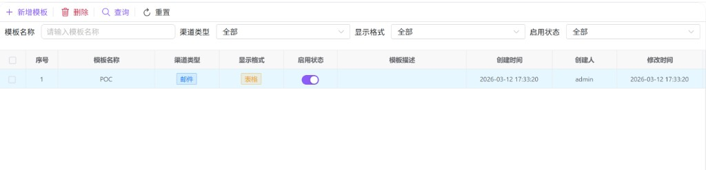
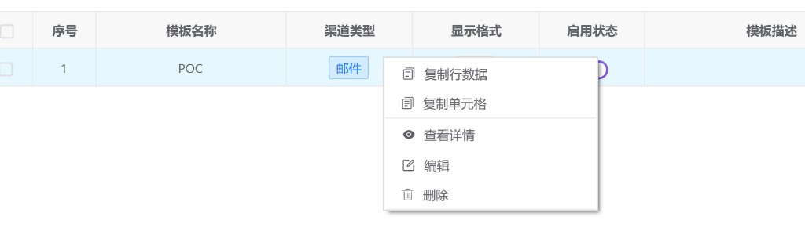
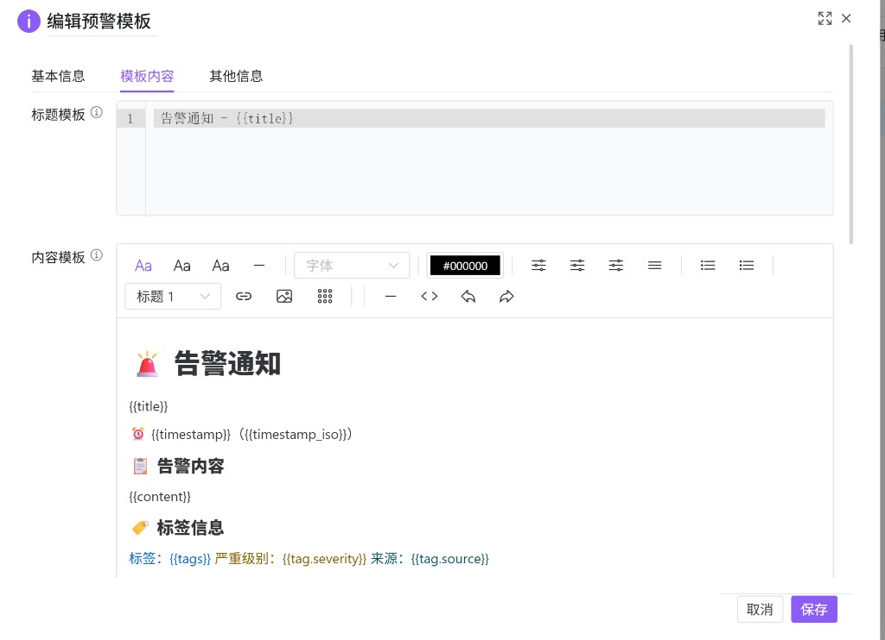

# 预警模板管理（hub0081）

维护告警消息的 **标题模板** 与 **内容模板**，使用与后端一致的 **Mustache** 占位符语法（双花括号包裹字段路径，例如 {{title}}、{{content}}），发送时由后端替换为实际标题、正文、时间、标签、表格字段等。模板按 **模板名称** 唯一标识，并绑定 **渠道类型**（或通用）、**显示格式** 与启用状态，供 **[预警服务配置（hub0080）](./hub0080.md)** 中「默认模板名称」引用。

---

## 概述

| 能力 | 说明 |
|------|------|
| 模板 CRUD | **新增 / 编辑 / 查看** 使用弹窗（三 Tab）；**删除** 支持右键单行或工具栏勾选批量删除。 |
| 启停 | 列表「启用状态」列 **开关** 直接切换，通过更新模板接口写回。 |
| 渠道与格式 | 渠道类型可为具体渠道或「通用」；显示格式为 **文本** 或 **表格**。 |
| 邮件内容 | 渠道类型为 **邮件** 时，「内容模板」使用 **富文本** 编辑，输出 HTML；其它渠道为 Markdown 代码编辑。 |

---

## 访问入口

侧栏 **预警管理** → **预警模板管理**。

---

## 列表与筛选

### 筛选项

| 字段 | 说明 |
|------|------|
| **模板名称** | 占位：请输入模板名称。 |
| **渠道类型** | 全部 / 邮件 / QQ / 企业微信 / 钉钉 / Webhook / 短信。 |
| **显示格式** | 全部 / 文本 / 表格。 |
| **启用状态** | 全部 / 启用 / 禁用。 |

**查询** 刷新列表，**重置** 清空条件。

### 工具栏

| 按钮 | 说明 |
|------|------|
| **新增模板** | 打开「新增预警模板」弹窗。 |
| **删除** | **批量删除**：先勾选表格左侧 **一条或多条** 记录，再点删除，确认后逐条调用删除接口。未勾选时会提示先选择。 |

### 表格列

包含 **模板名称**、**渠道类型**（未选渠道时列表中显示为 **通用**）、**显示格式**（文本 / 表格标签样式）、**启用状态**（行内开关）、**模板描述**、创建与修改时间及操作人等。

### 右键菜单

| 菜单项 | 说明 |
|--------|------|
| **查看详情** | 打开只读弹窗，标题为 **查看预警模板**。 |
| **编辑** | 拉取详情后打开 **编辑预警模板**。 |
| **删除** | 删除当前行对应模板（确认后执行）。 |

表格若还提供 **复制行数据** 等项，为通用表格能力。

---

## 新增 / 编辑 / 查看弹窗

标题：**新增预警模板**、**编辑预警模板**、**查看预警模板**。查看模式下确认即关闭，不提交保存。

### Tab：基本信息

| 字段 | 说明 |
|------|------|
| **模板名称** | 必填；仅英文字母、数字、下划线，最长 64 字符；作为模板主键，编辑保存时使用当前表单中的名称。 |
| **渠道类型** | 可选「通用(不限制)」或具体渠道；切换渠道且 **标题/内容模板仍为空** 时，会自动填入该渠道对应的默认标题与默认内容草稿（避免覆盖已编辑内容）。 |
| **显示格式** | 必填：**文本** 或 **表格**。 |
| **启用状态** | 开关；禁用后仍可在列表中看到，但 **hub0080** 绑定时应注意勿选已禁用模板。 |
| **模板描述** | 可选，约 500 字内（以字数统计为准）。 |

### Tab：模板内容

| 区域 | 说明 |
|------|------|
| **标题模板** | 单行或多行纯文本编辑器（CodeMirror），支持 {{title}}、{{tag.severity}} 等占位符。 |
| **内容模板** | **邮件**：富文本工具栏，适合排版 HTML 邮件；**非邮件**：Markdown 代码编辑器。 |
| **占位符说明** | 界面内嵌表格列出常用占位符：`title`、`content`、`timestamp`、`timestamp_iso`、`tags`、`tag.<键>`、`extra.<键>`、`table` / `table.<列>` 等；规则为 {{field}} 形式，未匹配字段将 **原样保留**。 |
| **附件配置(JSON)** | 可选，用于邮件附件等扩展（JSON 编辑器）。 |

### Tab：其他信息

备注、创建/修改时间与操作人（多为只读）。

---

## 与预警渠道（hub0080）的配合

在 **预警服务配置** 的渠道表单中，**默认模板名称** 的「…」选择器会按当前渠道的 **渠道类型** 过滤本模块中的模板。请保证模板 **渠道类型** 与渠道一致，或为 **通用**，且模板处于 **启用** 状态，避免选不到或发送失败。

---

## 使用建议

1. 先确定渠道（邮件 / 企微等），再建模板，便于使用正确的编辑器（HTML vs Markdown）。  
2. 重大变更前可 **导出或复制** 当前 HTML/Markdown 备份（手动全选复制即可）。  
3. 占位符大小写与后端约定一致，自定义字段优先走 `extra.*` 或 `table.*` 命名空间。  
4. 批量删除前确认无 **hub0080** 渠道仍引用这些模板名称。
