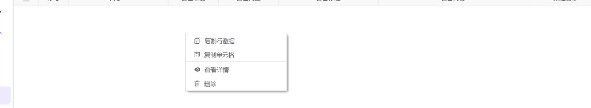

# 预警日志管理（hub0082）

查询系统中已记录或已投递的 **预警（告警）日志**：可按时间范围、日志 ID、级别、类型、标题、渠道与发送状态筛选；列表支持分页、勾选批量删除、右键查看详情与单行删除；详情弹窗展示完整字段及 JSON 扩展数据。

---

## 概述

| 能力 | 说明 |
|------|------|
| 条件查询 | **时间范围** 为必填；其它条件为空时不参与过滤。 |
| 列表展示 | 展示日志 ID、级别、类型、标题、内容、渠道、发送状态及时间等；支持底部分页。 |
| 批量删除 | 工具栏 **删除**：需先在表格左侧 **勾选** 一条或多条记录，确认后批量删除。未勾选时会提示先选择。 |
| 单行操作 | 表格 **右键菜单**：复制行数据、复制单元格（表格内置）、**查看详情**、**删除**（当前行）。 |

与 **[预警服务配置（hub0080）](./hub0080.md)** 中维护的 **渠道名称** 对应：日志中的「渠道名称」即发送时所选用的渠道标识。

---

## 访问入口

侧栏 **预警管理** → **预警日志管理**。

---

## 列表与筛选

### 时间范围（必填）

- 控件为 **日期时间范围**；打开页面时默认 **当天 00:00:00～23:59:59**。
- 面板内提供快捷选项：**今天**、**昨天**、**最近 1 小时**、**最近 6 小时**、**最近 24 小时**、**最近 7 天**。
- 未选择完整起止时间时，查询会校验并提示选择时间范围。

### 其它筛选项

| 字段 | 说明 |
|------|------|
| **日志 ID** | 占位：请输入日志 ID。 |
| **告警级别** | 全部 / **信息** / **警告** / **错误** / **严重**。 |
| **告警类型** | 占位：请输入告警类型（业务自定义类型标识）。 |
| **告警标题** | 占位：请输入告警标题。 |
| **渠道名称** | 占位：请输入渠道名称。 |
| **发送状态** | 全部 / **待发送** / **发送中** / **成功** / **失败**。 |

**查询** 按当前条件刷新列表（会重置到第一页）。**重置** 清空条件并恢复表单默认值（含当天时间范围）。

### 工具栏

| 按钮 | 说明 |
|------|------|
| **删除** | **批量删除**：仅处理 **已勾选** 的行；确认后按选中条数批量删除。 |

---

## 表格列

除左侧 **勾选列** 与 **序号** 外，主要数据列包括：

| 列名 | 说明 |
|------|------|
| **日志 ID** | 日志主键。 |
| **告警级别** | 以标签展示：信息 / 警告 / 错误 / 严重。 |
| **告警类型** | 类型标识。 |
| **告警标题** | 摘要标题。 |
| **告警内容** | 正文，过长时悬停可看完整内容。 |
| **渠道名称** | 发送使用的渠道。 |
| **发送状态** | 待发送 / 发送中 / 成功 / 失败。 |
| **告警时间** | 告警发生时间。 |
| **发送时间** | 实际发送时间（若有）。 |
| **错误信息** | 发送失败时的错误说明。 |
| **创建时间 / 创建人** | 记录写入信息。 |
| **修改时间 / 修改人** | 最后变更信息。 |

---

## 右键菜单

在表格数据行上 **右键** 可打开上下文菜单（含表格内置复制项）：

| 菜单项 | 说明 |
|--------|------|
| **复制行数据** | 将当前行各列数据复制到剪贴板（表格内置）。 |
| **复制单元格** | 复制右键所指向单元格的内容（表格内置）。 |
| **查看详情** | 打开 **预警日志详情** 弹窗，按日志 ID 拉取完整记录。 |
| **删除** | 删除 **当前右键所在行** 对应日志，需二次确认。 |

---

## 详情弹窗

- 标题形如：**预警日志详情 -** 后跟当前 **日志 ID**。
- **基本信息**：日志 ID、告警级别、告警类型、渠道名称、告警时间、发送状态、发送时间、创建与修改信息、错误信息等。
- **告警标题**、**告警内容**：若有则单独卡片展示。
- **扩展数据**：当存在告警标签、额外数据、表格数据或发送结果等 JSON 字段时，以折叠面板展示，并支持格式化查看。

弹窗无底部按钮栏，通过右上角关闭；关闭后列表不会自动刷新，若需看到最新状态请再次 **查询**。
